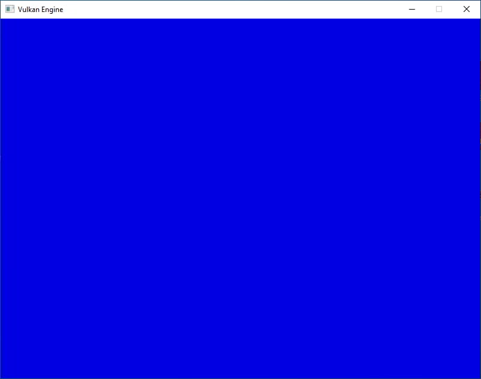
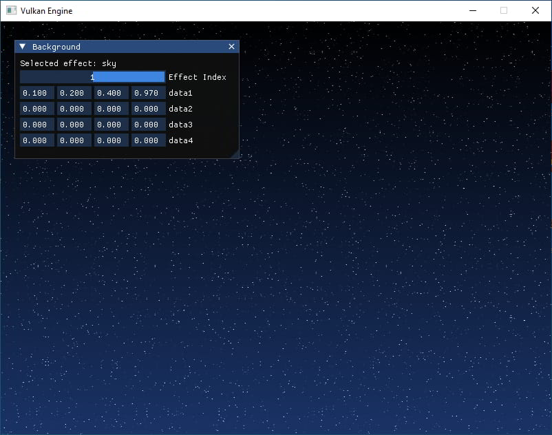

# Odin Vulkan Guide Tutorial 2.0

In progress tutorial of [vkguide.dev](https://vkguide.dev/) using Odin Language.

## TODO

Separate sections with branches.

## Progress

- [x] 1. Initializing Vulkan

  - [x] Vulkan Initialization
  - [x] Vulkan Initialization Code
  - [x] Executing Vulkan Commands
  - [x] Setting up Vulkan commands
  - [x] Rendering Loop
  - [x] Mainloop Code

- [x] 2. Drawing with Compute

  - [x] Improving the render loop
  - [x] Vulkan Shaders
  - [x] Vulkan Shaders - Code
  - [x] Setting up IMGUI
  - [x] Push Constants and new shaders

- [ ] 3. Graphics Pipelines

  - [ ] The graphics pipeline
  - [ ] Setting up render pipeline
  - [ ] Mesh buffers
  - [ ] Mesh Loading
  - [ ] Blending
  - [ ] Window Resizing

- [ ] 4. Textures and Engine Architecture

  - [ ] Descriptor Abstractions
  - [ ] Textures
  - [ ] Engine Architecture
  - [ ] Setting up Materials
  - [ ] Meshes and Camera

- [ ] 5. GLTF loading

  - [ ] Interactive Camera
  - [ ] GLTF Scene Nodes
  - [ ] GLTF Textures
  - [ ] Faster Draw

## Dependencies

- [odin-imgui](https://gitlab.com/L-4/odin-imgui/-/tree/main?ref_type=heads)
- [odin-vk-bootstrap](https://github.com/Capati/odin-vk-bootstrap)
- [odin-vma](https://github.com/Capati/odin-vma)
