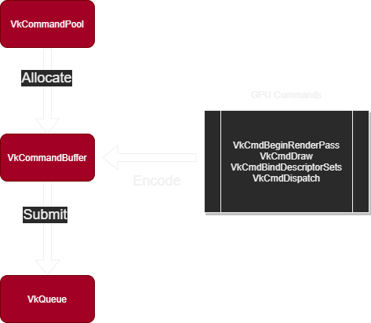

# Vulkan Command Execution

Unlike OpenGL or DirectX pre-11, in Vulkan, all GPU commands have to go through a command
buffer, and executed through a Queue.

The general flow to execute commands is:

- You allocate a `vk..CommandBuffer` from a `vk..CommandPool`
- You record commands into the command buffer, using `vk..CmdXXXXX` functions.
- You submit the command buffer into a `vk..Queue`, which starts executing the commands.

It is possible to submit the same command buffer multiple times. In tutorials and samples it's
very common to record the commands once, and then submit them every frame in the render loop.
In this tutorial, we are going to record the commands every frame, as it's more relevant to how
a real render engine works.

Recording commands in Vulkan is relatively cheap. Often, the operation that is costly is the
VkQueueSubmit call, where the driver validates the command buffer and executes it on the GPU.

One very important part with command buffers is that they can be recorded in parallel. You can
record different command buffers from different threads safely. To do that, you need to have 1
`vk..CommandPool` and 1 `vk..CommandBuffer` per thread (minimum), and make sure that each thread
only uses their own command buffers & pools. Once that is done, it's possible to submit the
command buffers in one of the threads. `vk.QueueSubmit` is not thread-safe, only one thread can
push the commands on a given queue at a time. Its common in big engines to have the submit
being done from a background thread, and that way the main render-loop thread can continue
executing.

## vk.Queue

Queues in Vulkan are an "execution port" for GPUs. Every GPU has multiple queues available, and
you can even use them at the same time to execute different command streams. Commands submitted
to separate queues may execute at once. This is very useful if you are doing background work
that doesn't exactly map to the main frame loop. You can create a `vk..Queue` specifically for
said background work and have it separated from the normal rendering.

All queues in Vulkan come from a Queue Family. A Queue Family is the "type" of queue it is, and
what type of commands it supports.

Different GPUs support different Queue Families. An example is this NVidia GT 750ti from Vulkan
Hardware Info [Link](https://vulkan.gpuinfo.org/displayreport.php?id=8859#queuefamilies). It
has 2 Queue families, one that supports up to 16 queues that have all features, and then a
family that can support 1 queue for transfer only.
[Here](https://vulkan.gpuinfo.org/displayreport.php?id=24407#queuefamilies) you have an example
for a high end AMD card, there are 5 queue families, and only up to 2 queues per type. It has 1
queue that supports everything, up to 2 queues that support compute and transfer, 2 dedicated
transfer queues, and then 2 other queues for present alone. As you can see, the queues
supported by each GPU can vary significantly.

It is common to see engines using 3 queue families. One for drawing the frame, other for async
compute, and other for data transfer. In this tutorial, we use a single queue that will run all
our commands for simplicity.

## vk.CommandPool

A `vk..CommandPool` is created from the `vk..Device`, and you need the index of the queue family
this command pool will create commands from.

Think of the `vk..CommandPool` as the allocator for a `vk..CommandBuffer`. You can allocate as
many `vk..CommandBuffer` as you want from a given pool, but you can only record commands from
one thread at a time. If you want multithreaded command recording, you need more
`vk..CommandPool` objects. For that reason, we will pair a command buffer with its command
allocator.

## vk.CommandBuffer

All commands for GPU get recorded in a VkCommandBuffer. All of the functions that will execute
GPU work won't do anything until the command buffer is submitted to the GPU through a
`vk..QueueSubmit` call.

Command buffers start in the Ready state. When in the Ready state, you can call
`vk.BeginCommandBuffer()` to put it into the Recording state. Now you can start inputting
commands into it with `vk.CmdXXXXX` functions. Once you are done, call `vk.EndCommandBuffer()` to
finish the recording the commands and put it in the Executable state where it is ready to be
submitted into the GPU.

To submit the command buffer, you call `vk.QueueSubmit()`, using both the command and the queue
to submit into. `vk.QueueSubmit` also accepts submitting multiple command buffers together. Any
command buffer that is submitted is put in the Pending state.

Once a command buffer has been submitted, it's still "alive", and being consumed by the GPU, at
this point it is NOT safe to reset the command buffer yet. You need to make sure that the GPU
has finished executing all of the commands from that command buffer until you can reset and
reuse it

To reset a command buffer, you use `vk.ResetCommandBuffer()`.

As we will want to continue drawing the next frame while the command buffer is executed, we are
going to double-buffer the commands. This way, while the gpu is busy rendering and processing
one buffer, we can write into a different one.

For more detailed information on the command buffer lifecycle, refer to the Vulkan
specification chapter for [Command Buffers][].

[Command Buffers]: https://docs.vulkan.org/spec/latest/chapters/cmdbuffers.html#commandbuffers-lifecycle
