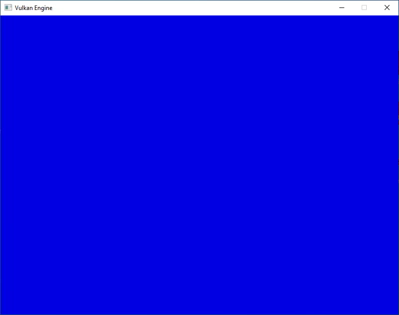

# Mainloop Code

The first thing we need to do is to add the synchronization structures that we are going to
need into our Frame_Data structure. We add the new members into the struct.

```odin
Frame_Data :: struct {
    swapchain_semaphore:   vk.Semaphore,
    render_fence:          vk.Fence,
    swapchain_image_index: u32,
}
```

We are going to need a semaphore and the main render fence. Let us begin creating them.

The `swapchain_semaphore` is going to be used so that our render commands wait on the swapchain
image request. `render_fence` will lets us wait for the draw commands of a given
frame to be finished.

Lets initialize them. Check the procedures to make a VkFenceCreateInfo and a
VkSemaphoreCreateInfo on our initializers.odin code.

```odin title="tutorial/01_initializing_vulkan/initializers.odin"
fence_create_info :: proc(flags: vk.FenceCreateFlags = {}) -> vk.FenceCreateInfo {
    info := vk.FenceCreateInfo {
        sType = .FENCE_CREATE_INFO,
        flags = flags,
    }
    return info
}

semaphore_create_info :: proc(flags: vk.SemaphoreCreateFlags = {}) -> vk.SemaphoreCreateInfo {
    info := vk.SemaphoreCreateInfo {
        sType = .SEMAPHORE_CREATE_INFO,
        flags = flags,
    }
    return info
}
```

Both of these structures are pretty simple and need almost no options other than to give them
some flags. For more info on the structures, here are the spec links [VkFenceCreateInfo][] and
[VkSemaphoreCreateInfo][].

[VkFenceCreateInfo]: https://registry.khronos.org/vulkan/specs/1.3-extensions/html/chap7.html#VkFenceCreateInfo
[VkSemaphoreCreateInfo]: https://registry.khronos.org/vulkan/specs/1.3-extensions/html/chap7.html#VkSemaphoreCreateInfo

Lets write the actual creation now.

```odin
engine_init_sync_structures :: proc(self: ^Engine) -> (ok: bool) {
    // Create synchronization structures, one fence to control when the gpu has finished
    // rendering the frame, and 2 semaphores to sincronize rendering with swapchain. We want
    // the fence to start signalled so we can wait on it on the first frame
    fence_create_info := fence_create_info({.SIGNALED})
    semaphore_create_info := semaphore_create_info()

    for &frame in self.frames {
          vk_check(
            vk.CreateFence(self.vk_device, &fence_create_info, nil, &frame.render_fence),
        ) or_return

        vk_check(
            vk.CreateSemaphore(
                self.vk_device,
                &semaphore_create_info,
                nil,
                &frame.swapchain_semaphore,
            ),
        ) or_return
    }

    return true
}
```

On the fence, we are using the flag `{.SIGNALED}` (from `vk..FenceCreateInfo`) . This is very
important, as it allows us to wait on a freshly created fence without causing errors. If we did
not have that bit, when we call into WaitFences the first frame, before the gpu is doing work,
the thread will be blocked.

We create the 3 structures for each of our frames. Now that we have them, we can write the draw
loop.

## Draw loop

Let's start the draw loop by first waiting for the GPU to have finished its work, using the fence.

```odin
engine_draw :: proc(self: ^Engine) -> (ok: bool) {
    frame := engine_get_current_frame(self)

    // Wait until the gpu has finished rendering the last frame. Timeout of 1 second
    vk_check(vk.WaitForFences(self.vk_device, 1, &frame.render_fence, true, 1e9)) or_return
    vk_check(vk.ResetFences(self.vk_device, 1, &frame.render_fence)) or_return

    return true
}
```

We use `vk.WaitForFences()` to wait for the GPU to have finished its work, and after it we
reset the fence. Fences have to be reset between uses, you can't use the same fence on multiple
GPU commands without resetting it in the middle.

The timeout of the WaitFences call is of 1 second. It's using nanoseconds for the wait time. If
you call the procedure with 0 as the timeout, you can use it to know if the GPU is still
executing the command or not.

Next, we are going to request an image index from the swapchain.

```odin
// Request image from the swapchain
vk_check(
    vk.AcquireNextImageKHR(
        self.vk_device,
        self.vk_swapchain,
        1e9,
        frame.swapchain_semaphore,
        0,
        &frame.swapchain_image_index,
    ),
) or_return
```

`vk.AcquireNextImageKHR` will request the image index from the swapchain, and if the swapchain
doesn't have any image we can use, it will block the thread with a maximum for the timeout set,
which will be 1 second.

Check how we are sending the swapchain_semaphore to it. This is to make sure that we can sync
other operations with the swapchain having an image ready to render.

We use the index given from this procedure to decide which of the swapchain images we are going
to use for drawing.

Time to begin the rendering commands. For that, we are going to reset the command buffer for
this frame, and begin it again. We will need to use another one of the initializer procedures.

```odin title="tutorial/01_initializing_vulkan/initializers.odin"
command_buffer_begin_info :: proc(
    flags: vk.CommandBufferUsageFlags = {},
) -> vk.CommandBufferBeginInfo {
    info := vk.CommandBufferBeginInfo {
        sType = .COMMAND_BUFFER_BEGIN_INFO,
        flags = flags,
    }
    return info
}
```

When a command buffer is started, we need to give it an info struct with some properties. We
will not be using inheritance info so we can keep it nullptr, but we do need the flags.

Here is the link to the spec for this structure [VkCommandBufferBeginInfo][].

[VkCommandBufferBeginInfo]: https://registry.khronos.org/vulkan/specs/1.3-extensions/html/chap6.html#VkCommandBufferBeginInfo

Back to `engine_draw()`, we start by resetting the command buffer and restarting it.

```odin
// The the current command buffer, naming it cmd for shorter writing
cmd := frame.main_command_buffer

// Now that we are sure that the commands finished executing, we can safely reset the
// command buffer to begin recording again.
vk_check(vk.ResetCommandBuffer(cmd, {})) or_return

// Begin the command buffer recording. We will use this command buffer exactly once, so we
// want to let vulkan know that
cmd_begin_info := command_buffer_begin_info({.ONE_TIME_SUBMIT})

// Start the command buffer recording
vk_check(vk.BeginCommandBuffer(cmd, &cmd_begin_info)) or_return
```

We are going to copy the command buffer handle from our Frame_Data into a variable named `cmd`.
This is to shorten all other references to it. Vulkan handles are just a 64 bit handle/pointer,
so its fine to copy them around, but remember that their actual data is handled by vulkan
itself.

Now we call `vk.ResetCommandBuffer` to clear the buffer. This will completly remove all
commands and free its memory. We can now start the command buffer again with
`vk.BeginCommandBuffer`. On the cmdBeginInfo, we will give it the flag `{.ONE_TIME_SUBMIT}`
(from `vk.CommandBufferUsageFlags`). This is optional, but we might get a small speedup from
our command encoding if we can tell the drivers that this buffer will only be submitted and
executed once. We are only doing 1 submit per frame before the command buffer is reset, so this
is perfectly good for us.

With the command buffer recording started, let's add commands to it. We will first transition
the swapchain image into a drawable layout, then perform a `vk.CmdClear` on it, and finally
transition it back for a display optimal layout.

This means we are going to need a way to transition images as part of a command buffer instead
of using a renderpass, so we are going to add it as a procedure on `images.odin`.

Transitioning an image has loads of possible options. We are going to do the absolute simplest
way of implementing this, by only using currentLayout + newLayout.

We will be doing a pipeline barrier, using the syncronization 2 feature/extension which is part
of vulkan 1.3 . A pipeline barrier can be used for many different things like syncronizing
read/write operation between commands and controlling things like one command drawing into a
image and other command using that image for reading.

Add the procedure to `images.odin` (create the file if need).

```odin title="tutorial\01_initializing_vulkan\images.odin"
package vk_guide

// Vendor
import vk "vendor:vulkan"

transition_image :: proc(
    cmd: vk.CommandBuffer,
    image: vk.Image,
    current_layout: vk.ImageLayout,
    new_layout: vk.ImageLayout,
) {
    image_barrier := vk.ImageMemoryBarrier2 {
        sType = .IMAGE_MEMORY_BARRIER_2,
    }

    image_barrier.srcStageMask = {.ALL_COMMANDS}
    image_barrier.srcAccessMask = {.MEMORY_WRITE}
    image_barrier.dstStageMask = {.ALL_COMMANDS}
    image_barrier.dstAccessMask = {.MEMORY_WRITE, .MEMORY_READ}

    image_barrier.oldLayout = current_layout
    image_barrier.newLayout = new_layout

    aspect_mask: vk.ImageAspectFlags =
        {.DEPTH} if new_layout == .DEPTH_ATTACHMENT_OPTIMAL else {.COLOR}

    image_barrier.subresourceRange = image_subresource_range(aspect_mask)
    image_barrier.image = image

    dep_info := vk.DependencyInfo {
        sType                   = .DEPENDENCY_INFO,
        imageMemoryBarrierCount = 1,
        pImageMemoryBarriers    = &image_barrier,
    }

    vk.CmdPipelineBarrier2(cmd, &dep_info)
}
```

`vk.ImageMemoryBarrier2` contains the information for a given *image* barrier. On here, is
where we set the old and new layouts. In the StageMask, we are doing `{.ALL_COMMANDS}`. This is
inefficient, as it will stall the GPU pipeline a bit. For our needs, its going to be fine as we
are only going to do a few transitions per frame. If you are doing many transitions per frame
as part of a post-process chain, you want to avoid doing this, and instead use StageMasks more
accurate to what you are doing.

AllCommands stage mask on the barrier means that the barrier will stop the gpu commands
completely when it arrives at the barrier. By using more finegrained stage masks, its possible
to overlap the GPU pipeline across the barrier a bit. AccessMask is similar, it controls how
the barrier stops different parts of the GPU. we are going to use `.MEMORY_WRITE` for our
source, and add `.MEMORY_READ` to our destination. Those are generic options that will be fine.

If you want to read about what would be the optimal way of using pipeline barriers for
different use cases, you can find a great reference in here [Khronos Vulkan Documentation:
Syncronization examples][] This layout transition is going to work just fine for the whole
tutorial, but if you want, you can add more complicated transition procedures that are more
accurate/lightweight.

[Khronos Vulkan Documentation: Syncronization examples]: https://github.com/KhronosGroup/Vulkan-Docs/wiki/Synchronization-Examples

As part of the barrier, we need to use a `vk.ImageSubresourceRange` too. This lets us target a
part of the image with the barrier. Its most useful for things like array images or mipmapped
images, where we would only need to barrier on a given layer or mipmap level. We are going to
completely default it and have it transition all mipmap levels and layers.

```odin
image_subresource_range :: proc(aspectMask: vk.ImageAspectFlags) -> vk.ImageSubresourceRange {
    subImage := vk.ImageSubresourceRange {
        aspectMask = aspectMask,
        levelCount = vk.REMAINING_MIP_LEVELS,
        layerCount = vk.REMAINING_ARRAY_LAYERS,
    }
    return subImage
}
```

An thing we care in that structure is the `aspectMask` (`vk.ImageAspectFlags`). This is going
to be either `.COLOR` or `.DEPTH`. For color and depth images respectively. We wont need any of
the other options. We will keep it as Color aspect under all cases except when the target
layout is `DEPTH_ATTACHMENT_OPTIMAL`, which we will use later when we add depth buffer.

Once we have the range and the barrier, we pack them into a `vk.DependencyInfo` struct and call
`vk.CmdPipelineBarrier2`. It is possible to layout transitions multiple images at once by
sending more imageMemoryBarriers into the dependency info, which is likely to improve
performance if we are doing transitions or barriers for multiple things at once.

With the transition procedure implemented, we can now draw things.

```odin title="Import the 'core:math' package at the top"
import "core:math"
```

```odin title="engine_draw"
// Make the swapchain image into writeable mode before rendering
transition_image(cmd, self.swapchain_images[frame.swapchain_image_index], .UNDEFINED, .GENERAL)

// Make a clear-color from frame number. This will flash with a 120 frame period.
flash := abs(math.sin(f32(self.frame_number) / 120.0))
clear_value := vk.ClearColorValue {
    float32 = {0.0, 0.0, flash, 1.0},
}

clear_range := image_subresource_range({.COLOR})

// Clear image
vk.CmdClearColorImage(
    cmd,
    self.swapchain_images[frame.swapchain_image_index],
    .GENERAL,
    &clear_value,
    1,
    &clear_range,
)

// Make the swapchain image into presentable mode
transition_image(
    cmd,
    self.swapchain_images[frame.swapchain_image_index],
    .GENERAL,
    .PRESENT_SRC_KHR,
)

// Finalize the command buffer (we can no longer add commands, but it can now be executed)
vk_check(vk.EndCommandBuffer(cmd)) or_return
```

We begin by transitioning the swapchain image. `UNDEFINED` Is the "dont care" layout. Its also
the layout newly created images will be at. We use it when we dont care about the data that is
already in the image, and we are fine with the GPU destroying it.

The target layout we want is `GENERAL`. This is a general purpose layout, which allows reading
and writing from the image. Its not the most optimal layout for rendering, but it is the one we
want for `vk.CmdClearColorImage` . This is the image layout you want to use if you want to
write a image from a compute shader. If you want a read-only image or a image to be used with
rasterization commands, there are better options.

For a more detailed list on image layouts, you can check the spec here [Vulkan Spec: image
layouts][].

[Vulkan Spec: image layouts]: https://registry.khronos.org/vulkan/specs/1.3-extensions/html/chap12.html#resources-image-layouts

We now calculate a clear color through a basic formula with the _frameNumber. We will be
cycling it through a sin procedure. This will interpolate between black and blue clear color.

`vk.CmdClearColorImage` requires 3 main parameters to work. First of them is the image, which
is going to be the one from the swapchain. Then it wants a clear color, and then it needs a
subresource range for what part of the image to clear, which we are going to use a default
`ImageSubresourceRange` for.

With the clear command executed, we now need to transition the image to `PRESENT_SRC_KHR` which
is the only image layout that the swapchain allows for presenting to screen. And at the end, we
finish by calling `vk.EndCommandBuffer`

With this, we now have a fine command buffer that is recorded and ready to be dispatched into
the gpu. We could call `vk.QueueSubmit` already, but its going to be of little use right now as
we need to also connect the synchronization structures for the logic to interact correctly with
the swapchain.

We will be using `vk.QueueSubmit2` for submitting our commands. This is part of
syncronization-2 and is an updated version of the older `vk.QueueSubmit` from vulkan 1.0. The
procedure call requires a `vk.SubmitInfo2` which contains the information on the semaphores
used as part of the submit, and we can give it a Fence so that we can check for that submit to
be finished executing. `vk.SubmitInfo2` requires `vk.SemaphoreSubmitInfo` for each of the
semaphores it uses, and a `vk.CommandBufferSubmitInfo` for the command buffers that will be
enqueued as part of the submit.

Lets check the procedures for those.

```odin title="tutorial/01_initializing_vulkan/initializers.odin"
semaphore_submit_info :: proc(
    stageMask: vk.PipelineStageFlags2,
    semaphore: vk.Semaphore,
) -> vk.SemaphoreSubmitInfo {
    submitInfo := vk.SemaphoreSubmitInfo {
        sType     = .SEMAPHORE_SUBMIT_INFO,
        semaphore = semaphore,
        stageMask = stageMask,
        value     = 1,
    }
    return submitInfo
}

command_buffer_submit_info :: proc(cmd: vk.CommandBuffer) -> vk.CommandBufferSubmitInfo {
    info := vk.CommandBufferSubmitInfo {
        sType         = .COMMAND_BUFFER_SUBMIT_INFO,
        commandBuffer = cmd,
    }
    return info
}

submit_info :: proc(
    cmd: ^vk.CommandBufferSubmitInfo,
    signalSemaphoreInfo: ^vk.SemaphoreSubmitInfo,
    waitSemaphoreInfo: ^vk.SemaphoreSubmitInfo,
) -> vk.SubmitInfo2 {
    info := vk.SubmitInfo2 {
        sType                    = .SUBMIT_INFO_2,
        waitSemaphoreInfoCount   = waitSemaphoreInfo == nil ? 0 : 1,
        pWaitSemaphoreInfos      = waitSemaphoreInfo,
        signalSemaphoreInfoCount = signalSemaphoreInfo == nil ? 0 : 1,
        pSignalSemaphoreInfos    = signalSemaphoreInfo,
        commandBufferInfoCount   = 1,
        pCommandBufferInfos      = cmd,
    }
    return info
}
```

`command_buffer_submit_info` only needs the command buffer handle. We dont need anything else,
and we can leave the deviceMask at 0 as we are not it.

`semaphore_submit_info` requires a `stageMask`, which is the same as we saw with the
transition_image procedure. Other than that, it only needs the semaphore handle. device index
parameter is used for multi-gpu semaphore usage, but we wont do any of it. and value is used
for timeline semaphores, which are a special type of semaphore where they work through a
counter intead of a binary state. We will also not be using them, so we can default it to 1

`submit_info` arranges everything together. it needs the command submit info, and then the
semaphore wait and signal infos. We are going to only use 1 semaphore each for waiting and
signaling, but its possible to signal or wait on multiple semaphores at once for more
complicated systems.

Here are the links to spec for those structures:

- [VkCommandBufferSubmitInfo](https://registry.khronos.org/vulkan/specs/1.3-extensions/html/chap6.html#VkCommandBufferSubmitInfo)
- [VkSemaphoreSubmitInfo](https://registry.khronos.org/vulkan/specs/1.3-extensions/html/chap6.html#VkSemaphoreSubmitInfo)
- [VkSubmitInfo2](https://registry.khronos.org/vulkan/specs/1.3-extensions/html/chap6.html#VkSubmitInfo2)

With the initializers made, we can write the submit itself.

```odin
// Prepare the submission to the queue. we want to wait on the
// `swapchain_semaphore`, as that semaphore is signaled when the swapchain is
// ready. We will signal the `ready_for_present_semaphore`, to signal that
// rendering has finished.

ready_for_present_semaphore := self.swapchain_image_semaphores[frame.swapchain_image_index]

cmd_info := command_buffer_submit_info(cmd)
signal_info := semaphore_submit_info({.ALL_GRAPHICS}, ready_for_present_semaphore)
wait_info := semaphore_submit_info({.COLOR_ATTACHMENT_OUTPUT_KHR}, frame.swapchain_semaphore)

submit := submit_info(&cmd_info, &signal_info, &wait_info)

	// Submit command buffer to the queue and execute it. `render_fence` will now
	// block until the graphic commands finish execution.
vk_check(vk.QueueSubmit2(self.graphics_queue, 1, &submit, frame.render_fence)) or_return
```

We first create each of the different info structs needed, and then we call `vk.QueueSubmit2`.
For our command info we are just going to send the command we just recorded. For the wait info,
we are going to use the swapchain semaphore of the current frame. When we called
`vk.AcquireNextImageKHR`, we set this same semaphore to be signaled, so with this, we make sure
that the commands executed here wont begin until the swapchain image is ready.

For signal info, we will be using the semaphore of the current swapchain image, which will lets us
synchronize with presenting the image on the screen.

And for the fence, we are going to use the current frame render_fence. At the start of the draw
loop, we waited for that same fence to be ready. This is how we are going to synchronize our gpu
to the cpu, as when the cpu goes ahead of the GPU, the fence will stop us so we don't use any of
the other structures from this frame until the draw commands are executed.

Last thing we need on the frame is to present the image we have just drawn into the screen

```odin
// Prepare present
//
// This will put the image we just rendered to into the visible window. we want to wait on
// the `ready_for_present_semaphore` for that, as its necessary that drawing commands
// have finished before the image is displayed to the user.
present_info := vk.PresentInfoKHR {
    sType              = .PRESENT_INFO_KHR,
    pSwapchains        = &self.vk_swapchain,
    swapchainCount     = 1,
    pWaitSemaphores    = &ready_for_present_semaphore,
    waitSemaphoreCount = 1,
    pImageIndices      = &frame.swapchain_image_index,
}

vk_check(vk.QueuePresentKHR(self.graphics_queue, &present_info)) or_return

// Increase the number of frames drawn
self.frame_number += 1
```

`vk.QueuePresent` has a very similar info struct as the queue submit. It also has the pointers
for the semaphores, but it has image index and swapchain index. We will wait on the
ready_for_present_semaphore, and connect it to our swapchain. This way, we wont be presenting the image to
the screen until it has finished the rendering commands from the submit right before it.

At the end of the procedure, we increment frame counter.

With this, we have the draw loop done. Only thing left is to clean up the sync structures
properly as part of the cleanup procedure

```odin
for &frame in self.frames {
    vk.DestroyCommandPool(self.vk_device, frame.command_pool, nil)

    // Destroy sync objects
    vk.DestroyFence(self.vk_device, frame.render_fence, nil)
    vk.DestroySemaphore(self.vk_device, frame.swapchain_semaphore, nil)
}
```

Try running the engine at this moment. If everything is correct, you should have a window with
a flashing blue screen.



If you encounter unexpected results, check the validation layers, as they will catch possible
synchronization problems.

:::warning[]

Resizing the window in Vulkan at this stage will generate an error of `ERROR_OUT_OF_DATE_KHR`.
This issue will be addressed and fixed in a later chapter.

:::

This concludes chapter 1, and the next we are going to do is to begin using some compute
shaders to draw other things than a simple flashing screen.
