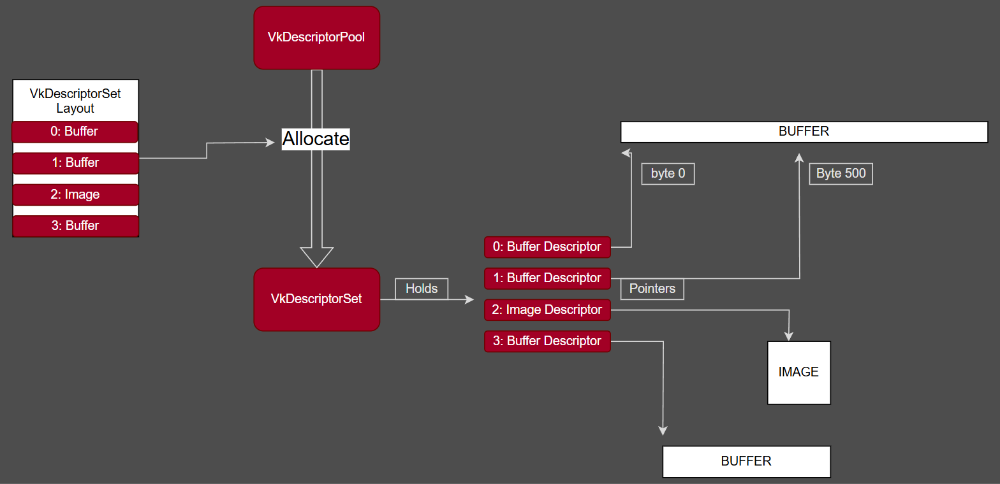

# Vulkan Shaders

## Running code on the GPU

We have the render loop implemented now, so the next step is to draw something.

Instead of drawing geometry just yet, we are going to use Compute Shaders to write data into a
image, and then display that image to the screen. Compute shaders to calculate images is a very
common use case that you can see from complex postprocessing chains in engines. Its also common
to do when the programmer is going to do raytracing or other non-geometry drawing.

## `vk.Pipeline`

In vulkan, to execute code on the gpu, we need to setup a pipeline. There are two types of
pipelines, Graphics and Compute. The Compute pipelines are much simpler, because they only
require the data for the shader code, and the layout for the descriptors used for data
bindings. Graphics pipelines, on the other hand, have to configure a considerable amount of
state for all of the fixed function hardware in the GPU such as color blending, depth testing,
or geometry formats. We will use them next chapter.

Both types of pipelines share the shader modules and the layouts, which are built in the same
way.

## `vk.ShaderModule`

A `vk.ShaderModule` is a processed shader file. We create it from a pre-compiled **SPIR-V**
file. In our case, we are using **HLSL** (High-Level Shading Language) to write our shaders.
However, in Vulkan, the driver does not accept shader code in **HLSL** directly. Instead, we
need to compile our **HLSL** files ahead of time into a compiled **SPIR-V** file (more
information in the next section).

## Descriptor sets

To give data to the shaders, we need to setup some bindings. In vulkan, binding objects like
images and buffers to the shader requires Descriptor Sets. Think of a single descriptor as a
handle or pointer into a resource. That resource being a Buffer or a Image, and also holds
other information, such as the size of the buffer, or the type of sampler if it's for an image.
A `vk.DescriptorSet` is a pack of those pointers that are bound together. Vulkan does not allow
you to bind individual resources in shaders. Descriptor sets are allocated from a
`vk.DescriptorPool`, using a `vk.DescriptorLayout` that contains the information about what that
descriptor set holds (for example, 2 images). Once a descriptor set is allocated, you can
update its data using `vkUpdateDescriptorSets`, which takes an array of `vk.WriteDescriptorSet`.
Once you have a fully configured descriptor set, you can bind it to your pipeline using
`vk.BindDescriptorSets`, and its data will be available in the shader.

Open on a new tab/window to enlarge the image

In this chapter we will connect a draw image to the compute shader so that the shader can write
into it. Over the tutorial, we will be writing some abstractions that simplify this flow. A
pipeline can have multiple slots to bind a few descriptor sets. The vulkan spec guarantees that
we will have at least 4 sets, so that will be what we will target in the tutorial. According to
gpu vendors, each descriptor set slot has a cost, so the less we have, the better. Later in the
tutorial we will have Descriptor Set #0 to always bind some global scene data, which will
contain some uniform buffers, and some special textures. Descriptor Set #1 will be used for
per-object data.

## Push Constants

Apart from Descriptor Sets, which are used to connect the shaders to buffers and images, vulkan
offers an option to directly write a few bytes of data while recording the command buffer.
PushConstants is a mechanic unique to vulkan which reserves a very small amount of memory to be
bound directly to the shader. This one is fast, but its also very limited in space and must be
written as you encode the commands. Its main use is that you can give it some per-object data,
if your objects dont need much of it, but according to gpu vendors, their best use case is to
send some indexes to the shader to be used to access some bigger data buffers.

## Pipeline Layout

A shader has some inputs it needs, and this is what a `vk.PipelineLayout` is made of. To create
one, we must give it the `vk.DescriptorSetLayout` of the descriptor slots it needs, and
PushConstantRange defining its push constant usage. PipelineLayouts for a graphics and compute
pipeline are made in the same way, and they must be created before the pipeline itself.

## The Compute Pipeline

To build a compute pipeline, we need to create first the pipeline layout for it, and then hook
a single shader module for its code. Once its built, we can execute the compute shader by first
calling `vk.CmdBindPipeline` and then calling `vk.CmdDispatch`.

Compute shaders have a specific programming model. When we call `vk.CmdDispatch`, we give vulkan a
number of work groups to launch in 3 dimensions in a X *Y* Z fashion. In our case here, we will
be using it to draw a image, so we only use 2 of those dimensions, that way we can execute one
workgroup per group of pixels in the image.

In the compute shader, the `[numthreads(16, 16, 1)]` attribute is specified directly above the
`main` function. By doing that, we are setting the size of a single workgroup. This means that
for every work unit from the `vk.CmdDispatch`, we will have 16x16 lanes of execution, which
works well to write into a 16x16 pixel square.

On the shader code, we can access what the lane index is through `SV_GroupThreadID` variable.
There is also `SV_DispatchThreadID` and `SV_GroupID`.  By using those variables we can find out
what pixel exactly do we write from each lane.

Lets now set all of this up in the code and get our first shaders working.
