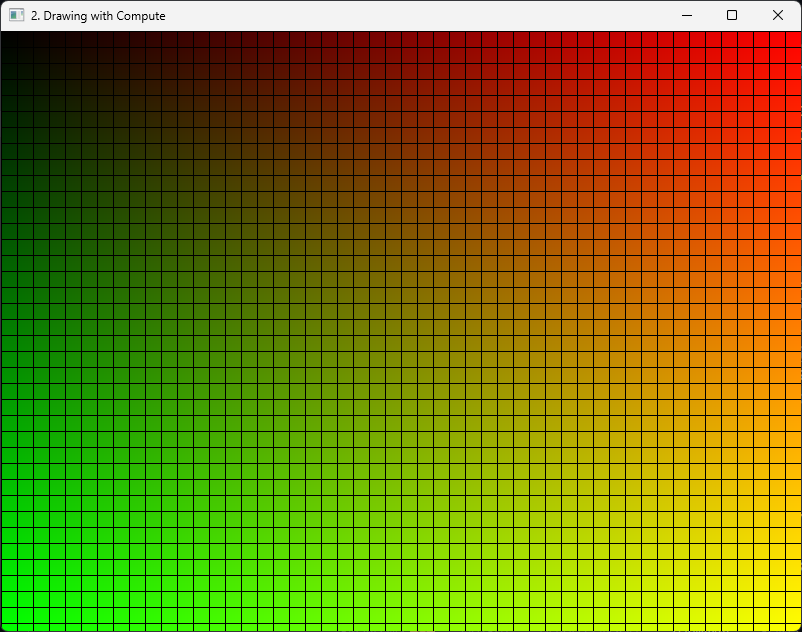

# Vulkan Shaders - Code

Lets now write the code necesary for our compute shader. We will begin with a very simple
shader that has an image as input, and writes a color to it, based on the thread ID, forming a
gradient. This one is already on the code, in the shaders folder. From now on, all the shaders
we add will go into that folder as the CMake script will build them.

```hlsl title="shaders/source/gradient.comp.hlsl"
// Thread group size definition - 16x16 threads per group
#define THREAD_GROUP_SIZE_X 16
#define THREAD_GROUP_SIZE_Y 16

// Resource binding - This texture will store our output image
RWTexture2D<float4> image : register(u0);

// Main compute shader procedure
// - numthreads decorator defines the thread group dimensions (equivalent to GLSL's local_size)
// - DTid (DispatchThreadID) - Global thread ID (equivalent to gl_GlobalInvocationID in GLSL)
// - GTid (GroupThreadID) - Thread ID within the current group (equivalent to
//   gl_LocalInvocationID in GLSL)
[numthreads(THREAD_GROUP_SIZE_X, THREAD_GROUP_SIZE_Y, 1)]
void main(uint3 DTid : SV_DispatchThreadID, uint3 GTid : SV_GroupThreadID)
{
    // Get the current pixel coordinate from the global thread ID
    int2 texelCoord = int2(DTid.xy);

    // Get the dimensions of our texture
    // This replaces imageSize() in GLSL
    uint width, height;
    image.GetDimensions(width, height);

    // Only process pixels within the bounds of the texture
    if (texelCoord.x < width && texelCoord.y < height)
    {
        // Initialize with black color (fully opaque)
        float4 color = float4(0.0, 0.0, 0.0, 1.0);

        // Skip border threads (where local IDs are 0)
        // This creates a grid pattern where the outer edge of each thread group is black
        if (GTid.x != 0 && GTid.y != 0)
        {
            // Calculate color based on normalized coordinates
            // Red channel increases with x position
            color.x = float(texelCoord.x) / (width);
            // Green channel increases with y position
            color.y = float(texelCoord.y) / (height);
        }

        // Write the calculated color to the texture
        // This replaces imageStore() in GLSL
        image[texelCoord] = color;
    }
}
```

For resource binding, HLSL uses a register-based system instead of descriptor sets. Our
`RWTexture2D` is bound to `register(u0)`, which is functionally equivalent to binding an
`image2D` to set 0, binding 0 in GLSL.

The thread group size is specified using the `[numthreads]` attribute. This defines that each
group will have 16x16 lanes working together, similar to the GLSL workgroup size.

The shader creates a gradient based on the global thread ID coordinates
(`SV_DispatchThreadID`). If the local thread ID (`SV_GroupThreadID`) is 0 on either X or Y, we
default to black, creating a grid pattern that visualizes our thread group boundaries.

## HLSL to SPIR-V

As part of the vulkan SDK, we have the `dxc` program, which is used to compile HLSL into SPIR-V.

If you look at the `/shaders/source/` folder in the odin-vk-guide codebase, you see two scripts,
`compile.bat` (for Windows) and `compile.sh` (for Unix). Whenever you want to compile the
shaders on this tutorial, you need to build the shaders using the script.

:::tip[Watch Shader Changes]

The compile script can watch the `shaders` folder for changes. Simply pass `watch` as an
argument:

```bash
compile.bat watch
```

This command will initially compile all shaders and then continuously monitor the folder,
recompiling any shader that was modified.

:::

This is the basic command to compile using `dxc`:

```bash title="using dxc.exe on Windows"
dxc.exe -spirv -T vs_6_10 -E main .\gradient.comp.hlsl -Fo .\gradient.comp.hlsl.spv
```

```bash title="using dxc on Unix"
dxc -spirv -T vs_6_10 -E main ./gradient.comp.hlsl -Fo ./gradient.comp.hlsl.spv
```

- `-T` selects the profile to compile the shader against (`vs_6_0` = Vertex shader model 6,
  `ps_6_0` = Pixel/fragment shader model 6, `cs_6_0` = Compute shader model 6, etc.).

- `-E` selects the main entry point for the shader.

If you want to learn more how to use HLSL shaders with Vulkan, you can check in this official
vulkan site [HLSL In Vulkan][].

[HLSL In Vulkan]: https://docs.vulkan.org/guide/latest/hlsl.html

:::warning[compile the shaders]

Any time you touch the shaders, make sure you compile the shaders. This process has to succeed
with no errors, or the project will be missing the spirv files necessary to run this shaders on
the gpu.

:::

## Setting up the descriptor layout

To build the compute pipeline, we need to create its layout. In this case, the layout will only
contain a single descriptor set that then has a image as its binding 0.

To build a descriptor layout, we need to store an array of bindings. Lets create a structure to
abstract this so that handling those is simpler. Our descriptor abstractions will go into
`descriptors.odin`.

```odin title="descriptors.odin"
package vk_guide

// Core
import "base:runtime"
import sa "core:container/small_array"

// Vendor
import vk "vendor:vulkan"

MAX_BOUND_DESCRIPTOR_SETS :: 8

Descriptor_Sets :: sa.Small_Array(MAX_BOUND_DESCRIPTOR_SETS, vk.DescriptorSetLayoutBinding)

Descriptor_Layout_Builder :: struct {
    bindings: Descriptor_Sets,
}
```

We will be storing `vk.DescriptorSetLayoutBinding`, a configuration/info struct, into an array,
and then have a `build()` procedure which creates the `vk.DescriptorSetLayout`, which is a vulkan
object, not a info/config structure.

:::tip[MAX_BOUND_DESCRIPTOR_SETS]

In Vulkan, the concept of "descriptor set layouts" relates to how resources like textures and
buffers are organized for shaders. The maximum number of descriptor set layouts a pipeline can
have is tied to the device's `maxBoundDescriptorSets` limit, which indicates how many descriptor
sets can be bound at once. This value is not fixed and depends on the specific GPU, but it's
commonly at least 4, with some devices supporting up to 8.

:::

Lets write the procedures for that builder.

```odin
descriptor_layout_builder_add_binding :: proc(
    self: ^Descriptor_Layout_Builder,
    binding: u32,
    type: vk.DescriptorType,
    loc := #caller_location,
) {
    // Assert that we haven't exceeded the maximum number of descriptor sets
    assert(sa.len(self.bindings) < MAX_BOUND_DESCRIPTOR_SETS, loc = loc)

    new_binding := vk.DescriptorSetLayoutBinding {
        binding         = binding,
        descriptorCount = 1,
        descriptorType  = type,
    }

    sa.push(&self.bindings, new_binding)
}

descriptor_layout_builder_clear :: proc(self: ^Descriptor_Layout_Builder) {
    sa.clear(&self.bindings)
}
```

First, we have the `descriptor_layout_builder_add_binding` procedure. This will just write a
`vk.DescriptorSetLayoutBinding` and push it into the array. When creating a layout binding, for
now we only need to know the binding number and the descriptor type. With the example of the
compute shader above, thats `binding = 0`, and type is `.STORAGE_IMAGE`, which is a writeable
image.

Next is creating the layout itself.

```odin
descriptor_layout_builder_build :: proc(
    self: ^Descriptor_Layout_Builder,
    device: vk.Device,
    shader_stages: vk.ShaderStageFlags,
    pNext: rawptr = nil,
    flags: vk.DescriptorSetLayoutCreateFlags = {},
    loc := #caller_location,
) -> (
    set: vk.DescriptorSetLayout,
    ok: bool,
) #optional_ok {
    assert(device != nil, "Invalid Vulkan device handle.", loc = loc)
    assert(shader_stages != {}, "No shader stages specified for descriptor set layout.", loc = loc)
    assert(sa.len(self.bindings) > 0, "No bindings added to descriptor layout builder.", loc = loc)

    bindings := sa.slice(&self.bindings)

    for &b in bindings {
        b.stageFlags += shader_stages
    }

    info := vk.DescriptorSetLayoutCreateInfo {
        sType        = .DESCRIPTOR_SET_LAYOUT_CREATE_INFO,
        pNext        = pNext,
        bindingCount = u32(len(bindings)),
        pBindings    = raw_data(bindings),
        flags        = flags,
    }

    vk_check(vk.CreateDescriptorSetLayout(device, &info, nil, &set)) or_return

    return set, true
}
```

We are first looping through the bindings and adding the stage-flags. For each of the
descriptor bindings within a descriptor set, they can be different between the fragment shader
and vertex shader. We wont be supporting per-binding stage flags, and instead force it to be
for the whole descriptor set.

Next we need to build the `vk.DescriptorSetLayoutCreateInfo`, which we dont do much with, just
hook it into the array of descriptor bindings. We then call `vk.CreateDescriptorSetLayout` and
return the set layout.

## Descriptor Allocator

With the layout, we can now allocate the descriptor sets. Lets also write a allocator struct
that will abstract it so that we can keep using it through the codebase.

```odin
Pool_Size_Ratio :: struct {
    type:  vk.DescriptorType,
    ratio: f32,
}

Descriptor_Allocator :: struct {
     vk.DescriptorPool,
}
```

Descriptor allocation happens through `vk.DescriptorPool`. Those are objects that need to be
pre-initialized with some size and types of descriptors for it. Think of it like a memory
allocator for some specific descriptors. Its possible to have 1 very big descriptor pool that
handles the entire engine, but that means we need to know what descriptors we will be using for
everything ahead of time. That can be very tricky to do at scale. Instead, we will keep it
simpler, and we will have multiple descriptor pools for different parts of the project, and try
to be more accurate with them.

One very important thing to do with pools is that when you reset a pool, it destroys all of the
descriptor sets allocated from it. This is very useful for things like per-frame descriptors.
That way we can have descriptors that are used just for one frame, allocated dynamically, and
then before we start the frame we completely delete all of them in one go. This is confirmed to
be a fast path by GPU vendors, and recommended to use when you need to handle per-frame
descriptor sets.

The DescriptorAllocator we have just declared has procedures to initialize a pool, clear the
pool, and allocate a descriptor set from it.

Lets write the code now.

```odin
descriptor_allocator_init_pool :: proc(
    self: ^Descriptor_Allocator,
    device: vk.Device,
    max_sets: u32,
    pool_ratios: []Pool_Size_Ratio,
) -> (
    ok: bool,
) {
    ta := context.temp_allocator
    runtime.DEFAULT_TEMP_ALLOCATOR_TEMP_GUARD()

    pool_sizes := make([dynamic]vk.DescriptorPoolSize, ta)
    reserve(&pool_sizes, len(pool_ratios))

    for &ratio in pool_ratios {
        append(
            &pool_sizes,
            vk.DescriptorPoolSize {
                type = ratio.type,
                descriptorCount = u32(ratio.ratio) * max_sets,
            },
        )
    }

    pool_info := vk.DescriptorPoolCreateInfo {
        sType         = .DESCRIPTOR_POOL_CREATE_INFO,
        maxSets       = max_sets,
        poolSizeCount = u32(len(pool_sizes)),
        pPoolSizes    = raw_data(pool_sizes[:]),
    }

    vk_check(vk.CreateDescriptorPool(device, &pool_info, nil, &self.pool)) or_return

    return true
}

descriptor_allocator_clear_descriptors :: proc(self: ^Descriptor_Allocator, device: vk.Device) {
    vk.ResetDescriptorPool(device, self.pool, {})
}

descriptor_allocator_destroy_pool :: proc(self: ^Descriptor_Allocator, device: vk.Device) {
    vk.DestroyDescriptorPool(device, self.pool, nil)
}
```

We add creation and destruction procedures. The clear procedure is not a delete, but a reset.
It will destroy all of the descriptors created from the pool and put it back to initial state,
but wont delete the VkDescriptorPool itself.

To initialize a pool, we use `vk.CreateDescriptorPool` and give it an array of PoolSizeRatio.
Thats a structure that contains a type of descriptor (same VkDescriptorType as on the bindings
above ), alongside a ratio to multiply the maxSets parameter is. This lets us directly control
how big the pool is going to be. maxSets controls how many VkDescriptorSets we can create from
the pool in total, and the pool sizes give how many individual bindings of a given type are
owned.

Now we need the last procedure, `descriptor_allocator_allocate`. Here it is.

```odin
descriptor_allocator_allocate :: proc(
    self: ^Descriptor_Allocator,
    device: vk.Device,
    layout: ^vk.DescriptorSetLayout,
) -> (
    ds: vk.DescriptorSet,
    ok: bool,
) #optional_ok {
    allocInfo := vk.DescriptorSetAllocateInfo {
        sType              = .DESCRIPTOR_SET_ALLOCATE_INFO,
        descriptorPool     = self.pool,
        descriptorSetCount = 1,
        pSetLayouts        = layout,
    }

    vk_check(vk.AllocateDescriptorSets(device, &allocInfo, &ds)) or_return

    return ds, true
}
```

We need to fill the `vk.DescriptorSetAllocateInfo`. It needs the descriptor pool we will
allocate from, how many descriptor sets to allocate, and the set layout.

## Initializing the layout and descriptors

Lets add a new procedure to the engine and some new fields we will use.

```odin
Engine :: struct {
    global_descriptor_allocator:  Descriptor_Allocator,
    draw_image_descriptors:       vk.DescriptorSet,
    draw_image_descriptor_layout: vk.DescriptorSetLayout,
}
```

We will be storing one of those descriptor allocators in our engine as the global allocator.
Then we need to store the descriptor set that will bind our render image, and the descriptor
layout for that type of descriptor, which we will need later for creating the pipeline.

Remember to add the `engine_init_descriptors()` procedure to the `engine_init()` procedure of
the engine, after `engine_sync_structures`.

```odin
engine_init :: proc(self: ^Engine) -> (ok: bool) {
    // Other code ---

    engine_init_commands(self) or_return

    engine_init_sync_structures(self) or_return

    engine_init_descriptors(self) or_return // < here

    // Everything went fine
    self.is_initialized = true

    return true
}
```

We can now begin writing the procedure.

```odin
engine_init_descriptors :: proc(self: ^Engine) -> (ok: bool) {
    // Create a descriptor pool that will hold 10 sets with 1 image each
    sizes := []Pool_Size_Ratio{{.STORAGE_IMAGE, 1}}

    descriptor_allocator_init_pool(
        &self.global_descriptor_allocator,
        self.vk_device,
        10,
        sizes,
    ) or_return
    defer if !ok {
        descriptor_allocator_destroy_pool(&self.global_descriptor_allocator, self.vk_device)
    }

    // Make the descriptor set layout for our compute draw
    builder: Descriptor_Layout_Builder
    descriptor_layout_builder_add_binding(&builder, 0, .STORAGE_IMAGE)
    self.draw_image_descriptor_layout = descriptor_layout_builder_build(
        &builder,
        self.vk_device,
        {.COMPUTE},
    ) or_return
    defer if !ok {
        vk.DestroyDescriptorSetLayout(self.vk_device, self.draw_image_descriptor_layout, nil)
    }

    return true
}
```

We will first initialize the descriptor allocator with 10 sets, and we 1 descriptor per set of
type `.STORAGE_IMAGE`. Thats the type used for a image that can be written to from a compute
shader.

Then, we use the layout builder to build the descriptor set layout we need, which is a layout
with only 1 single binding at binding number 0, of type `.STORAGE_IMAGE` too (matching the
pool).

With this, we would be able to allocate up to 10 descriptors of this type for use with compute
drawing.

We continue the procedure by allocating one of them, and writing it so that it points to our
draw image.

```odin
engine_init_descriptors :: proc(self: ^Engine) -> (ok: bool) {
    // Other code ---

    // Allocate a descriptor set for our draw image
    self.draw_image_descriptors = descriptor_allocator_allocate(
        &self.global_descriptor_allocator,
        self.vk_device,
        &self.draw_image_descriptor_layout,
    ) or_return

    img_info := vk.DescriptorImageInfo {
        imageLayout = .GENERAL,
        imageView   = self.draw_image.image_view,
    }

    draw_image_write := vk.WriteDescriptorSet {
        sType           = .WRITE_DESCRIPTOR_SET,
        dstBinding      = 0,
        dstSet          = self.draw_image_descriptors,
        descriptorCount = 1,
        descriptorType  = .STORAGE_IMAGE,
        pImageInfo      = &img_info,
    }

    vk.UpdateDescriptorSets(self.vk_device, 1, &draw_image_write, 0, nil)

    deletion_queue_push(self.main_deletion_queue, self.global_descriptor_allocator.pool)
    deletion_queue_push(self.main_deletion_queue, self.draw_image_descriptor_layout)

    return true
}
```

First we allocate a descriptor set object with the help of the allocator, of layout
`draw_image_descriptor_layout` which we created above. Then we need to update that descriptor
set with our draw image. To do that, we need to use the `vkUpdateDescriptorSets` procedure.
This procedure takes an array of `vk.WriteDescriptorSet` which are the individual updates to
perform. We create a single write, which points to binding 0 on the set we just allocated, and
it has the correct type. It also points to a `vk.DescriptorImageInfo` holding the actual image
data we want to bind, which is going to be the imageview for our draw image.

With this done, we now have a descriptor set we can use to bind our draw image, and the layout
we needed. We can finally proceed to creating the compute pipeline

## The compute pipeline

With the descriptor set layout, we now have a way of creating the pipeline layout. There is one
last thing we have to do before creating the pipeline, which is to load the shader code to the
driver. In vulkan pipelines, to set shaders you need to build a `vk.ShaderModule`. We are going
to add a procedure to load those as part of `pipelines.odin`.

Now add this procedure.

```odin title="pipelines.odin (create the file)"
package vk_guide

// Core
import "base:runtime"
import "core:log"
import "core:os"

// Vendor
import vk "vendor:vulkan"

load_shader_module :: proc(
    device: vk.Device,
    file_path: string,
) -> (
    shader: vk.ShaderModule,
    ok: bool,
) #optional_ok {
    runtime.DEFAULT_TEMP_ALLOCATOR_TEMP_GUARD()
    if code, code_ok := os.read_entire_file(file_path, context.temp_allocator); code_ok {
        // Create a new shader module, using the code we loaded
        return create_shader_module(device, code)
    }
    log.errorf("Failed to load shader file: [%s]", file_path)
    return
}

create_shader_module :: proc(
    device: vk.Device,
    code: []byte,
) -> (
    shader: vk.ShaderModule,
    ok: bool,
) #optional_ok {
    create_info := vk.ShaderModuleCreateInfo {
        sType    = .SHADER_MODULE_CREATE_INFO,
        codeSize = len(code),
        pCode    = cast(^u32)raw_data(code),
    }

    vk_check(
        vk.CreateShaderModule(device, &create_info, nil, &shader),
        "failed to create shader module",
    ) or_return

    return shader, true
}
```

With this procedure, we first load the file into a `[]byte`. This will store the compiled
shader data, which we can then use on the call to `vk.CreateShaderModule`. The create-info for a
shader module needs nothing except the shader data as an int array. Shader modules are only
needed when building a pipeline, and once the pipeline is built they can be safely destroyed,
so we wont be storing them in the `Engine` struct.

Back to `engine.odin`, lets add the new fields we will need in the `Engine` struct, and the
`engine_init_pipelines()` procedure alongside a `engine_init_background_pipelines()` procedure.
`engine_init_pipelines()` will call the other pipeline initialization procedures that we will
add as the tutorial progresses.

```odin
Engine :: struct {
    gradient_pipeline:        vk.Pipeline,
    gradient_pipeline_layout: vk.PipelineLayout,
}
```

Add it  to the `engine_init` procedure. The `engine_init_pipelines()` procedure will call
`init_background_pipelines()`

```odin
engine_init :: proc(self: ^Engine) -> (ok: bool) {
    // Other code ---

    engine_init_commands(self) or_return

    engine_init_sync_structures(self) or_return

    engine_init_descriptors(self) or_return

    engine_init_pipelines(self) or_return // < here

    // Everything went fine
    self.is_initialized = true

    return true
}

engine_init_pipelines :: proc(self: ^Engine) -> (ok: bool) {
    engine_init_background_pipelines(self) or_return
    return true
}
```

Lets now begin creating the pipeline. The first thing we will do is create the pipeline layout.

```odin
engine_init_background_pipelines :: proc(self: ^Engine) -> (ok: bool) {
    compute_layout := vk.PipelineLayoutCreateInfo {
        sType                  = .PIPELINE_LAYOUT_CREATE_INFO,
        pSetLayouts            = &self.draw_image_descriptor_layout,
        setLayoutCount         = 1,
    }

    vk_check(
        vk.CreatePipelineLayout(
            self.vk_device,
            &compute_layout,
            nil,
            &self.gradient_pipeline_layout,
        ),
    ) or_return

    return true
}
```

To create a pipeline, we need an array of descriptor set layouts to use, and other
configuration such as push-constants. On this shader we wont need those so we can skip them,
leaving only the DescriptorSetLayout.

Now, we are going to create the pipeline object itself by loading the shader module and adding
it plus other options into a VkComputePipelineCreateInfo.

```odin
engine_init_background_pipelines :: proc(self: ^Engine) -> (ok: bool) {
    // Other code ---

    GRADIENT_COMP_SPV :: #load("./../../shaders/compiled/gradient.comp.spv")
    gradient_shader := create_shader_module(self.vk_device, GRADIENT_COMP_SPV) or_return
    defer vk.DestroyShaderModule(self.vk_device, gradient_shader, nil)

    stage_info := vk.PipelineShaderStageCreateInfo {
        sType  = .PIPELINE_SHADER_STAGE_CREATE_INFO,
        stage  = {.COMPUTE},
        module = gradient_shader,
        pName  = "main",
    }

    compute_pipeline_create_info := vk.ComputePipelineCreateInfo {
        sType  = .COMPUTE_PIPELINE_CREATE_INFO,
        layout = self.gradient_pipeline_layout,
        stage  = stage_info,
    }

    vk_check(
        vk.CreateComputePipelines(
            self.vk_device,
            0,
            1,
            &compute_pipeline_create_info,
            nil,
            &self.gradient_pipeline,
        ),
    ) or_return

    return true
}
```

First we load the `gradient_shader` `vk.ShaderModule` by using the procedure we created just
now. We will check for error as its very common for it to fail if the file is wrong. Keep in
mind that the paths here are configured to work for the default windows + msvc build folders.
If you are using any other option, check that the file paths are correct. Consider abstracting
the path yourself to work from a folder set in a config file.

Then, we need to connect the shader into a `vk.PipelineShaderStageCreateInfo`. The thing to
note here is that we are giving it the name of the procedure we want the shader to use, which
is going to be main(). It is possible to store multiple compute shader variants on the same
shader file, by using different entry point procedures and then setting them up here.

Last, we fill the `vk.ComputePipelineCreateInfo`. We will need the stage info for the compute
shader, and the layout. We can  then call `vk.CreateComputePipelines`.

At the end of the procedure, we will do proper cleanup of the structures so that they get
deleted at the end of the program through the deletion queue.

```odin
engine_init_background_pipelines :: proc(self: ^Engine) -> (ok: bool) {
    // Other code ---

    deletion_queue_push(self.main_deletion_queue, self.gradient_pipeline_layout)
    deletion_queue_push(self.main_deletion_queue, self.gradient_pipeline)

    return true
}
```

We can destroy the shader module directly on the procedure, we created the pipeline so we have
no need for it anymore. With the pipeline and its layout, we need to wait until the end of the
program.

We are now ready to draw with it.

## Drawing with compute

Go back to the `engine_draw_background()` procedure, we will replace the `vk.CmdClear` with a
compute shader invocation.

```odin
engine_draw_background :: proc(self: ^Engine, cmd: vk.CommandBuffer) -> (ok: bool) {
    // Bind the gradient drawing compute pipeline
    vk.CmdBindPipeline(cmd, .COMPUTE, self.gradient_pipeline)

    // Bind the descriptor set containing the draw image for the compute pipeline
    vk.CmdBindDescriptorSets(
        cmd,
        .COMPUTE,
        self.gradient_pipeline_layout,
        0,
        1,
        &self.draw_image_descriptors,
        0,
        nil,
    )

    // Execute the compute pipeline dispatch. We are using 16x16 workgroup size so
    // we need to divide by it
    vk.CmdDispatch(
        cmd,
        u32(math.ceil_f32(f32(self.draw_extent.width) / 16.0)),
        u32(math.ceil_f32(f32(self.draw_extent.height) / 16.0)),
        1,
    )

    return true
}
```

First we need to bind the pipeline using `vk.CmdBindPipeline`. As the pipeline is a compute
shader, we use `vk.PipelineBindPoint.COMPUTE`. Then, we need to bind the descriptor set that
holds the draw image so that the shader can access it. Finally, we use `vk.CmdDispatch` to
launch the compute shader. We will decide how many invocations of the shader to launch
(remember, the shader is 16x16 per workgroup) by dividing the resolution of our draw image by
16, and rounding up.

If you run the program at this point, it should display this image. If you have an error when
loading the shader, make sure you have the shaders built by the provided script.


