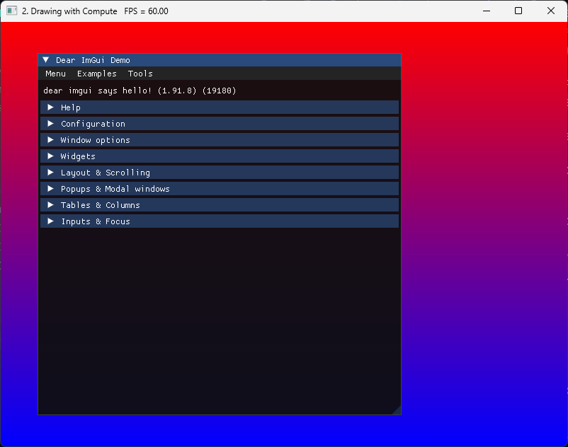

# Setting up IMGUI

As the engine grows, we need a way to have some interactable interface we can play with to add
sliders, buttons, and display data.

To do that, we are going to add the library **dear Imgui** to the project. This is a library
that makes it very easy to add windows and interfaces with sliders, buttons, editable text...
Without having to setup UI files or deal with a complex system.

<!-- ## Immediate GPU commands

:::warning[EDIT UNTIL FIXED]

This section of the article will be moved away, new version of imgui does not need immediate
commands to upload. We still need the immediate commands for later in the tutorial.

:::

Imgui will require us to run some commands outside of the normal draw loop. This is going to be
something we will need many times on the engine for different uses. We are going to implement
an `engine_immediate_submit` procedure, which uses a fence and a different command buffer from
the one we use on draws to send some commands to the GPU without syncronizing with swapchain or
with rendering logic.

Lets add those structures into the VulkanEngine class

```odin
Engine :: struct {
    // Immediate submission
    im_command_pool:   vk.CommandPool,
    im_command_buffer: vk.CommandBuffer,
    im_fence:          vk.Fence,
}

Immediate_Proc :: #type proc(engine: ^Engine, cmd: vk.CommandBuffer)

engine_immediate_submit :: proc(self: ^Engine, im_proc: Immediate_Proc) -> (ok: bool) {
    return true
}
```

We have a fence and a command buffer with its pool. The `engine_immediate_submit` procedure
takes an `Immediate_Proc` procedure as callback to call our commands. Add the
`engine_init_imgui()` procedure too, and add it at the end of the `engine_init()` chain of
procedure calls. Leave it empty for now.

We need to create those syncronization structures for immediate submit, so lets go into
`engine_init_commands()` procedure and hook the command part.

```odin
engine_init_commands :: proc(self: ^Engine) -> (ok: bool) {
    // Other code ---

    vk_check(
        vk.CreateCommandPool(self.vk_device, &command_pool_info, nil, &self.im_command_pool),
    ) or_return

    // Allocate the command buffer for immediate submits
    cmd_alloc_info := command_buffer_allocate_info(self.im_command_pool)
    vk_check(
        vk.AllocateCommandBuffers(self.vk_device, &cmd_alloc_info, &self.im_command_buffer),
    ) or_return

    deletion_queue_push(self.main_deletion_queue, self.im_command_pool)

    return true
}
```

This is the same we were doing with the per-frame commands, but this time we are directly
putting it into the deletion queue for cleanup.

Now we need to create the fence, which we are going to add to `engine_init_sync_structures()`.
Add it to the end

```odin
engine_init_sync_structures :: proc(self: ^Engine) -> (ok: bool) {
    // Other code ---

    vk_check(vk.CreateFence(self.vk_device, &fence_create_info, nil, &self.im_fence)) or_return

    deletion_queue_push(self.main_deletion_queue, self.im_fence)

    return true
}
```

We will use the same `fence_create_info` we were using for the per-frame fences. Same as with the
commands, we are directly adding its destroy procedure to the deletion queue too.

Now implement the `engine_immediate_submit` procedure.

```odin
engine_immediate_submit :: proc(self: ^Engine, im_proc: Immediate_Proc) -> (ok: bool) {
    vk_check(vk.ResetFences(self.vk_device, 1, &self.im_fence)) or_return
    vk_check(vk.ResetCommandBuffer(self.im_command_buffer, {})) or_return

    cmd := self.im_command_buffer

    cmd_begin_info := command_buffer_begin_info({.ONE_TIME_SUBMIT})

    vk_check(vk.BeginCommandBuffer(cmd, &cmd_begin_info)) or_return

    im_proc(self, cmd)

    vk_check(vk.EndCommandBuffer(cmd)) or_return

    cmd_info := command_buffer_submit_info(cmd)
    submit_info := submit_info(&cmd_info, nil, nil)

    // Submit command buffer to the queue and execute it.
    //  `render_fence` will now block until the graphic commands finish execution
    vk_check(vk.QueueSubmit2(self.graphics_queue, 1, &submit_info, self.im_fence)) or_return

    vk_check(vk.WaitForFences(self.vk_device, 1, &self.im_fence, true, 9999999999)) or_return

    return true
}
```

Note how this procedure is very similar and almost the same as the way we are executing
commands on the gpu.

Its close to the same thing, except we are not syncronizing the submit with the swapchain.

We will be using this procedure for data uploads and other "instant" operations outside of the
render loop. One way to improve it would be to run it on a different queue than the graphics
queue, and that way we could overlap the execution from this with the main render loop. -->

## IMGUI Setup

Lets now go with the imgui initialization.

We need to import some packages first at the top of `engine.odin` file.

```odin
// Libraries
import im "libs:imgui"
import im_glfw "libs:imgui/imgui_impl_glfw"
import im_vk "libs:imgui/imgui_impl_vulkan"
```

Its the main imgui package, and then the implementation for the GLFW and the vulkan backends.

Now to the initialization procedure.

```odin
engine_init_imgui :: proc(self: ^Engine) -> (ok: bool) {
    im.CHECKVERSION()

    // 1: create descriptor pool for IMGUI
    // The size of the pool is very oversize, but it's copied from imgui demo itself.
    pool_sizes := []vk.DescriptorPoolSize {
        {.SAMPLER, 1000},
        {.COMBINED_IMAGE_SAMPLER, 1000},
        {.SAMPLED_IMAGE, 1000},
        {.STORAGE_IMAGE, 1000},
        {.UNIFORM_TEXEL_BUFFER, 1000},
        {.STORAGE_TEXEL_BUFFER, 1000},
        {.UNIFORM_BUFFER, 1000},
        {.STORAGE_BUFFER, 1000},
        {.UNIFORM_BUFFER_DYNAMIC, 1000},
        {.STORAGE_BUFFER_DYNAMIC, 1000},
        {.INPUT_ATTACHMENT, 1000},
    }

    pool_info := vk.DescriptorPoolCreateInfo {
        sType         = .DESCRIPTOR_POOL_CREATE_INFO,
        flags         = {.FREE_DESCRIPTOR_SET},
        maxSets       = 1000,
        poolSizeCount = u32(len(pool_sizes)),
        pPoolSizes    = raw_data(pool_sizes),
    }

    imgui_pool: vk.DescriptorPool
    vk_check(vk.CreateDescriptorPool(self.vk_device, &pool_info, nil, &imgui_pool)) or_return

    // This initializes the core structures of imgui
    im.create_context()
    defer if !ok {im.destroy_context()}

    // This initializes imgui for GLFW
    im_glfw.init_for_vulkan(self.window, true) or_return
    defer if !ok {im_glfw.shutdown()}

    // This initializes imgui for Vulkan
    init_info := im_vk.Init_Info {
        instance = self.vk_instance,
        physical_device = self.vk_physical_device,
        device = self.vk_device,
        queue = self.graphics_queue,
        descriptor_pool = imgui_pool,
        min_image_count = 3,
        image_count = 3,
        use_dynamic_rendering = true,
        pipeline_rendering_create_info = {
            sType = .PIPELINE_RENDERING_CREATE_INFO,
            colorAttachmentCount = 1,
            pColorAttachmentFormats = &self.swapchain_format,
        },
        msaa_samples = ._1,
    }

    im_vk.load_functions(
        proc "c" (function_name: cstring, user_data: rawptr) -> vk.ProcVoidFunction {
            engine := cast(^Engine)user_data
            return vk.GetInstanceProcAddr(engine.vk_instance, function_name)
        },
        self,
    ) or_return

    im_vk.init(&init_info) or_return
    defer if !ok {im_vk.shutdown()}

    // Remember the LIFO queue, make sure the order of push is correct
    deletion_queue_push(self.main_deletion_queue, imgui_pool)
    deletion_queue_push(self.main_deletion_queue, im_vk.shutdown)
    deletion_queue_push(self.main_deletion_queue, im_glfw.shutdown)

    return true
}
```

Call this procedure at the end of `engine_init()`, after `engine_init_pipelines();` This code
is adapted from the imgui demos. We first need to create some structures that imgui wants, like
its own descriptor pool. The descriptor pool here is storing data for 1000 of a lot of
different types of descriptors, so its a bit overkill. It wont be a problem, just slightly less
efficient space-wise.

We then call `im.create_context()` , `im_glfw.init_for_vulkan`, and `im_vk.init`. These
procedures will initialize the different parts of imgui we need. On the vulkan one, we need to
hook a few things, like our device, instance, queue. Note that before we can use anything from
`im_vk` we need to load the Vulkan functions first using `im_vk.load_functions`.

One important one is that we need to set `use_dynamic_rendering` to `true`, and set
`pColorAttachmentFormats` to our swapchain format, this is because we wont be using vulkan
render-passes but Dynamic Rendering instead. And unlike with the compute shader, we are going
to draw dear imgui directly into the swapchain.

Last, we add cleanup code into the destruction queue.

## IMGUI render loop

ImGui is initialized now, but we need to hook it into the rendering loop.

First thing we have to do is to add its code into the `engine_run()` procedure.

```odin
// Run main loop.
@(require_results)
engine_run :: proc(self: ^Engine) -> (ok: bool) {
    // Other code ---

    loop: for !glfw.WindowShouldClose(self.window) {
        // Other code ---

        // Do not draw if we are minimized
        if self.stop_rendering {
            glfw.WaitEvents() // Wait to avoid endless spinning
            continue loop
        }

        // ImGUi new frame
        im_glfw.new_frame()
        im_vk.new_frame()
        im.new_frame()

        // Some ImGUi UI to test
        im.show_demo_window()

        // Make ImGUi calculate internal draw structures
        im.render()

        engine_draw(self) or_return
    }

    log.info("Exiting...")

    return true
}
```

We need to call the 3 procedures for a new frame on imgui. Once that is done, we can now do our
UI commands. We are going to leave it on the demo window for now. When we call `im.render()`,
that calculates the vertices/draws/etc that imgui requires to draw the frame, but it does not
do any drawing on its own. To draw it we will continue it from within our `engine_draw()`
procedure.

## Dynamic Rendering

Imgui will draw using actual gpu draws with meshes and shaders, it will not do a compute draw
like we are doing at the moment. To draw geometry, it needs to be done withing a renderpass.
But we are not using renderpasses as we will use dynamic rendering, a vulkan 1.3 feature.
Instead of calling `vk.CmdBeginRenderpass`, and giving it a VkRenderPass object, we call
VkBeginRendering, with a `vk.RenderingInfo` that contains the settings needed for the images to
draw into.

The `vk.RenderingInfo` points into multiple `vk.RenderingAttachmentInfo` for our target images to
draw into, so lets begin writing that one into the initializers.

```odin title="initializers.odin"
attachment_info :: proc(
    view: vk.ImageView,
    clear: ^vk.ClearValue,
    layout: vk.ImageLayout = .COLOR_ATTACHMENT_OPTIMAL,
) -> vk.RenderingAttachmentInfo {
    colorAttachment := vk.RenderingAttachmentInfo {
        sType       = .RENDERING_ATTACHMENT_INFO,
        imageView   = view,
        imageLayout = layout,
        loadOp      = clear != nil ? .CLEAR : .LOAD,
        storeOp     = .STORE,
    }
    if clear != nil {
        colorAttachment.clearValue = clear^
    }
    return colorAttachment
}
```

For our attachment info, we will have clear value as an optional pointer, that way we can
either do a clear or skip it and load the image.

We need to hook imageview and layout as usual with all these rendering commands. The important
part is the loadOP and storeOP. This controls what happens to the render target in this
attachment when its used within a renderpass (both dynamic one and class renderpass). For load
options, we have LOAD, which will keep the data in that image. Clear which will set it to our
clear value at the start, and dont-care where we plan to replace every pixel and thus the gpu
can skip loading it from memory.

For our store op, we are going to use store hardcoded, as we will want our draw commands to be
saved.

With the attachment info done, we can make the `vk.RenderingInfo`. Add a new procedure
`engine_draw_imgui()` to draw a renderpass that renders imgui.

```odin
engine_draw_imgui :: proc(
    self: ^Engine,
    cmd: vk.CommandBuffer,
    target_view: vk.ImageView,
) -> (
    ok: bool,
) {
    color_attachment := attachment_info(target_view, nil, .GENERAL)
    render_info := rendering_info(self.vkb.swapchain.extent, &color_attachment, nil)

    vk.CmdBeginRendering(cmd, &render_info)

    im_vk.render_draw_data(im.get_draw_data(), cmd)

    vk.CmdEndRendering(cmd)

    return
}
```

We are going to take a render extent to setup a rectangle of pixels to draw, and we will send a
color attachment and a depth attachment. We dont need the depth attachment right now, thats for
later.

Then we need to call it from our `engine_draw()` procedure.

```odin
// Execute a copy from the draw image into the swapchain
copy_image_to_image(
    cmd,
    self.draw_image.image,
    self.swapchain_images[frame.swapchain_image_index],
    self.draw_extent,
    self.vkb.swapchain.extent,
)

// Set swapchain image layout to Attachment Optimal so we can draw it
transition_image(
    cmd,
    self.swapchain_images[frame.swapchain_image_index],
    .TRANSFER_DST_OPTIMAL,
    .COLOR_ATTACHMENT_OPTIMAL,
)

// Draw imgui into the swapchain image
engine_draw_imgui(self, cmd, self.swapchain_image_views[frame.swapchain_image_index])

// Set swapchain image layout to Present so we can show it on the screen
transition_image(
    cmd,
    self.swapchain_images[frame.swapchain_image_index],
    .COLOR_ATTACHMENT_OPTIMAL,
    .PRESENT_SRC_KHR,
)

// Finalize the command buffer (we can no longer add commands, but it can now be executed)
vk_check(vk.EndCommandBuffer(cmd)) or_return
```

That `copy_image_to_image` command is the same as before, we are replacing the later commands
until the end of the `vk.EndCommandBuffer` call.

Before, we were transitioning the swapchain image from transfer layout into present layout, but
now we are going to change it into `.COLOR_ATTACHMENT_OPTIMAL` instead. This is the layout you
should be using whenever you are calling rendering commands like in here.

After that, we build the VkRenderingInfo and send a single color attachment to it. That color
attachment will point to the swapchain image we target.

Now that we have a `vk.RenderInfo`, we can call `vk.CmdBeginRendering`, this begins a render
pass, and we can now execute draw commands. We call into the imgui vulkan backend with our
command buffer, which will make imgui record its draw commands into the buffer. Once that is
done, we can call `vk.CmdEndRendering` to end the render pass.

After that, we transition the swapchain image from attachment-optimal into present mode, and
can finally end the command buffer.

If you run the application at this point, you will have the imgui demo window you can play
around with.



Lets continue and hook our new debug UI to the shaders.
