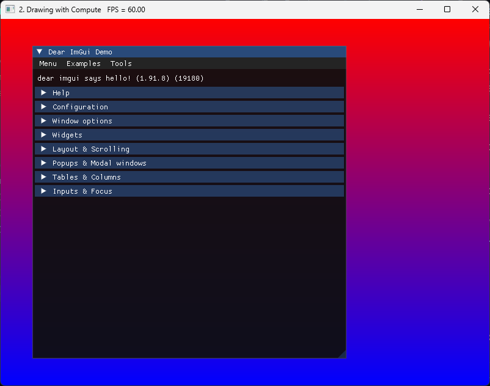

# Setting up IMGUI

As the engine grows, we need a way to have some interactable interface we can play with to add
sliders, buttons, and display data.

To do that, we are going to add the library **dear Imgui** to the project. This is a library
that makes it very easy to add windows and interfaces with sliders, buttons, editable text...
Without having to setup UI files or deal with a complex system.

## IMGUI Setup

Lets now go with the imgui initialization.

We need to import some packages first at the top of `engine.odin` file.

```odin title="engine.odin"
// Local packages
import "libs:vkb"
import "libs:vma"
// highlight-start
import im "libs:imgui"
import im_glfw "libs:imgui/backends/glfw"
import im_vk "libs:imgui/backends/vulkan"
// highlight-end
```

Its the main imgui package, and then the implementation for the GLFW and the vulkan backends.

Now to the initialization procedure.

```odin title="engine.odin"
engine_init_imgui :: proc(self: ^Engine) -> (ok: bool) {
    im.CHECKVERSION()

    // 1: create descriptor pool for IMGUI
    // The size of the pool is very oversize, but it's copied from imgui demo itself.
    pool_sizes := []vk.DescriptorPoolSize {
        {.SAMPLER, 1000},
        {.COMBINED_IMAGE_SAMPLER, 1000},
        {.SAMPLED_IMAGE, 1000},
        {.STORAGE_IMAGE, 1000},
        {.UNIFORM_TEXEL_BUFFER, 1000},
        {.STORAGE_TEXEL_BUFFER, 1000},
        {.UNIFORM_BUFFER, 1000},
        {.STORAGE_BUFFER, 1000},
        {.UNIFORM_BUFFER_DYNAMIC, 1000},
        {.STORAGE_BUFFER_DYNAMIC, 1000},
        {.INPUT_ATTACHMENT, 1000},
    }

    pool_info := vk.DescriptorPoolCreateInfo {
        sType         = .DESCRIPTOR_POOL_CREATE_INFO,
        flags         = {.FREE_DESCRIPTOR_SET},
        maxSets       = 1000,
        poolSizeCount = u32(len(pool_sizes)),
        pPoolSizes    = raw_data(pool_sizes),
    }

    imgui_pool: vk.DescriptorPool
    vk_check(vk.CreateDescriptorPool(self.vk_device, &pool_info, nil, &imgui_pool)) or_return

    // This initializes the core structures of imgui
    im.CreateContext()
    defer if !ok {im.DestroyContext()}

    // This initializes imgui for GLFW
    im_glfw.InitForVulkan(self.window, install_callbacks = true) or_return
    defer if !ok {im_glfw.Shutdown()}

    // This initializes imgui for Vulkan
    pipeline_info := im_vk.PipelineInfo {
        PipelineRenderingCreateInfo = {
            sType                   = .PIPELINE_RENDERING_CREATE_INFO,
            colorAttachmentCount    = 1,
            pColorAttachmentFormats = &self.swapchain_format,
        },
        MSAASamples = {._1},
    }

    // This initializes imgui for Vulkan
    init_info := im_vk.InitInfo {
        ApiVersion          = self.vkb.instance.api_version,
        Instance            = self.vk_instance,
        PhysicalDevice      = self.vk_physical_device,
        Device              = self.vk_device,
        Queue               = self.graphics_queue,
        DescriptorPool      = imgui_pool,
        MinImageCount       = 3,
        ImageCount          = 3,
        UseDynamicRendering = true,
        PipelineInfoMain    = pipeline_info,
    }

    im_vk.LoadFunctions(
        self.vkb.instance.api_version,
        proc "c" (function_name: cstring, user_data: rawptr) -> vk.ProcVoidFunction {
            engine := cast(^Engine)user_data
            return vk.GetInstanceProcAddr(engine.vk_instance, function_name)
        },
        self,
    ) or_return

    im_vk.Init(&init_info) or_return
    defer if !ok {im_vk.Shutdown()}

    // Remember the LIFO queue, make sure the order of push is correct
    deletion_queue_push(&self.main_deletion_queue, imgui_pool)
    deletion_queue_push(&self.main_deletion_queue, im_vk.Shutdown)
    deletion_queue_push(&self.main_deletion_queue, im_glfw.Shutdown)

    return true
}
```

Call this procedure at the end of `engine_init()`, after `engine_init_pipelines();` This code
is adapted from the imgui demos. We first need to create some structures that imgui wants, like
its own descriptor pool. The descriptor pool here is storing data for 1000 of a lot of
different types of descriptors, so its a bit overkill. It wont be a problem, just slightly less
efficient space-wise.

We then call `im.CreateContext()` , `im_glfw.InitForVulkan`, and `im_vk.Init`. These
procedures will initialize the different parts of imgui we need. On the vulkan one, we need to
hook a few things, like our device, instance, queue.

:::warning[function pointers]

Note that before using any procedure from `im_vk`, we need to load the Vulkan functions using
`im_vk.load_functions`. This step ensures that the required function pointers are available for
ImGui to use, similar to what we did previously for **VMA**.

:::

One important one is that we need to set `UseDynamicRendering` to `true`, and set
`pColorAttachmentFormats` to our swapchain format, this is because we wont be using vulkan
render-passes but Dynamic Rendering instead. And unlike with the compute shader, we are going
to draw dear imgui directly into the swapchain.

Last, we add cleanup code into the destruction queue.

## IMGUI render loop

ImGui is initialized now, but we need to hook it into the rendering loop.

First thing we have to do is to add its code into the `engine_run()` procedure.

```odin title="engine.odin"
// Run main loop.
@(require_results)
engine_run :: proc(self: ^Engine) -> (ok: bool) {
    log.info("Entering main loop...")

    loop: for !glfw.WindowShouldClose(self.window) {
        glfw.PollEvents()

        // Do not draw if we are minimized
        if self.stop_rendering {
            glfw.WaitEvents() // Wait to avoid endless spinning
            continue loop
        }

        // ImGUi new frame
        im_glfw.NewFrame()
        im_vk.NewFrame()
        im.NewFrame()

        // Some ImGUi UI to test
        im.ShowDemoWindow()

        // Make ImGUi calculate internal draw structures
        im.Render()

        engine_draw(self) or_return
    }

    log.info("Exiting...")

    return true
}
```

We need to call the 3 procedures for a new frame on imgui. Once that is done, we can now do our
UI commands. We are going to leave it on the demo window for now. When we call `im.Render()`,
that calculates the vertices/draws/etc that imgui requires to draw the frame, but it does not
do any drawing on its own. To draw it we will continue it from within our `engine_draw()`
procedure.

## Dynamic Rendering

Imgui will draw using actual gpu draws with meshes and shaders, it will not do a compute draw
like we are doing at the moment. To draw geometry, it needs to be done withing a renderpass.
But we are not using renderpasses as we will use dynamic rendering, a vulkan 1.3 feature.
Instead of calling `vk.CmdBeginRenderpass`, and giving it a VkRenderPass object, we call
VkBeginRendering, with a `vk.RenderingInfo` that contains the settings needed for the images to
draw into.

The `vk.RenderingInfo` points into multiple `vk.RenderingAttachmentInfo` for our target images
to draw into, so lets see that one into the initializers.

```odin title="initializers.odin"
attachment_info :: proc(
    view: vk.ImageView,
    clear: ^vk.ClearValue,
    layout: vk.ImageLayout = .COLOR_ATTACHMENT_OPTIMAL,
) -> vk.RenderingAttachmentInfo {
    colorAttachment := vk.RenderingAttachmentInfo {
        sType       = .RENDERING_ATTACHMENT_INFO,
        imageView   = view,
        imageLayout = layout,
        loadOp      = clear != nil ? .CLEAR : .LOAD,
        storeOp     = .STORE,
    }
    if clear != nil {
        colorAttachment.clearValue = clear^
    }
    return colorAttachment
}
```

For our attachment info, we will have clear value as an optional pointer, that way we can
either do a clear or skip it and load the image.

We need to hook imageview and layout as usual with all these rendering commands. The important
part is the loadOP and storeOP. This controls what happens to the render target in this
attachment when its used within a renderpass (both dynamic one and class renderpass). For load
options, we have LOAD, which will keep the data in that image. Clear which will set it to our
clear value at the start, and dont-care where we plan to replace every pixel and thus the gpu
can skip loading it from memory.

For our store op, we are going to use store hardcoded, as we will want our draw commands to be
saved.

With the attachment info done, we can make the `vk.RenderingInfo`. Add a new procedure
`engine_draw_imgui()` to draw a renderpass that renders imgui.

```odin title="engine.odin"
engine_draw_imgui :: proc(
    self: ^Engine,
    cmd: vk.CommandBuffer,
    target_view: vk.ImageView,
) -> (
    ok: bool,
) {
    color_attachment := attachment_info(target_view, nil, .COLOR_ATTACHMENT_OPTIMAL)
    render_info := rendering_info(self.swapchain_extent, &color_attachment, nil)

    vk.CmdBeginRendering(cmd, &render_info)

    im_vk.RenderDrawData(im.GetDrawData(), cmd)

    vk.CmdEndRendering(cmd)

    return
}
```

We are going to take a render extent to setup a rectangle of pixels to draw, and we will send a
color attachment and a depth attachment. We dont need the depth attachment right now, thats
for later.

:::note[Image layout]

The layout here is `.COLOR_ATTACHMENT_OPTIMAL`, not `.GENERAL` like our compute pass used.
`vk.CmdBeginRendering` requires the image to actually be in the layout you declare. Skipping
this causes a validation error, since the image's tracked layout won't match what we told
`vk.CmdBeginRendering` to expect.

:::

Then we need to call it from our `engine_draw()` procedure.

```odin title="engine.odin"
// Execute a copy from the draw image into the swapchain
copy_image_to_image(
    cmd,
    self.draw_image.image,
    self.swapchain_images[frame.swapchain_image_index],
    self.draw_extent,
    self.swapchain_extent,
)

// Set swapchain image layout to Attachment Optimal so we can draw it
transition_image(
    cmd,
    self.swapchain_images[frame.swapchain_image_index],
    .TRANSFER_DST_OPTIMAL,
    .COLOR_ATTACHMENT_OPTIMAL,
)

// highlight-start
// Draw imgui into the swapchain image
engine_draw_imgui(self, cmd, self.swapchain_image_views[swapchain_image_index])
// highlight-end

// Set swapchain image layout to Present so we can show it on the screen
transition_image(
    cmd,
    self.swapchain_images[frame.swapchain_image_index],
    .COLOR_ATTACHMENT_OPTIMAL,
    .PRESENT_SRC_KHR,
)

// Finalize the command buffer (we can no longer add commands, but it can now be executed)
vk_check(vk.EndCommandBuffer(cmd)) or_return
```

That `copy_image_to_image` command is the same as before, we are replacing the later commands
until the end of the `vk.EndCommandBuffer` call.

Before, we were transitioning the swapchain image from transfer layout into present layout, but
now we are going to change it into `.COLOR_ATTACHMENT_OPTIMAL` instead. This is the layout you
should be using whenever you are calling rendering commands like in here.

After that, we build the VkRenderingInfo and send a single color attachment to it. That color
attachment will point to the swapchain image we target.

Now that we have a `vk.RenderInfo`, we can call `vk.CmdBeginRendering`, this begins a render
pass, and we can now execute draw commands. We call into the imgui vulkan backend with our
command buffer, which will make imgui record its draw commands into the buffer. Once that is
done, we can call `vk.CmdEndRendering` to end the render pass.

After that, we transition the swapchain image from attachment-optimal into present mode, and
can finally end the command buffer.

If you run the application at this point, you will have the imgui demo window you can play
around with.



Lets continue and hook our new debug UI to the shaders.
