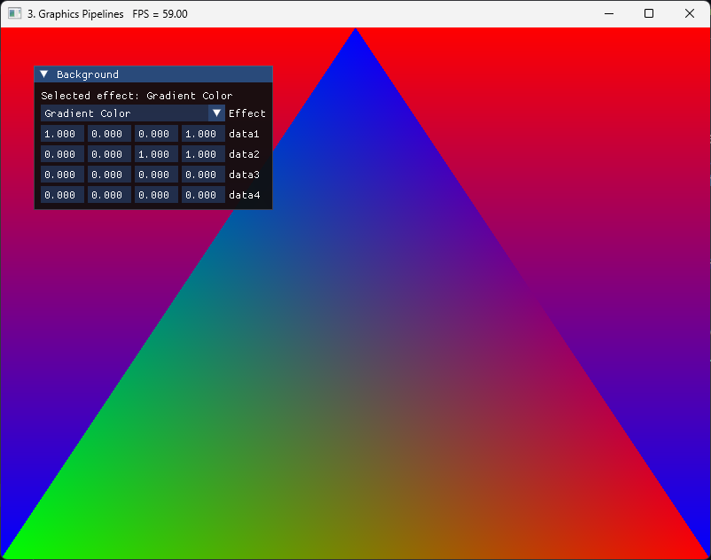

# Setting up render pipeline

## `vk.GraphicsPipelineCreateInfo`

Building a graphics pipeline is a far more involved task than building a compute pipeline. With
the compute pipeline, we only needed a single shader module and pipeline layout, so there was
no need of an abstraction layer. But graphics pipelines contain a considerable amount of
options, and without a way to simplify it, creating them can be considerably complicated.

For that reason, we will be creating a PipelineBuilder structure, that keeps track of all those
options, and will offer some simpler procedures to enable/disable features we want, keeping as
much defaulted as possible. A lot of those options are things that we wont be using on the
tutorial, so trying to reduce the area will be useful.

Some of the options on a pipeline can be set to be dynamic, which means we will set those
options when binding the pipeline and recording draw commands. For example we will put viewport
as dynamic, as if we had it "baked in", we would need to create new pipelines if we wanted to
change the resolution of our rendering.

Before writing the builder, lets look at what we will need to fill. In the same way creating a
compute pipeline required a `vk.ComputePipelineCreateInfo`, a graphics one is a
`vk.GraphicsPipelineCreateInfo` structure.

```odin
GraphicsPipelineCreateInfo :: struct {
    sType:               StructureType,
    pNext:               rawptr,
    flags:               PipelineCreateFlags,
    stageCount:          u32,
    pStages:             [^]PipelineShaderStageCreateInfo,
    pVertexInputState:   ^PipelineVertexInputStateCreateInfo,
    pInputAssemblyState: ^PipelineInputAssemblyStateCreateInfo,
    pTessellationState:  ^PipelineTessellationStateCreateInfo,
    pViewportState:      ^PipelineViewportStateCreateInfo,
    pRasterizationState: ^PipelineRasterizationStateCreateInfo,
    pMultisampleState:   ^PipelineMultisampleStateCreateInfo,
    pDepthStencilState:  ^PipelineDepthStencilStateCreateInfo,
    pColorBlendState:    ^PipelineColorBlendStateCreateInfo,
    pDynamicState:       ^PipelineDynamicStateCreateInfo,
    layout:              PipelineLayout,
    renderPass:          RenderPass,
    subpass:             u32,
    basePipelineHandle:  Pipeline,
    basePipelineIndex:   i32,
}
```

Spec page for graphics pipeline can be found here, which can be used to check things in detail.

* [VkGraphicsPipelineCreateInfo](https://registry.khronos.org/vulkan/specs/1.3-extensions/html/chap10.html#VkGraphicsPipelineCreateInfo)

`stageCount` and `pStages` contains the ShaderStageCreateInfo that will contain the shader
modules for the different stages on the pipeline. We will be sending here our fragment shader
and vertex shader.

`vk.PipelineVertexInputStateCreateInfo` contains the configuration for vertex attribute input
with vertex buffers. If we configure this correctly, our vertex shader will get vertex
properties as input in an optimal way. But we will not be using this, as we are just going to
send a data array to the shader and index it ourselves, which allows techniques that improve
performance and allows more complicated vertex formats that compress data. This is generally
known as "vertex pulling", and even if you are doing equivalent thing as the fixed-hardware
vertex input, on modern gpus it will perform about the same.

`vk.PipelineInputAssemblyStateCreateInfo` contains the configuration for triangle topology. We
use this to set the pipeline to draw triangles, points, or lines.

`vk.PipelineTessellationStateCreateInfo` is configuration for fixed tesellation. We will not be
using this and will leave it as null.

`vk.PipelineViewportStateCreateInfo` contains information about the viewport the pixels will be
rendered into. This lets you set what region of pixels will the pipeline draw. We will default
it, because we will be using dynamic state for this.

`vk.PipelineRasterizationStateCreateInfo` has the information on how exactly do the triangles
get rasterized between the vertex shader and the fragment shader. It has options for depth bias
(used when rendering shadows), toggling between wireframe and solid rendering, and the
configuration for drawing or skipping backfaces.

`vk.PipelineMultisampleStateCreateInfo` lets us configure Multi Sample antialiasing. Thats a
way of improving the antialiasing of our rendering by rasterizing the fragments more times at
triangle edges. We will default it to no antialiasing, but we will look into using it later.

`vk.PipelineDepthStencilStateCreateInfo` contains the depth-testing and stencil configuration.

`vk.PipelineColorBlendStateCreateInfo` has the color blending and attachment write information.
Its used to make triangles transparent or other blending configurations.

`vk.PipelineDynamicStateCreateInfo` configures dynamic state. One great downside that vulkan
pipelines have is that their configuration is "hardcoded" at creation. So if we want to do
things like toggle depth-testing on and off, we will need 2 pipelines. It even hardcodes
viewport, so if we want to change the size of our render targets, we will also need to rebuild
all pipelines. Building pipelines is a very expensive operation, and we want to minimize the
number of pipelines used as its critical for performance. For that reason, some of the state of
a vulkan pipeline can be set as dynamic, and then the configuration option can be modified at
runtime when recording commands. What dynamic state is supported by a given gpu depends on gpu
vendor, driver version, and other variables. We will be using dynamic state for our viewport
and scissor configuration, as almost all GPUs support that one, and it removes the need to
hardcode the draw image resolution when building the pipelines.

The VkGraphicsPipelineCreateInfo takes a VkPipelineLayout that is the same one used when
building compute pipelines.

It also takes a VkRenderPass and subpass index. We will not be using that because we use
dynamic rendering, so all systems related to VkRenderPass will be completely skipped. Instead,
we need to extend the VkGraphicsPipelineCreateInfo with a `vk.PipelineRenderingCreateInfo`
added into its pNext chain. This structure holds a list of the attachment formats the pipeline
will use.

## Pipeline Builder

Lets begin writing the builder. All pipeline code will be on `pipelines.odin`. You can find
it on the shared folder if you are checking the chapter code.

```odin
// Core
import sa "core:container/small_array"

MAX_SHADER_STAGES :: #config(MAX_SHADER_STAGES, 8)

Shader_Stages :: sa.Small_Array(MAX_SHADER_STAGES, vk.PipelineShaderStageCreateInfo)

Pipeline_Builder :: struct {
    shader_stages:           Shader_Stages,
    input_assembly:          vk.PipelineInputAssemblyStateCreateInfo,
    rasterizer:              vk.PipelineRasterizationStateCreateInfo,
    color_blend_attachment:  vk.PipelineColorBlendAttachmentState,
    multisampling:           vk.PipelineMultisampleStateCreateInfo,
    pipeline_layout:         vk.PipelineLayout,
    depth_stencil:           vk.PipelineDepthStencilStateCreateInfo,
    render_info:             vk.PipelineRenderingCreateInfo,
    color_attachment_format: vk.Format,
    tessellation_state:      vk.PipelineTessellationStateCreateInfo,
    base_pipeline:           vk.Pipeline,
    base_pipeline_index:     i32,
    flags:                   vk.PipelineCreateFlags,
    allocator:               runtime.Allocator,
}
```

The pipeline builder will hold most of the state we need to track of. The actual CreateInfo
structure will be fully filled from the `pipeline_builder_build()` procedure. But first, we
need to initialize a builder with some defaults. We have a `pipeline_builder_clear()` procedure
that will set everything into empty/default properties. The `pipeline_builder_create_default`
just returns a builder with the same defaults.

Lets write that `pipeline_builder_clear()` procedure first.

```odin
pipeline_builder_clear :: proc(self: ^Pipeline_Builder) {
    assert(self != nil)

    self.input_assembly = {
        sType = .PIPELINE_INPUT_ASSEMBLY_STATE_CREATE_INFO,
    }

    self.rasterizer = {
        sType = .PIPELINE_RASTERIZATION_STATE_CREATE_INFO,
    }

    self.multisampling = {
        sType = .PIPELINE_MULTISAMPLE_STATE_CREATE_INFO,
    }

    self.depth_stencil = {
        sType = .PIPELINE_DEPTH_STENCIL_STATE_CREATE_INFO,
    }

    self.render_info = {
        sType = .PIPELINE_RENDERING_CREATE_INFO,
    }

    self.tessellation_state = {
        sType = .PIPELINE_TESSELLATION_STATE_CREATE_INFO,
    }

    sa.clear(&self.shader_stages)
    self.pipeline_layout = {}
    self.base_pipeline = {}
    self.base_pipeline_index = -1
    self.flags = {}
}

pipeline_builder_create_default :: proc() -> (builder: Pipeline_Builder) {
    pipeline_builder_clear(&builder)
    return
}
```

We will set the `sType` of every structure here, and leave everything else as 0.

Lets begin writing the `pipeline_builder_build` procedure. first we will begin by setting some
of the Info structures we are missing because they wont be configured.

```odin
pipeline_builder_build :: proc(
    self: ^Pipeline_Builder,
    device: vk.Device,
) -> (
    pipeline: vk.Pipeline,
    ok: bool,
) #optional_ok {
    // Make viewport state from our stored viewport and scissor.
    // At the moment we wont support multiple viewports or scissors
    viewport_state := vk.PipelineViewportStateCreateInfo {
        sType         = .PIPELINE_VIEWPORT_STATE_CREATE_INFO,
        viewportCount = 1,
        scissorCount  = 1,
    }

    // Setup dummy color blending. We arent using transparent objects yet,
    // the blending is just "no blend", but we do write to the color attachment
    color_blending := vk.PipelineColorBlendStateCreateInfo {
        sType           = .PIPELINE_COLOR_BLEND_STATE_CREATE_INFO,
        logicOpEnable   = false,
        logicOp         = .COPY,
        attachmentCount = 1,
        pAttachments    = &self.color_blend_attachment,
    }

    // Completely clear `VertexInputStateCreateInfo`, as we have no need for it
    vertex_input_info := vk.PipelineVertexInputStateCreateInfo {
        sType = .PIPELINE_VERTEX_INPUT_STATE_CREATE_INFO,
    }

    dynamic_states := [?]vk.DynamicState{.VIEWPORT, .SCISSOR}
    dynamic_info := vk.PipelineDynamicStateCreateInfo {
        sType             = .PIPELINE_DYNAMIC_STATE_CREATE_INFO,
        pDynamicStates    = raw_data(dynamic_states[:]),
        dynamicStateCount = u32(len(dynamic_states)),
      }

    return pipeline, true
}
```

We first fill `vk.PipelineViewportStateCreateInfo` with just viewport count and nothing else.
With dynamic viewport state we dont need to fill the viewport or stencil options here.

Then we fill `vk.PipelineColorBlendStateCreateInfo` with some default options for logic
blending (we wont use it), and hook the `vk.PipelineColorBlendAttachmentState` for the blending
options for a single attachment. We only support rendering to one attachment here, so this is
fine. It can be made into an array of `vk.PipelineColorBlendAttachmentState` if drawing to
multiple attachments is needed.

Setting up dynamic state is just filling a `vk.PipelineDynamicStateCreateInfo` with an array of
`vk.DynamicState` enums. We will use these 2 for now.

To connect all of the configuration structures we have on the builder, lets begin filling the
`vk.GraphicsPipelineCreateInfo` and add `render_info` into the `pNext` of the graphics pipeline
info itself.

```odin
// Build the actual pipeline.
// We now use all of the info structs we have been writing into into this one
// to create the pipeline.
pipeline_info := vk.GraphicsPipelineCreateInfo {
    sType               = .GRAPHICS_PIPELINE_CREATE_INFO,
    // Connect the renderInfo to the pNext extension mechanism
    pNext               = &self.render_info,
    flags               = self.flags,
    stageCount          = u32(sa.len(self.shader_stages)),
    pStages             = raw_data(sa.slice(&self.shader_stages)),
    pVertexInputState   = &vertex_input_info,
    pInputAssemblyState = &self.input_assembly,
    pTessellationState  = &self.tessellation_state,
    pViewportState      = &viewport_state,
    pRasterizationState = &self.rasterizer,
    pMultisampleState   = &self.multisampling,
    pDepthStencilState  = &self.depth_stencil,
    pColorBlendState    = &color_blending,
    pDynamicState       = &dynamic_info,
    layout              = self.pipeline_layout,
    basePipelineHandle  = self.base_pipeline,
    basePipelineIndex   = self.base_pipeline_index,
}
```

This is all we needed for the pipeline, so we can finally call the create procedure.

```odin
vk_check(
    vk.CreateGraphicsPipelines(device, 0, 1, &pipeline_info, nil, &pipeline),
    "Failed to create pipeline",
) or_return
```

And thats it with the main creation procedure. We now need to actually set the options
properly, as right now the entire pipeline is essentially null, which will error as-is due to
missing options.

```odin
pipeline_builder_add_shader :: proc(
    self: ^Pipeline_Builder,
    shader: vk.ShaderModule,
    stage: vk.ShaderStageFlags,
    entry_point: cstring = "main",
) {
    create_info := pipeline_shader_stage_create_info(stage, shader, entry_point)
    sa.push(&self.shader_stages, create_info)
}

pipeline_builder_set_shaders :: proc(
    self: ^Pipeline_Builder,
    vertex_shader, fragment_shader: vk.ShaderModule,
) {
    pipeline_builder_add_shader(self, vertex_shader, {.VERTEX})
    pipeline_builder_add_shader(self, fragment_shader, {.FRAGMENT})
}
```

We begin by adding a procedure to set the vertex and fragment shaders. We add them into the
`shader_stages` array with the proper info creation, which we already had from building the
compute pipeline.

Next we add a procedure to set input topology.

```odin
pipeline_builder_set_input_topology :: proc(
    self: ^Pipeline_Builder,
    topology: vk.PrimitiveTopology,
    primitive_restart_enable: bool = false,
) {
    self.input_assembly.topology = topology
    // we are not going to use primitive restart on the entire tutorial so leave it on false
    self.input_assembly.primitiveRestartEnable = b32(primitive_restart_enable)
}
```

`vk.PrimitiveTopology` has the options for `TRIANGLE_LIST`, `POINT_LIST`, and so on.
PrimitiveRestart is used for triangle strips and line strips, but we dont use it.

The rasterizer state is a big one so we will split it on a few options.

```odin
pipeline_builder_set_polygon_mode :: proc(
    self: ^Pipeline_Builder,
    polygon_mode: vk.PolygonMode,
    line_width: f32 = 1.0,
) {
    self.rasterizer.polygonMode = polygon_mode
    self.rasterizer.lineWidth = line_width
}
```

We need to have lineWidth as 1.f as default, then we set the polygon mode, which controls
wireframe vs solid rendering and point rendering.

```odin
pipeline_builder_set_cull_mode :: proc(
    self: ^Pipeline_Builder,
    cull_mode: vk.CullModeFlags,
    front_face: vk.FrontFace,
) {
    self.rasterizer.cullMode = cull_mode
    self.rasterizer.frontFace = front_face
}
```

Cull mode will set the front face and the cull mode for backface culling.

Next is setting the multisample state. We will default the structure to multisampling disabled.
Later we can add other procedures for enabling different multisampling levels for antialiasing

```odin
pipeline_builder_set_multisampling :: proc(
    self: ^Pipeline_Builder,
    rasterization_samples: vk.SampleCountFlags,
    min_sample_shading: f32 = 1.0,
    sample_mask: ^vk.SampleMask = nil,
    alpha_to_coverage_enable: bool = false,
    alpha_to_one_enable: bool = false,
) {
    self.multisampling.rasterizationSamples = rasterization_samples
    self.multisampling.sampleShadingEnable = min_sample_shading < 1.0
    self.multisampling.minSampleShading = min_sample_shading
    self.multisampling.pSampleMask = sample_mask
    self.multisampling.alphaToCoverageEnable = b32(alpha_to_coverage_enable)
    self.multisampling.alphaToOneEnable = b32(alpha_to_one_enable)
}

pipeline_builder_set_multisampling_none :: proc(self: ^Pipeline_Builder) {
    pipeline_builder_set_multisampling(self, {._1})
}
```

Next we will add a procedure for blending mode.

```odin
pipeline_builder_set_blend_state :: proc(
    self: ^Pipeline_Builder,
    blend_enable: bool,
    src_color_blend: vk.BlendFactor,
    dst_color_blend: vk.BlendFactor,
    color_blend_op: vk.BlendOp,
    src_alpha_blend: vk.BlendFactor,
    dst_alpha_blend: vk.BlendFactor,
    alpha_blend_op: vk.BlendOp,
    color_write_mask: vk.ColorComponentFlags,
) {
    self.color_blend_attachment = {
        blendEnable         = b32(blend_enable),
        srcColorBlendFactor = src_color_blend,
        dstColorBlendFactor = dst_color_blend,
        colorBlendOp        = color_blend_op,
        srcAlphaBlendFactor = src_alpha_blend,
        dstAlphaBlendFactor = dst_alpha_blend,
        alphaBlendOp        = alpha_blend_op,
        colorWriteMask      = color_write_mask,
    }
}

pipeline_builder_disable_blending :: proc(self: ^Pipeline_Builder) {
    // Default write mask
    self.color_blend_attachment.colorWriteMask = {.R, .G, .B, .A}
    // No blending
    self.color_blend_attachment.blendEnable = false
}
```

We will have our `pipeline_builder_disable_blending()` procedure that sets `blendEnable` to
`false` but sets the correct write mask. We will add procedures for more blending modes later.
We need to setup a proper colorWriteMask here so that our pixel output will write to the
attachment correctly.

Now we hook our formats, lets add the procedures for both depth testing and color attachment.

```odin
pipeline_builder_set_color_attachment_format :: proc(self: ^Pipeline_Builder, format: vk.Format) {
    self.color_attachment_format = format
    // Connect the format to the `render_info`  structure
    self.render_info.colorAttachmentCount = 1
    self.render_info.pColorAttachmentFormats = &self.color_attachment_format
}

pipeline_builder_set_depth_attachment_format :: proc(self: ^Pipeline_Builder, format: vk.Format) {
    self.render_info.depthAttachmentFormat = format
}
```

On the color attachment, the pipeline needs it by pointer because it wants an array of color
attachments. This is useful for things like deferred rendering where you draw to multiple
images at once, but we dont need this yet so we can default it to just 1 color format.

The last one we need is a procedure to disable the depth testing logic.

```odin
pipeline_builder_disable_depth_test :: proc(self: ^Pipeline_Builder) {
    self.depth_stencil.depthTestEnable = false
    self.depth_stencil.depthWriteEnable = false
    self.depth_stencil.depthCompareOp = .NEVER
    self.depth_stencil.depthBoundsTestEnable = false
    self.depth_stencil.stencilTestEnable = false
    self.depth_stencil.front = {}
    self.depth_stencil.back = {}
    self.depth_stencil.minDepthBounds = 0.0
    self.depth_stencil.maxDepthBounds = 1.0
}
```

## Draw Geometry

With all the basic features for the pipeline builder filled, we can now draw a triangle. For
our triangle, we are going to use hardcoded vertex positions in the vertex shader, and the
output will be a pure color.

These are the shaders:

```glsl title="/shaders/source/colored_triangle.vert"
#version 450

layout (location = 0) out vec3 outColor;

void main() 
{
    //const array of positions for the triangle
    const vec3 positions[3] = vec3[3](
        vec3(1.f,1.f, 0.0f),
        vec3(-1.f,1.f, 0.0f),
        vec3(0.f,-1.f, 0.0f)
    );

    //const array of colors for the triangle
    const vec3 colors[3] = vec3[3](
        vec3(1.0f, 0.0f, 0.0f), //red
        vec3(0.0f, 1.0f, 0.0f), //green
        vec3(00.f, 0.0f, 1.0f)  //blue
    );

    //output the position of each vertex
    gl_Position = vec4(positions[gl_VertexIndex], 1.0f);
    outColor = colors[gl_VertexIndex];
}
```

```glsl title="/shaders/source/colored_triangle.frag"
#version 450

//shader input
layout (location = 0) in vec3 inColor;

//output write
layout (location = 0) out vec4 outFragColor;

void main() 
{
    //return red
    outFragColor = vec4(inColor,1.0f);
}
```

In our vertex shader, we have a hardcoded array of positions, and we index into it from
`gl_VertexIndex`. This works in a similar way to `LocalThreadID` on compute shaders worked. For
every invocation of the vertex shader, this will be a different index, and we can use it to
process out vertex, which will write into the fixed function gl_Position variable. As the array
is only of length 3, if we tried to render more than 3 vertices (1 triangle) this will error.

In our fragment shader, we will declare an output at `layout = 0` (this connects to the render
attachments of the render pass), and we have a simple hardcoded red output.

Lets now create the pipeline and layout we need to draw this triangle.

On `Engine` structure, we add a couple of fields to hold the pipeline and its layout. We also
add a `engine_init_triangle_pipeline()` procedure.

```odin
Engine :: struct {
    triangle_pipeline_layout: vk.PipelineLayout,
    triangle_pipeline:        vk.Pipeline,
}

engine_init_triangle_pipeline :: proc(self: ^Engine) -> (ok: bool) {
    return true
}
```

We will call this `engine_init_triangle_pipeline()` from `engine_init_pipelines()` procedure.

Lets write that procedure We will start by loading the 2 shaders into `vk.ShaderModules`, like
we did with the compute shader, but this time more shaders.

```odin
engine_init_triangle_pipeline :: proc(self: ^Engine) -> (ok: bool) {
    triangle_frag_shader := create_shader_module(
        self.vk_device,
        #load("./../../shaders/compiled/colored_triangle.frag.spv"),
    ) or_return
    defer vk.DestroyShaderModule(self.vk_device, triangle_frag_shader, nil)

    triangle_vert_shader := create_shader_module(
        self.vk_device,
        #load("./../../shaders/compiled/colored_triangle.vert.spv"),
    ) or_return
    defer vk.DestroyShaderModule(self.vk_device, triangle_vert_shader, nil)

    // Build the pipeline layout that controls the inputs/outputs of the shader, we are not
    // using descriptor sets or other systems yet, so no need to use anything other than empty
    // default
    pipeline_layout_info := pipeline_layout_create_info()
    vk_check(
        vk.CreatePipelineLayout(
            self.vk_device,
            &pipeline_layout_info,
            nil,
            &self.triangle_pipeline_layout,
        ),
    ) or_return
    deletion_queue_push(self.main_deletion_queue, self.triangle_pipeline_layout)

    return true
}
```

We also create the pipeline layout. Unlike with the compute shader before, this time we have no
push constants and no descriptor bindings on here, so its really just a completely empty
layout.

Now we create the pipeline, using the Pipeline Builder created before.

```odin
engine_init_triangle_pipeline :: proc(self: ^Engine) -> (ok: bool) {
    // Other code ---
  
    builder := pipeline_builder_create_default()

    // Use the triangle layout we created
    builder.pipeline_layout = self.triangle_pipeline_layout
    // Add the vertex and pixel shaders to the pipeline
    pipeline_builder_set_shaders(&builder, triangle_vert_shader, triangle_frag_shader)
    // It will draw triangles
    pipeline_builder_set_input_topology(&builder, .TRIANGLE_LIST)
    // Filled triangles
    pipeline_builder_set_polygon_mode(&builder, .FILL)
    // No backface culling
    pipeline_builder_set_cull_mode(&builder, vk.CullModeFlags_NONE, .CLOCKWISE)
    // No multisampling
    pipeline_builder_set_multisampling_none(&builder)
    // No blending
    pipeline_builder_disable_blending(&builder)
    // No depth testing
    pipeline_builder_disable_depth_test(&builder)

    // Connect the image format we will draw into, from draw image
    pipeline_builder_set_color_attachment_format(&builder, self.draw_image.image_format)
    pipeline_builder_set_depth_attachment_format(&builder, .UNDEFINED)

    // Finally build the pipeline
    self.triangle_pipeline = pipeline_builder_build(&builder, self.vk_device) or_return
    deletion_queue_push(self.main_deletion_queue, self.triangle_pipeline)

    return true
}
```

With the pipeline built, we can draw our triangle as part of the command buffer we create every
frame.

The compute shader we run for the background needed to draw into `GENERAL` image layout, but
when doing geometry rendering, we need to use `COLOR_ATTACHMENT_OPTIMAL`. It is possible to
draw into `GENERAL` layout with graphics pipelines, but its lower performance and the
validation layers will complain. We will create a new procedure, `engine_draw_geometry()`, to
hold these graphics commands.

Lets update the draw loop first.

```odin
// Start the command buffer recording
vk_check(vk.BeginCommandBuffer(cmd, &cmd_begin_info)) or_return

// Transition our main draw image into general layout so we can write into it
// we will overwrite it all so we dont care about what was the older layout
transition_image(cmd, self.draw_image.image, .UNDEFINED, .GENERAL)

// Clear the image
engine_draw_background(self, cmd) or_return

transition_image(cmd, self.draw_image.image, .GENERAL, .COLOR_ATTACHMENT_OPTIMAL)

// Draw the triangle
engine_draw_geometry(self, cmd) or_return

// Transition the draw image and the swapchain image into their correct transfer layouts
transition_image(cmd, self.draw_image.image, .COLOR_ATTACHMENT_OPTIMAL, .TRANSFER_SRC_OPTIMAL)
transition_image(
    cmd,
    self.swapchain_images[frame.swapchain_image_index],
    .UNDEFINED,
    .TRANSFER_DST_OPTIMAL,
)
```

Now fill the draw_geometry procedure

```odin
engine_draw_geometry :: proc(self: ^Engine, cmd: vk.CommandBuffer) -> (ok: bool) {
    // Begin a render pass connected to our draw image
    color_attachment := attachment_info(self.draw_image.image_view, nil, .COLOR_ATTACHMENT_OPTIMAL)

    render_info := rendering_info(self.draw_extent, &color_attachment, nil)
    vk.CmdBeginRendering(cmd, &render_info)

    vk.CmdBindPipeline(cmd, .GRAPHICS, self.triangle_pipeline)

    // Set dynamic viewport and scissor
    viewport := vk.Viewport {
        x        = 0,
        y        = 0,
        width    = f32(self.draw_extent.width),
        height   = f32(self.draw_extent.height),
        minDepth = 0.0,
        maxDepth = 1.0,
    }

    vk.CmdSetViewport(cmd, 0, 1, &viewport)

    scissor := vk.Rect2D {
        offset = {x = 0, y = 0},
        extent = {width = self.draw_extent.width, height = self.draw_extent.height},
    }

    vk.CmdSetScissor(cmd, 0, 1, &scissor)

    // Launch a draw command to draw 3 vertices
    vk.CmdDraw(cmd, 3, 1, 0, 0)

    vk.CmdEndRendering(cmd)

    return true
}
```

To draw our triangle we need to begin a renderpass with cmdBeginRendering. This is the same we
were doing for imgui last chapter, but this time we are pointing it into our _drawImage instead
of the swapchain image.

We do a `vk.CmdBindPipeline`, but instead of using the bind point `.COMPUTE`, we now use
`.GRAPHICS`. Then, we have to set our viewport and scissor. This is required before we left them
undefined when creating the pipeline as we were using dynamic pipeline state. With that set, we
can do a `vk.CmdDraw()` to draw the triangle. With that done, we can finish the render pass to end
our drawing.

If you run the program at this point, you should see a triangle being rendered on top of the
compute based background


