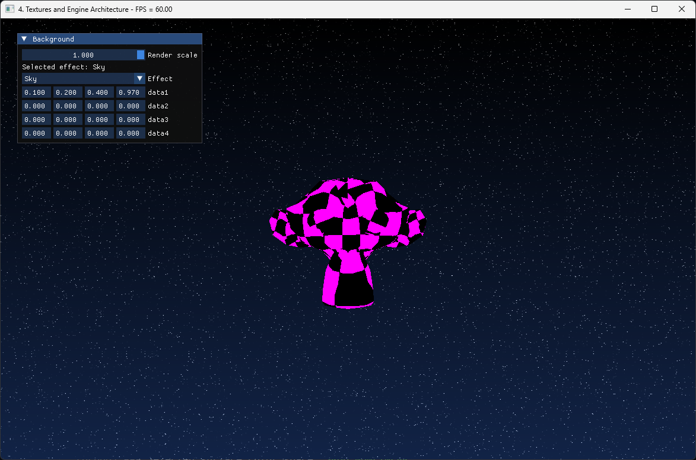

# Textures

We already showed how to use images when we did compute based rendering, but there are things
about images we still need to deal with, specially how to use them in graphics shaders for
rendering and display. We will begin here by creating a set of default textures for our engine,
and then load a texture from a file.

First, lets bring the `Allocated_Image` from `core.odin` and move it to `images.odin`, also
move the `destroy_image` procedure.

```odin title="Moved from core.odin to images.odin"
Allocated_Image :: struct {
    device:       vk.Device,
    image:        vk.Image,
    image_view:   vk.ImageView,
    image_extent: vk.Extent3D,
    image_format: vk.Format,
    allocator:    vma.Allocator,
    allocation:   vma.Allocation,
}

destroy_image :: proc(self: Allocated_Image) {
    vk.DestroyImageView(self.device, self.image_view, nil)
    vma.destroy_image(self.allocator, self.image, self.allocation)
}
```

Now, we need to add procedures to the `images.odin` file to deal with creating images.

```odin title="images.odin"
// Core
import "core:math" // < add to the top

@(require_results)
create_image_default :: proc(
    self: ^Engine,
    size: vk.Extent3D,
    format: vk.Format,
    usage: vk.ImageUsageFlags,
    mipmapped := false,
) -> (
    new_image: Allocated_Image,
    ok: bool,
) {
    return
}

@(require_results)
create_image_from_data :: proc(
    self: ^Engine,
    data: rawptr,
    size: vk.Extent3D,
    format: vk.Format,
    usage: vk.ImageUsageFlags,
    mipmapped := false,
) -> (
    new_image: Allocated_Image,
    ok: bool,
) {
    return
}

create_image :: proc {
    create_image_default,
    create_image_from_data,
}
```

Now we start writing the procedures implementations.

```odin
@(require_results)
create_image_default :: proc(
    self: ^Engine,
    size: vk.Extent3D,
    format: vk.Format,
    usage: vk.ImageUsageFlags,
    mipmapped := false,
) -> (
    new_image: Allocated_Image,
    ok: bool,
) {
    new_image.allocator = self.vma_allocator
    new_image.device = self.vk_device
    new_image.image_format = format
    new_image.image_extent = size

    img_info := image_create_info(format, usage, size)
    if mipmapped {
        img_info.mipLevels = u32(math.floor(math.log2(max(f32(size.width), f32(size.height))))) + 1
    }

    // Always allocate images on dedicated GPU memory
    alloc_info := vma.Allocation_Create_Info {
        usage          = .Gpu_Only,
        required_flags = {.DEVICE_LOCAL},
    }

    // Allocate and create the image
    vk_check(
        vma.create_image(
            self.vma_allocator,
            img_info,
            alloc_info,
            &new_image.image,
            &new_image.allocation,
            nil,
        ),
    ) or_return
    defer if !ok {
        vma.destroy_image(self.vma_allocator, new_image.image, nil)
    }

    // If the format is a depth format, we will need to have it use the correct aspect flag
    aspect_flag := vk.ImageAspectFlags{.COLOR}
    if format == .D32_SFLOAT {
        aspect_flag = vk.ImageAspectFlags{.DEPTH}
    }

    // Build a image-view for the draw image to use for rendering
    view_info := imageview_create_info(new_image.image_format, new_image.image, {.COLOR})

    vk_check(vk.CreateImageView(self.vk_device, &view_info, nil, &new_image.image_view)) or_return
    defer if !ok {
        vk.DestroyImageView(self.vk_device, new_image.image_view, nil)
    }

    return new_image, true
}
```

This is the same we already did when creating a draw image, just copied into its own procedure.
We begin by storing the `size` and `format` as part of the `Allocated_Image`, then we make a
`vk.ImageCreateInfo` with the `size`, `format`, and `usages`, then we allocate the image with
**VMA**, and finally create the image-view. Something we weren't doing before is setting up the
aspect flag. We will default it to`COLOR` unless the image is on a D32 float depth format.

To write image data, it works very similar to what we did last chapter with the buffers. We
need to create a temporal staging buffer, copy our pixels to it, and then do an immediate
submit where we call a `vk.CmdCopyBufferToImage`. Lets write that procedure too. We will do it
as a procedure group version of the same `create_image_default` procedure, but taking a
`rawptr` data parameter for pixels. We will be hardcoding our textures to just be **RGBA 8**
bit format here, as thats the format most image files are at.

```odin
@(require_results)
create_image_from_data :: proc(
    self: ^Engine,
    data: rawptr,
    size: vk.Extent3D,
    format: vk.Format,
    usage: vk.ImageUsageFlags,
    mipmapped := false,
) -> (
    new_image: Allocated_Image,
    ok: bool,
) {
    data_size := vk.DeviceSize(size.depth * size.width * size.height * 4)
    upload_buffer := create_buffer(self, data_size, {.TRANSFER_SRC}, .Cpu_To_Gpu) or_return
    defer destroy_buffer(upload_buffer)

    intr.mem_copy(upload_buffer.info.mapped_data, data, data_size)

    usage := usage
    usage += {.TRANSFER_DST, .TRANSFER_SRC}
    new_image = create_image_default(self, size, format, usage, mipmapped) or_return
    defer if !ok {
      destroy_image(new_image)
    }

    Copy_Image_Data :: struct {
        upload_buffer: vk.Buffer,
        new_image:     vk.Image,
        size:          vk.Extent3D,
    }

    copy_data := Copy_Image_Data {
        upload_buffer = upload_buffer.buffer,
        new_image     = new_image.image,
        size          = size,
    }

    engine_immediate_submit(
        self,
        copy_data,
        proc(engine: ^Engine, cmd: vk.CommandBuffer, data: Copy_Image_Data) {
            // Transition image to transfer destination layout
            transition_image(cmd, data.new_image, .UNDEFINED, .TRANSFER_DST_OPTIMAL)

            // Setup the copy region
            copy_region := vk.BufferImageCopy {
                imageSubresource = {aspectMask = {.COLOR}, layerCount = 1},
                imageExtent = data.size,
            }

            // Copy the buffer into the image
            vk.CmdCopyBufferToImage(
                cmd,
                data.upload_buffer,
                data.new_image,
                .TRANSFER_DST_OPTIMAL,
                1,
                &copy_region,
            )

            // Transition image to shader read layout
            transition_image(cmd, data.new_image, .TRANSFER_DST_OPTIMAL, .SHADER_READ_ONLY_OPTIMAL)
        },
    ) or_return

    return new_image, true
}
```

We start by allocating a staging buffer (`upload_buffer`) with enough space for the pixel data,
on the `Cpu_To_Gpu` memory type. We then `mem_copy` the pixel data into it.

After that, we call the normal `create_image_default` procedure, but we add the `TRANSFER_DST`
and `TRANSFER_SRC` so that its allowed to copy data into and from it.

Once we have the image and the staging buffer, we run an immediate submit that will copy the
staging buffer pixel data into the image.

Similar to how we do it with the swapchain images, we first transition the image into
`TRANSFER_DST_OPTIMAL`. Then we create a `copy_region` structure, where we have the parameters for
the copy command. This will require the image size and the target image layers and mip levels.
Image layers is for textures that have multiple layers, one of the most common examples is a
cubemap texture, which will have 6 layers, one per each cubemap face. We will do that later
when we setup reflection cubemaps.

For mip level, we will copy the data into mip level 0 which is the top level. The image doesnt
have any more mip levels. For now we are just passing the `mipmapped` boolean into the other
`create_image_default`, but we aren't doing anything else. We will handle that later.

With those procedures, we can set up some default textures. We will create a default-white,
default-black, default-grey, and a checkerboard texture. This way we have some textures we can
use when something fails to load.

Lets add those test images into the `Engine` structure, and a couple samplers too that we can
use with those images and others.

```odin
Engine :: struct {
    // Textures
    white_image:              Allocated_Image,
    black_image:              Allocated_Image,
    grey_image:               Allocated_Image,
    error_checkerboard_image: Allocated_Image,
    default_sampler_linear:   vk.Sampler,
    default_sampler_nearest:  vk.Sampler,
}
```

Before we can continue, lets add `pack_unorm_4x8` to `math.odin`:

```odin
pack_unorm_4x8 :: proc "contextless" (v: la.Vector4f32) -> u32 {
    // Round and clamp each component to [0,255] range as u8
    r := u8(math.round_f32(clamp(v.x, 0.0, 1.0) * 255.0))
    g := u8(math.round_f32(clamp(v.y, 0.0, 1.0) * 255.0))
    b := u8(math.round_f32(clamp(v.z, 0.0, 1.0) * 255.0))
    a := u8(math.round_f32(clamp(v.w, 0.0, 1.0) * 255.0))

    // Pack into u32 (using RGBA layout)
    return u32(r) | (u32(g) << 8) | (u32(b) << 16) | (u32(a) << 24)
}
```

The `pack_unorm_4x8` procedure converts a `Vector4f32` color, typically representing red,
green, blue, and alpha channels in the range [`0.0`, `1.0`] into a single 32-bit unsigned
integer. This conversion allows for efficient storage and transmission of color data, which
will be useful in the following steps.

Lets go and create those as part of the `engine_init_default_data()` procedure, after the code
we created the test meshes.

```odin
engine_init_default_data :: proc(self: ^Engine) -> (ok: bool) {
    self.test_meshes = load_gltf_meshes(self, "assets/basicmesh.glb") or_return
    defer if !ok {
        destroy_mesh_assets(&self.test_meshes)
    }

    // Other code above ---

    // 3 default textures, white, grey, black. 1 pixel each
    white := pack_unorm_4x8({1, 1, 1, 1})
    self.white_image = create_image_from_data(
        self,
        &white,
        {1, 1, 1},
        .R8G8B8A8_UNORM,
        {.SAMPLED},
    ) or_return
    deletion_queue_push(&self.main_deletion_queue, self.white_image)

    grey := pack_unorm_4x8({0.66, 0.66, 0.66, 1})
    self.grey_image = create_image_from_data(
        self,
        &grey,
        {1, 1, 1},
        .R8G8B8A8_UNORM,
        {.SAMPLED},
    ) or_return
    deletion_queue_push(&self.main_deletion_queue, self.grey_image)

    black := pack_unorm_4x8({0, 0, 0, 0})
    self.black_image = create_image_from_data(
        self,
        &black,
        {1, 1, 1},
        .R8G8B8A8_UNORM,
        {.SAMPLED},
    ) or_return
    deletion_queue_push(&self.main_deletion_queue, self.black_image)

    // Checkerboard image
    magenta := pack_unorm_4x8({1, 0, 1, 1})
    pixels: [16 * 16]u32
    for x in 0 ..< 16 {
        for y in 0 ..< 16 {
            pixels[y * 16 + x] = ((x % 2) ~ (y % 2)) != 0 ? magenta : black
        }
    }
    self.error_checkerboard_image = create_image_from_data(
        self,
        raw_data(pixels[:]),
        {16, 16, 1},
        .R8G8B8A8_UNORM,
        {.SAMPLED},
    ) or_return
    deletion_queue_push(&self.main_deletion_queue, self.error_checkerboard_image)

    sampler_info := vk.SamplerCreateInfo {
        sType     = .SAMPLER_CREATE_INFO,
        magFilter = .NEAREST,
        minFilter = .NEAREST,
    }

    vk_check(
        vk.CreateSampler(self.vk_device, &sampler_info, nil, &self.default_sampler_nearest),
    ) or_return
    deletion_queue_push(&self.main_deletion_queue, self.default_sampler_nearest)

    sampler_info.magFilter = .LINEAR
    sampler_info.minFilter = .LINEAR

    vk_check(
        vk.CreateSampler(self.vk_device, &sampler_info, nil, &self.default_sampler_linear),
    ) or_return
    deletion_queue_push(&self.main_deletion_queue, self.default_sampler_linear)

    return true
}
```

For the 3 default color images, we create the image with that color as the single pixel. For
the checkerboard, we write a 16x16 array of pixel color data with some simple math for a
black/magenta check pattern.

On the samplers, we will leave all parameters as default except the min/mag filters, which we
will have as either **Linear** or **Nearest**. Linear will blur pixels, while Nearest will give
a pixelated look.

## Binding Images To Shaders

When we did the compute based rendering, we bound the image using the descriptor type
`STORAGE_IMAGE`, which was the type we use for a read/write texture with no sampling logic.
This is roughly equivalent to binding a buffer, just a multi-dimensional one with different
memory layout. But when we do drawing, we want to use the fixed hardware in the GPU for
accessing texture data, which needs the sampler. We have the option to either use
`COMBINED_IMAGE_SAMPLER`, which packages an image and a sampler to use with that image, or to
use 2 descriptors, and separate the two into `SAMPLER` and `SAMPLED_IMAGE`. According to gpu
vendors, the separated approach can be faster as there is less duplicated data. But its a bit
harder to deal with so we wont be doing it for now. Instead, we will use the combined
descriptor to make our shaders simpler.

We will be modifying the rectangle draw we had before into a draw that displays a image in that
rectangle. We need to create a new fragment shader that will show the image. Lets create a new
fragment shader for that. We will call it `tex_image.frag`.

```glsl title="/shaders/source/tex_image.frag"
//glsl version 4.5
#version 450

// Shader input
layout (location = 0) in vec3 inColor;
layout (location = 1) in vec2 inUV;

// Output write
layout (location = 0) out vec4 outFragColor;

layout(set =0, binding = 0) uniform sampler2D displayTexture;

void main() {
    outFragColor = texture(displayTexture,inUV);
}

```

We have 2 inputs to the fragment shader, color and UV. The shader doesnt use color but we want
to keep using the same vertex shader we had before.

To sample a texture, you do `texture( textureSampler, coordinates )`. There are other
procedures for things like directly accessing a given pixel. The texture object is declared as
`uniform sampler2D`.

This does change our pipeline layout, so we are going to need to update it too.

Lets add the layout into `Engine` structure, as we will keep it around.

```odin
Engine :: struct {
    // Textures
    single_image_descriptor_layout: vk.DescriptorSetLayout,
}
```

On `engine_init_descriptors()`, lets create it alongside the rest.

```odin title="init.odin"
engine_init_descriptors :: proc(self: ^Engine) -> (ok: bool) {
    // Other code above ---

    {
        builder: Descriptor_Layout_Builder
        descriptor_layout_builder_init(&builder, self.vk_device)
        descriptor_layout_builder_add_binding(&builder, 0, .COMBINED_IMAGE_SAMPLER)
        self.single_image_descriptor_layout = descriptor_layout_builder_build(
            &builder,
            {.FRAGMENT},
        ) or_return
    }
    deletion_queue_push(&self.main_deletion_queue, self.single_image_descriptor_layout)

    return true
}
```

A descriptor set with just a single image-sampler descriptor. We can now update the
`engine_init_mesh_pipeline()` procedure with this. We will be modifying the start part,
changing the fragment shader and connecting the descriptor set layout to the pipelinelayout
creation.

```odin
engine_init_mesh_pipeline :: proc(self: ^Engine) -> (ok: bool) {
    triangle_frag_shader := create_shader_module(
        self.vk_device,
        #load("./../../shaders/compiled/tex_image.frag.spv"), // < new
    ) or_return
    defer vk.DestroyShaderModule(self.vk_device, triangle_frag_shader, nil)

    triangle_vertex_shader := create_shader_module(
        self.vk_device,
        #load("./../../shaders/compiled/colored_triangle_mesh.vert.spv"),
    ) or_return
    defer vk.DestroyShaderModule(self.vk_device, triangle_vertex_shader, nil)

    buffer_range := vk.PushConstantRange {
        offset     = 0,
        size       = size_of(GPU_Draw_Push_Constants),
        stageFlags = {.VERTEX},
    }

    pipeline_layout_info := pipeline_layout_create_info()
    pipeline_layout_info.pPushConstantRanges = &buffer_range
    pipeline_layout_info.pushConstantRangeCount = 1
    pipeline_layout_info.pSetLayouts = &self.single_image_descriptor_layout // < new
    pipeline_layout_info.setLayoutCount = 1 // < new

    vk_check(
        vk.CreatePipelineLayout(
            self.vk_device,
            &pipeline_layout_info,
            nil,
            &self.mesh_pipeline_layout,
        ),
    ) or_return
    deletion_queue_push(&self.main_deletion_queue, self.mesh_pipeline_layout)

    // Other code bellow ---

    builder := pipeline_builder_create_default()
}
```

Now, on our draw procedure, we can dynamically create the descriptor set needed when binding
this pipeline, and use it to display textures we want to draw.

This goes into the `engine_draw_geometry()` procedure, changing the draw for the monkey mesh.

```odin
engine_draw_geometry :: proc(self: ^Engine, cmd: vk.CommandBuffer) -> (ok: bool) {
    // ...
    frame := engine_get_current_frame(self) // Move this from bellow to the top

    vk.CmdSetScissor(cmd, 0, 1, &scissor)

    // Other code above ---

    // Bind a texture
    image_set := descriptor_growable_allocate(
        &frame.frame_descriptors,
        &self.single_image_descriptor_layout,
    ) or_return

    {
        writer: Descriptor_Writer
        descriptor_writer_init(&writer, self.vk_device)
        descriptor_writer_write_image(
            &writer,
            binding = 0,
            image = self.error_checkerboard_image.image_view,
            sampler = self.default_sampler_nearest,
            layout = .SHADER_READ_ONLY_OPTIMAL,
            type = .COMBINED_IMAGE_SAMPLER,
        )
        descriptor_writer_update_set(&writer, image_set)
    }

    vk.CmdBindDescriptorSets(cmd, .GRAPHICS, self.mesh_pipeline_layout, 0, 1, &image_set, 0, nil)

    // Other code bellow ---

    // Create view matrix - place camera at positive Z looking at origin
    view := la.matrix4_translate_f32({0, 0, -5})
    // ...
}
```

We allocate a new descriptor set from the frame descriptor set allocator, using the
`single_image_descriptor_layout` that the shader uses.

Then we use a descriptor writer to write a single image descriptor on binding `0`, which will
be the `error_checkerboard_image`. We give it the nearest-sampler, so that it doesn't blend
between pixels. Then we update the descriptor set with the writer, and bind the set. Then we
proceed with the draw.

To finish, disable the blending from before to get the proper results.

```odin
// No blending
pipeline_builder_disable_blending(&builder)
// pipeline_builder_enable_blending_additive(&builder)
```

The result should be that the monkey head now has a magenta pattern on it.


