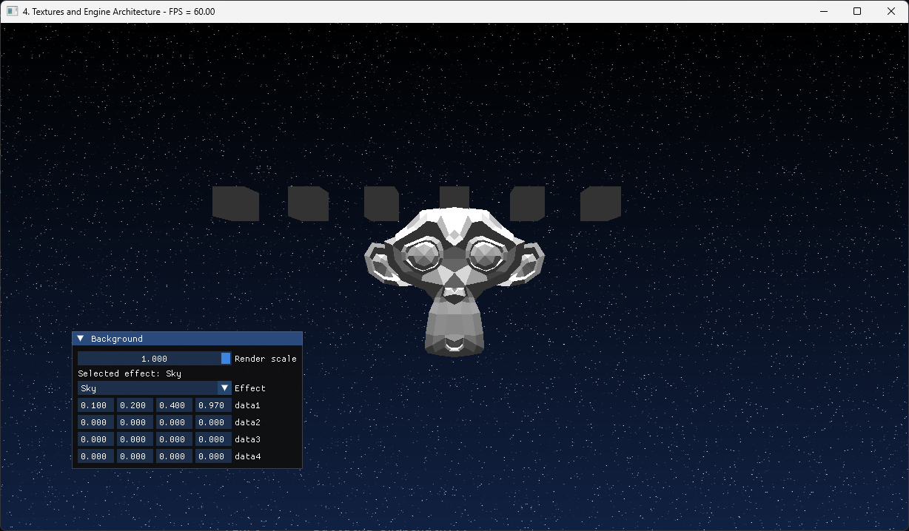

# Meshes and Camera

We will begin by setting up the new draw loop using the `Render_Object`'s explained last
chapter. We were harcoding the rendering on the mesh list loaded from GLTF, but now we will
convert that list into `Render_Object`'s and then draw that. We cant load textures from GLTF
yet so we will be using the default material.

We will begin creating the architecture by adding the scene node base structures to
`drawing.odin`.

```odin
// Base "interface" for renderable dynamic object.
Renderable :: struct {
    draw: proc(self: ^Renderable, top_matrix: la.Matrix4f32, ctx: ^Draw_Context),
}

// Structure that can hold children and propagate transforms.
Node :: struct {
    using renderable: Renderable, // Subtype polymorphism
    parent:           ^Node,
    children:         [dynamic]^Node,
    local_transform:  la.Matrix4x4f32,
    world_transform:  la.Matrix4x4f32,
}

// Initialize a node.
node_init :: proc(node: ^Node) {
    node.local_transform = la.MATRIX4F32_IDENTITY
    node.world_transform = la.MATRIX4F32_IDENTITY
    node.draw = node_draw
}

// Updates the world transform of this node and all children.
node_refresh_transform :: proc(node: ^Node, parent_matrix: la.Matrix4x4f32) {
    node.world_transform = la.matrix_mul(parent_matrix, node.local_transform)
    // Recursively update all children
    for &child in node.children {
        node_refresh_transform(child, node.world_transform)
    }
}

// Default draw implementation for nodes. Only draws children, serves as base behavior.
node_draw :: proc(self: ^Renderable, top_matrix: la.Matrix4x4f32, ctx: ^Draw_Context) {
    node := cast(^Node)self
    // Iterate through and draw all child nodes
    for &child in node.children {
        child.draw(cast(^Renderable)child, top_matrix, ctx)
    }
}
```

The node will be the first `Renderable` we have, that will hold the object matrix for the
transforms. Both local and world transform. The world transform needs to be updated, so
whenever the local Transform  gets changed, `refresh_transform` must be called. This will
recursively go down the node tree and make sure the matrices are on their correct places.

:::info[Subtype polymorphism]

To have inheritance-like functionality similar to C++ we will be using [Subtype
polymorphism][]. This is archived with the `using` keyword. Learn more with an [Odin example
for subtype polymorphism][].

:::

[Subtype polymorphism]: https://odin-lang.org/docs/overview/#subtype-polymorphism
[Odin example for subtype polymorphism]:
    https://github.com/odin-lang/Odin/blob/master/examples/demo/demo.odin#L799

The `draw` procedure will do nothing, only call `draw()` on children.

This base node does nothing, so we need to add a `Mesh_Node` to `Engine` that displays a mesh.

```odin
// Mesh node that holds a mesh asset and can be drawn.
Mesh_Node :: struct {
    using node: Node,
    mesh:       ^Mesh_Asset,
}

// Initialize a mesh node.
mesh_node_init :: proc(mesh_node: ^Mesh_Node) {
    node_init(cast(^Node)mesh_node)
    mesh_node.draw = mesh_node_draw
}

// Draw implementation for mesh nodes.
// Converts mesh data into render objects for the renderer.
mesh_node_draw :: proc(self: ^Renderable, top_matrix: la.Matrix4x4f32, ctx: ^Draw_Context) {
}
```

The `Mesh_Node` holds a pointer to a mesh asset, and use the `draw` procedure to add commands
into the draw context.

Lets write the `Draw_Context` too. All on `drawing.odin`.

```odin
// Render object that holds drawing data.
Render_Object :: struct {
    index_count:           u32,
    first_index:           u32,
    index_buffer:          vk.Buffer,
    material:              ^Material_Instance,
    transform:             la.Matrix4f32,
    vertex_buffer_address: vk.DeviceAddress,
}

// Define our base drawing context and renderable types.
Draw_Context :: struct {
    opaque_surfaces: [dynamic]Render_Object,
}
```

The draw context is just a list of `Render_Object` structures, for now. The `Render_Object` is
the core of our rendering. The engine itself will not call any vulkan procedures on the node
objects, and the renderer is going to take the array of `Render_Object`'s from the context, built
every frame (or cached), and execute a single vulkan draw procedure for each.

With those defined, the `mesh_node_draw()` procedure of the mesh node looks like this:

```odin
// Draw implementation for mesh nodes.
// Converts mesh data into render objects for the renderer.
mesh_node_draw :: proc(self: ^Renderable, top_matrix: la.Matrix4x4f32, ctx: ^Draw_Context) {
    mesh_node := cast(^Mesh_Node)self

    // Combine top matrix with node's world transform
    node_matrix := la.matrix_mul(top_matrix, mesh_node.world_transform)

    // Add render objects for each surface
    for &surface in mesh_node.mesh.surfaces {
        def := Render_Object {
            index_count           = surface.count,
            first_index           = surface.start_index,
            index_buffer          = mesh_node.mesh.mesh_buffers.index_buffer.buffer,
            material              = &surface.material.data,
            transform             = node_matrix,
            vertex_buffer_address = mesh_node.mesh.mesh_buffers.vertex_buffer_address,
        }

        // Add the render object to the context's opaque surfaces list
        append(&ctx.opaque_surfaces, def)
    }

    // Call parent draw to process children
    node_draw(self, top_matrix, ctx)
}
```

A mesh can have multiple surfaces with different materials, so we will loop the surfaces of the
mesh, and add the resulting `Render_Object`'s to the list. Note how we are dealing with the
matrix. We are not inserting the objects directly from the node `world_transform`, but
multiplying that by the `top_matrix`. This means that if the `draw()` procedure gets called
multiple times, we can draw the same multiple times with different transforms. Very useful if
we want to render the same objects multiple times, which is a common thing to do.

The last thing we need here is to add the object draw loop into `Engine` structure so that a
`Draw_Context` can be processed and turned into real vulkan calls.

To do that, remove the code that used to draw the monkey head. We will be replacing that. All
the code on `engine_draw_geometry` after the first triangle draw gets removed.

To hold the draw list, we add the `Draw_Context` structure into the `Engine` structure. We will
also add a `engine_update_scene()` procedure where we will call the draw procedures outside of the
vulkan render loop. Also a `map` of `Node`'s that will contain the meshes we load. This
procedure will also handle the logic like setting up the camera.

```odin title="engine.odin"
Engine :: struct {
    // Scene
    main_draw_context: Draw_Context,
    loaded_nodes:      map[string]^Node,
}

// Updates the scene state and prepares render objects.
engine_update_scene :: proc(self: ^Engine) {
}
```

We will add the code to the renderer on `engine_draw_geometry`, right after creating the
`GPU_Scene_Data` descriptor set, so that we can bind it. Replace the code in the procedure that
draws the hardcoded monkey head with this. Leave the descriptor set allocation for scene-data
as this uses it.

The relevant code is highlighted bellow:

```odin title="drawing.odin" {68-109}
engine_draw_geometry :: proc(self: ^Engine, cmd: vk.CommandBuffer) -> (ok: bool) {
    // Begin a render pass connected to our draw image
    color_attachment := attachment_info(self.draw_image.image_view, nil, .COLOR_ATTACHMENT_OPTIMAL)
    depth_attachment := depth_attachment_info(
        self.depth_image.image_view,
        .DEPTH_ATTACHMENT_OPTIMAL,
    )

    render_info := rendering_info(self.draw_extent, &color_attachment, &depth_attachment)
    vk.CmdBeginRendering(cmd, &render_info)

    vk.CmdBindPipeline(cmd, .GRAPHICS, self.mesh_pipeline)

    // Set dynamic viewport and scissor
    viewport := vk.Viewport {
        x        = 0,
        y        = 0,
        width    = f32(self.draw_extent.width),
        height   = f32(self.draw_extent.height),
        minDepth = 0.0,
        maxDepth = 1.0,
    }

    vk.CmdSetViewport(cmd, 0, 1, &viewport)

    scissor := vk.Rect2D {
        offset = {x = 0, y = 0},
        extent = {width = self.draw_extent.width, height = self.draw_extent.height},
    }

    vk.CmdSetScissor(cmd, 0, 1, &scissor)

    frame := engine_get_current_frame(self)

    // Allocate a new uniform buffer for the scene data
    gpu_scene_data_buffer := create_buffer(
        self,
        size_of(GPU_Scene_Data),
        {.UNIFORM_BUFFER},
        .Cpu_To_Gpu,
    ) or_return

    // Add it to the deletion queue of this frame so it gets deleted once its been used
    deletion_queue_push(&frame.deletion_queue, gpu_scene_data_buffer)

    // Write the buffer
    scene_uniform_data := cast(^GPU_Scene_Data)gpu_scene_data_buffer.info.mapped_data
    scene_uniform_data^ = self.scene_data

    // Create a descriptor set that binds that buffer and update it
    global_descriptor := descriptor_growable_allocate(
        &frame.frame_descriptors,
        &self.gpu_scene_data_descriptor_layout,
    ) or_return

    writer: Descriptor_Writer
    descriptor_writer_init(&writer, self.vk_device)
    descriptor_writer_write_buffer(
        &writer,
        binding = 0,
        buffer = gpu_scene_data_buffer.buffer,
        size = size_of(GPU_Scene_Data),
        offset = 0,
        type = .UNIFORM_BUFFER,
    )
    descriptor_writer_update_set(&writer, global_descriptor)

    // Draw all opaque surfaces
    for &draw in self.main_draw_context.opaque_surfaces {
        vk.CmdBindPipeline(cmd, .GRAPHICS, draw.material.pipeline.pipeline)
        vk.CmdBindDescriptorSets(
            cmd,
            .GRAPHICS,
            draw.material.pipeline.layout,
            0,
            1,
            &global_descriptor,
            0,
            nil,
        )
        vk.CmdBindDescriptorSets(
            cmd,
            .GRAPHICS,
            draw.material.pipeline.layout,
            1,
            1,
            &draw.material.material_set,
            0,
            nil,
        )

        vk.CmdBindIndexBuffer(cmd, draw.index_buffer, 0, .UINT32)

        push_constants := GPU_Draw_Push_Constants {
            vertex_buffer = draw.vertex_buffer_address,
            world_matrix  = draw.transform,
        }

        vk.CmdPushConstants(
            cmd,
            draw.material.pipeline.layout,
            {.VERTEX},
            0,
            size_of(GPU_Draw_Push_Constants),
            &push_constants,
        )

        vk.CmdDrawIndexed(cmd, draw.index_count, 1, draw.first_index, 0, 0)
    }

    vk.CmdEndRendering(cmd)

    return true
}
```

When the `Render_Object` was designed, it was meant to directly convert into a single draw
command on vulkan. So there is no logic other than directly binding the stuff and calling
`vk.CmdDraw`. We are binding the data every draw which is inefficient but we will fix that later.

Last thing is going to be using the mesh load we loaded last chapter to create some Nodes, and
then drawing them so they add the meshes into the draw context. The `load_meshes` is not
loading material properly, but we can give it the default material.

Lets first update the GeoSurface structure in `loader.odin` so that it can hold a material.

```odin title="loader.odin"
Material :: struct {
    data: Material_Instance,
}

Geo_Surface :: struct {
    start_index: u32,
    count:       u32,
    material:    ^Material,
}
```

Next, on `init.odin` file, in `engine_init_default_data` procedure, at the end after we created
the default material:

```odin
for &m in self.test_meshes {
    new_node := new(Mesh_Node)
    mesh_node_init(new_node)
    new_node.mesh = m

    // Set default material for all surfaces
    for &surface in new_node.mesh.surfaces {
        material: Material
        material.data = self.default_data
        surface.material = material
    }

    self.loaded_nodes[m.name] = cast(^Node)new_node
}
```

For each of the test meshes, we create a new `Mesh_Node`, and copy the mesh asset for that
node. Then we do similar with the default material.

:::note[]

We need to **allocate** a new node here to ensure it remains valid. This is necessary because
subtypes require a valid pointer to function correctly.

:::

This is because normally we would not be loading objects like this, but directly loading the
nodes, meshes, and materials from GLTF properly, on there, multiple nodes can refer to the same
mesh, and multiple meshes to the same material.

Lets create the engine_update_scene() procedure. We are also moving the camera logic we had on the
monkeyhead last chapter into here.

```odin title="engine.odin"
// Updates the scene state and prepares render objects.
engine_update_scene :: proc(self: ^Engine) {
    // Clear previous render objects
    clear(&self.main_draw_context.opaque_surfaces)

    // Draw the Suzanne mesh
    if suzanne, ok := self.loaded_nodes["Suzanne"]; ok {
        suzanne.draw(suzanne, la.MATRIX4F32_IDENTITY, &self.main_draw_context)
    }

    // Set up Camera
    aspect := f32(self.window_extent.width) / f32(self.window_extent.height)
    self.scene_data.view = la.matrix4_translate_f32({0, 0, -5})
    self.scene_data.proj = matrix4_perspective_reverse_z_f32(
        f32(la.to_radians(70.0)),
        aspect,
        0.1,
        true, // Invert the Y direction to match OpenGL and glTF axis conventions
    )
    self.scene_data.viewproj = la.matrix_mul(self.scene_data.proj, self.scene_data.view)

    // Default lighting parameters
    self.scene_data.ambient_color = {0.1, 0.1, 0.1, 1.0}
    self.scene_data.sunlight_color = {1.0, 1.0, 1.0, 1.0}
    self.scene_data.sunlight_direction = {0, 1, 0.5, 1.0}
}
```

We begin by clearing the render objects from the draw context, then looping other the
`loaded_nodes` and calling `draw` on `Suzanne` which is the mesh name for the monkey.

This procedure gets called at the very start of the `draw()` procedure, before waiting on the
frame fences.

```odin title="drawing.odin" {2}
engine_draw :: proc(self: ^Engine) -> (ok: bool) {
    engine_update_scene(self)

    // Other code bellow ---

    frame := engine_get_current_frame(self)

    // Wait until the gpu has finished rendering the last frame. Timeout of 1 second
    vk_check(vk.WaitForFences(self.vk_device, 1, &frame.render_fence, true, 1e9)) or_return
}
```

If you draw the engine now, you will see that the monkey head is being drawn with some dramatic
top down lighting.

:::warning[]

If the monkey head is not white but multicolor, check that you have `OVERRIDE_VERTEX_COLORS` on
`loader.odin` set to `false`.

:::

Now, to demonstrate it, we are going to manipulate the nodes and drawing a bit.

First, we are going to draw the objects more times by grabbing the `Node` that draws a cube, and
making it draw a line made of cubes. We have the Nodes stored on the `map`, so we can access
and render them individually however we want to.

On the `engine_update_scene()` procedure:

```cpp title="engine.odin"
// Draw the Suzanne mesh
if suzanne, ok := &self.loaded_nodes["Suzanne"]; ok {
    suzanne.draw(suzanne, la.MATRIX4F32_IDENTITY, &self.main_draw_context)
}

// Other code above ---

// Draw a line of cubes
if cube, ok := self.loaded_nodes["Cube"]; ok {
    for x := -3; x < 3; x += 1 {
        scale := la.matrix4_scale(la.Vector3f32{0.2, 0.2, 0.2})
        translation := la.matrix4_translate(la.Vector3f32{f32(x), 1, 0})
        cube.draw(cube, translation * scale, &self.main_draw_context)
    }
}
```

We make the cubes smaller, and give them a translation from left to right of the screen. Then
we call `draw` on them. Every time `draw` is called it will add the `Render_Object` into the
context with a different matrix, so it we can render the objects multiple times on different
positions.

Lets not forget to free the scene resources on `engine_cleanup`:

```odin title="init.odin" {7-12}
engine_cleanup :: proc(self: ^Engine) {
    // Make sure the gpu has stopped doing its things
    ensure(vk.DeviceWaitIdle(self.vk_device) == .SUCCESS)

    // Other code above ---

    // Clean up scene nodes
    delete(self.main_draw_context.opaque_surfaces)
    for _, &node in self.loaded_nodes {
        free(node)
    }
    delete(self.loaded_nodes)

    for &frame in self.frames {
        vk.DestroyCommandPool(self.vk_device, frame.command_pool, nil)
    }

    // Other code bellow ---
}
```

This is the end result for this chapter:



This concludes chapter 4. On the next chapter, we will upgrade the gltf loader to load scenes
with textures and multiple objects, and set up a interactive FPS camera.
