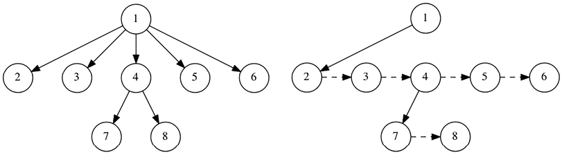

# Improving The Scene Graph

Scene graphs are the foundation of 3D rendering systems, enabling the arrangement of objects in
a hierarchical structure to facilitate transformation, rendering, and control. However, how
they are implemented can have a significant impact on performance, maintainability, and
extensibility. In this section, we'll examine the shortcomings of a conventional pointer-based
scene graph (as seen in the previous section), and how a refactored, data-oriented approach
using flat arrays and indices solves these issues.

## Pointer-Based Scene Graph

Here’s the original implementation we started before:

```odin
Renderable :: struct {
    draw: proc(self: ^Renderable, top_matrix: la.Matrix4f32, ctx: ^Draw_Context),
}

Node :: struct {
    using renderable: Renderable,
    parent:           ^Node,
    children:         [dynamic]^Node,
    local_transform:  la.Matrix4x4f32,
    world_transform:  la.Matrix4x4f32,
}

Mesh_Node :: struct {
    using node: Node,
    mesh:       ^Mesh_Asset,
}

mesh_node_draw :: proc(self: ^Renderable, top_matrix: la.Matrix4x4f32, ctx: ^Draw_Context) {
    mesh_node := cast(^Mesh_Node)self
    node_matrix := la.matrix_mul(top_matrix, mesh_node.world_transform)
    for &surface in mesh_node.mesh.surfaces {
        def := Render_Object{ /* ... */ }
        append(&ctx.opaque_surfaces, def)
    }
    node_draw(self, top_matrix, ctx) // Draw children
}
```

### The Problem

Lets explore the limitations of traditional pointer-based scene graphs and their impact on
performance and memory usage.

1. **Cache Inefficiency**:
    - **Problem**: Each `Node` contains pointers (`parent`, `children`, `mesh`), which scatter
      data across memory. When traversing the scene (e.g., in `mesh_node_draw`), the CPU must
      chase these pointers, causing frequent cache misses.
    - **Impact**: Modern CPUs are optimized for accessing contiguous memory. When data is
      scattered across memory due to pointer indirection, the CPU incurs additional latency
      from cache misses.

2. **Memory Overhead**:
    - **Problem**: Pointers are 64-bit (8 bytes) on most systems, and `children:
      [dynamic]^Node` adds per-node allocation overhead (e.g., capacity, length fields). A
      scene with thousands of nodes wastes significant memory on pointers rather than actual
      data.
    - **Impact**: Increased memory usage reduces scalability, especially on limited resources
      platforms like consoles or mobile devices.

3. **Complexity and Fragility**:
    - **Problem**: The `Renderable` interface and polymorphic `draw` procedures introduce
      runtime indirection (via procedure pointers) and require manual management of node types
      (`Node` vs. `Mesh_Node`). Pointers also risk dangling references if not carefully
      managed.
    - **Impact**: More code to maintain, harder debugging (e.g., null pointer crashes), and
      slower execution due to virtual-like calls.

4. **GPU Integration**:
    - **Problem**: Transforming `local_transform` and `world_transform` into GPU buffers
      requires gathering scattered data, complicating uploads to Vulkan.
    - **Impact**: Extra CPU work to linearize data, reducing efficiency in the render pipeline.

5. **Traversal Performance**:
    - **Problem**: Recursive traversal in `node_draw` and `mesh_node_draw` relies on following
      pointers to child nodes.
    - **Impact**: Explicit recursion causes performance issues, which become worse by deep
      recursion.

## Component-Based Scene Graphs

The component-based design define nodes as entities composed of distinct, interchangeable
components (e.g., transforms, meshes, materials). This fundamentally changes how scene data is
organized and handled. Rather than defining nodes as fixed structs with predefined fields—as in
the previous implementation—this approach treats each node as a simple entity, identified by a
unique integer ID. This ID works as a key to access various modular components stored in
different collections.

Before we begin, create a new file called `scene.odin` and move the definitions of
`Render_Object` and `Draw_Context` from `drawing.odin` into this new file. Them, update the
`material` field in `Render_Object` to be of type `u32`, representing an index into a materials
array. This change ensures better alignment with the data-oriented design principles discussed
earlier.

```odin title="scene.odin"
package vk_guide

// Core
import "base:builtin"
import la "core:math/linalg"

// Vendor
import vk "vendor:vulkan"

// Define sentinel values for indicating invalid node
NO_MESH :: max(u32)
NO_MATERIAL :: max(u32)
NO_NAME :: max(u32)

// Render object that holds drawing data.
Render_Object :: struct {
    index_count:           u32,
    first_index:           u32,
    index_buffer:          vk.Buffer,
    // highlight-next-line
    material:              u32, // Index into materials array
    transform:             la.Matrix4f32,
    vertex_buffer_address: vk.DeviceAddress,
}

// Define our base drawing context and renderable types.
Draw_Context :: struct {
    opaque_surfaces: [dynamic]Render_Object,
}
```

You can now remove the remain code from `drawing.odin` that was added from previous section.
From this point forward, any new code related to the scene graph should be added to
`scene.odin`, unless explicitly stated otherwise.

### Left Child, Right Sibling

Let's start our refactored code with the `Hierarchy` component.

```odin
// Hierarchy component for scene nodes
Hierarchy :: struct {
    parent:       i32, // -1 means no parent
    first_child:  i32, // -1 means no children
    next_sibling: i32, // -1 means no next sibling
    last_sibling: i32, // -1 means no siblings, otherwise the last sibling for quick appending
    level:        i32, // Depth in the hierarchy, root = 0
}
```

We are transitioning from the `Node` structure to the `Hierarchy` component, which uses integer
indices that are stored in contiguous arrays to represent relationships between nodes.

This new approach leverages the "**Left Child, Right Sibling**" representation, a clever way to
flatten a multi-child tree into a binary-like structure without pointers. Each node’s
`first_child` index points to its leftmost child, and `next_sibling` links to the next child of
the same parent, forming a **linked list of siblings**. `last_sibling` tracks the end of this list
for O(1) child appending, and `level` caches depth for quick hierarchy queries.



The picture on the left shows a normal tree where each node can have any number of children,
this is what we did before. The picture on the right, on the other hand, shows a new structure
that only saves one reference to the first child and another reference to the next "sibling."

:::info[]

For more information on the “Left Child, Right Sibling” representation, you can check out the
additional reading available on Wikipedia at
https://en.wikipedia.org/wiki/Left-child_right-sibling_binary_tree.

:::

:::note[]

It is important to note one key disadvantage: random access to a child node is now slower on
average because we must traverse each node in the list. However, this isn't a huge concern for
our purposes because we usually travel through all of the children or none of them.

:::

### The New `Scene`

Now, we can declare a new `Scene` structure with logical **components**:

```odin
// Scene container to store all node data in arrays
Scene :: struct {
    // Transform components
    local_transforms:  [dynamic]la.Matrix4f32,
    world_transforms:  [dynamic]la.Matrix4f32,

    // Hierarchy components
    hierarchy:         [dynamic]Hierarchy,

    // Mesh components (Node index -> Mesh index)
    mesh_for_node:     [dynamic]u32,

    // Material components (Node index -> Material index)
    material_for_node: [dynamic]u32,

    // Optional debug components
    name_for_node:     [dynamic]u32,
    node_names:        [dynamic]string,

    // Material instances
    materials:         [dynamic]Material_Instance,

    // Mesh assets
    meshes:            Mesh_Asset_List,
}
```

The new `Scene` structure is essentially a container that organizes all scene-related
information into tightly packed arrays. Each array corresponds to a specific component, such as
transforms, hierarchy relationships, meshes, or materials. Nodes are identified by their unique
IDs (an `i32` ranging from `0` to `len(hierarchy)-1`), which serve as indices into these
arrays.

- `local_transforms` - Per-node local transformation matrices (relative to parent)
- `world_transforms` - Per-node world transformation matrices (computed from local and parent
  transforms)
- `hierarchy` - Per-node hierarchy data
- `mesh_for_node` - Array mapping node indices to mesh indices (`NO_MESH` if none)
- `material_for_node` - Array mapping node indices to material indices (`NO_MATERIAL` if none)
- `name_for_node` - Map of node indices to name indices (for debugging, `NO_NAME` if none)
- `node_names` - Array of node names (indexed by `name_for_node` values)
- `materials` - Array of material instances (pipelines, descriptors, etc)
- `meshes` - List of mesh assets (vertices, indices, surfaces)

We also need a way to initialize and destroy scenes:

```odin
// Initialize a new scene.
scene_init :: proc(scene: ^Scene, allocator := context.allocator) {
    context.allocator = allocator
    scene.local_transforms = make([dynamic]la.Matrix4f32)
    scene.world_transforms = make([dynamic]la.Matrix4f32)
    scene.hierarchy = make([dynamic]Hierarchy)
    scene.mesh_for_node = make([dynamic]u32)
    scene.material_for_node = make([dynamic]u32)
    scene.name_for_node = make([dynamic]u32)
    scene.node_names = make([dynamic]string)
    scene.materials = make([dynamic]Material_Instance)
    scene.meshes = make([dynamic]Mesh_Asset)
}

// Free scene resources.
scene_destroy :: proc(scene: ^Scene, allocator := context.allocator) {
    context.allocator = allocator
    delete(scene.local_transforms)
    delete(scene.world_transforms)
    delete(scene.hierarchy)
    delete(scene.mesh_for_node)
    delete(scene.material_for_node)
    delete(scene.name_for_node)
    delete(scene.node_names)
    delete(scene.materials)
    delete(scene.meshes)
}
```

The `scene_init` procedure initializes the `Scene` instance, preparing it for use. On the other
hand, the `scene_destroy` procedure is responsible for the deallocation of a `Scene`’s
resources.

### Add Node

Next, we'll implement the `scene_add_node` procedure, which handles the insertion of new nodes
into the scene's hierarchical structure.

```odin
// Add a new node to the scene
scene_add_node :: proc(scene: ^Scene, #any_int parent, level: i32) -> i32 {
    // Create new node ID
    node := i32(len(scene.hierarchy))

    // Add transform components with identity matrices
    append(&scene.local_transforms, la.MATRIX4F32_IDENTITY)
    append(&scene.world_transforms, la.MATRIX4F32_IDENTITY)

    // Add default associations
    append(&scene.name_for_node, NO_NAME)
    append(&scene.mesh_for_node, NO_MESH)
    append(&scene.material_for_node, NO_MATERIAL)

    // Add hierarchy component
    new_hierarchy := Hierarchy {
        parent       = parent,
        first_child  = -1,
        next_sibling = -1,
        last_sibling = -1,
        level        = level,
    }
    append(&scene.hierarchy, new_hierarchy)

    // If we have a parent, update the parent's hierarchy
    if parent > -1 {
        // Get the first child of the parent
        first_child := scene.hierarchy[parent].first_child

        if first_child == -1 {
            // This is the first child, update parent
            scene.hierarchy[parent].first_child = node
            scene.hierarchy[parent].last_sibling = node
        } else {
            // Add as a sibling to the existing children
            // Get the last sibling for O(1) insertion instead of traversing
            last_sibling := scene.hierarchy[first_child].last_sibling

            if last_sibling > -1 {
                scene.hierarchy[last_sibling].next_sibling = node
            } else {
                // Legacy fallback traversal method
                dest := first_child
                for scene.hierarchy[dest].next_sibling != -1 {
                    dest = scene.hierarchy[dest].next_sibling
                }
                scene.hierarchy[dest].next_sibling = node
            }

            // Update the cached last sibling for future quick additions
            scene.hierarchy[first_child].last_sibling = node
        }
    }

    return node
}
```

The parameters are the `Scene` itself, a `parent` node index (or `-1` for a root node), and a
hierarchical `level`.

Let's break down the code:

1. **Node Index Assignment**: First, the addition process generates a new node identifier based
   on the current size of the hierarchy array. New identity transformations are then added to
   both the `local_transforms` and `world_transforms` transform arrays. Also associates the
   sentinel values for the name, mesh and materials nodes.

   ```odin
    // Create new node ID
    node := i32(len(scene.hierarchy))
    ```

2. **Transformation Initialization**: Next, the procedure initializes the node’s transformation
   components by appending identity matrices to both the `local_transforms` and
   `world_transforms` arrays. An identity matrix, represented by `la.MATRIX4F32_IDENTITY`,
   indicates no initial translation, rotation, or scaling.

    ```odin
    // Add transform components with identity matrices
    append(&scene.local_transforms, la.MATRIX4F32_IDENTITY)
    append(&scene.world_transforms, la.MATRIX4F32_IDENTITY)
    ```

    :::note[]

    The **local transform** defines the node’s position relative to its parent, while the
    **world transform**, will be recomputed later during the first frame to reflect its
    absolute position in the scene.

    :::

3. **Default Association Setup**: To maintain consistency across the `Scene`’s, the procedure
   appends default values for the node’s optional associations. Specifically, it adds `NO_NAME`
   to `name_for_node`, `NO_MESH` to `mesh_for_node`, and `NO_MATERIAL` to `material_for_node`.
   These sentinel values indicate that the node initially has no associated name, mesh, or
   material, allowing these attributes to be assigned later as needed.

    ```odin
    // Add default associations
    append(&scene.name_for_node, NO_NAME)
    append(&scene.mesh_for_node, NO_MESH)
    append(&scene.material_for_node, NO_MATERIAL)
    ```

4. **Hierarchy**: The procedure then constructs a `Hierarchy` instance for the new node,
   defining its place within the `scene`’s tree structure. This instance is initialized with
   the provided `parent` index, and its `first_child`, `next_sibling`, and `last_sibling`
   fields are set to `-1`, indicating no children or siblings at creation. The `level`
   parameter, representing the node’s hierarchical depth (e.g., `0` for roots, `1` for their
   children), is also assigned. This new `Hierarchy` object is appended to the `hierarchy`
   array, aligning its index with the node’s identifier.

    ```odin
    // Add hierarchy component
    new_hierarchy := Hierarchy {
        parent       = parent,
        first_child  = -1,
        next_sibling = -1,
        last_sibling = -1,
        level        = level,
    }
    append(&scene.hierarchy, new_hierarchy)
    ```

5. **Parent-Child Linkage**: If the `parent` parameter is greater than `-1`, signifying that
   the new node is not a root, the procedure updates the parent’s hierarchy to include the new
   node as a child. It first retrieves the `first_child` index from the parent’s `Hierarchy`
   entry. This value guides the subsequent linkage process, determining whether the new node
   becomes the first child or an additional sibling, ensuring the hierarchical structure
   remains intact.

    ```odin
    // If we have a parent, update the parent's hierarchy
    if parent > -1 {
        // Get the first child of the parent
        first_child := scene.hierarchy[parent].first_child
    ```

6. **First Child Assignment**: Within the parent linkage logic, if the parent’s `first_child`
   is `-1` (indicating no existing children), the procedure designates the new node as the
   first child by setting `scene.hierarchy[parent].first_child` to the node’s index.
   Additionally, it updates the `last_sibling` field to the same index, establishing a
   reference for efficient future sibling additions. This step completes the integration for a
   parent with no prior children.

    ```odin
    if first_child == -1 {
        // This is the first child, update parent
        scene.hierarchy[parent].first_child = node
        scene.hierarchy[parent].last_sibling = node
    } else {
    ```

7. **Sibling Linkage**: If the parent already has children (i.e., `first_child` is not `-1`),
   the procedure adds the new node as a sibling to the existing child list. It retrieves the
   `last_sibling` index from the `first_child`’s hierarchy entry, leveraging this cached value
   for O(1) insertion efficiency. If `last_sibling` is valid (greater than `-1`), it sets the
   `next_sibling` field of the last sibling to the new node’s index, linking them directly.

   ```odin {6,7,8,9,10,11}
   if first_child == -1 {
        // This is the first child, update parent
        scene.hierarchy[parent].first_child = node
        scene.hierarchy[parent].last_sibling = node
    } else {
        // Add as a sibling to the existing children
        // Get the last sibling for O(1) insertion instead of traversing
        last_sibling := scene.hierarchy[first_child].last_sibling

        if last_sibling > -1 {
            scene.hierarchy[last_sibling].next_sibling = node
        } else {
   ```

8. **Fallback Traversal**: In cases where `last_sibling` is `-1` (an edge case or legacy
   scenario), the procedure resorts to a traditional traversal method. It starts at the
   `first_child` and iterates through the `next_sibling` links until it finds the last sibling
   (where `next_sibling` is `-1`), then sets that node’s `next_sibling` to the new node’s
   index. This ensures correct linkage even if the `last_sibling` optimization is unavailable,
   though it operates at O(n) complexity.

   ```odin {4-9}
   if last_sibling > -1 {
        scene.hierarchy[last_sibling].next_sibling = node
    } else {
        // Legacy fallback traversal method
        dest := first_child
        for scene.hierarchy[dest].next_sibling != -1 {
            dest = scene.hierarchy[dest].next_sibling
        }
        scene.hierarchy[dest].next_sibling = node
    }
   ```

9. **Last Sibling Update**: Following sibling linkage, the procedure updates the `last_sibling`
   field of the `first_child`’s hierarchy entry to the new node’s index. This step maintains
   the optimization for future insertions, ensuring that the parent’s child list remains
   efficiently extensible by caching the tail of the sibling chain.

   ```odin {7,8}
                for scene.hierarchy[dest].next_sibling != -1 {
                dest = scene.hierarchy[dest].next_sibling
            }
            scene.hierarchy[dest].next_sibling = node
        }

        // Update the cached last sibling for future quick additions
        scene.hierarchy[first_child].last_sibling = node
    }
   ```

10. **Return Value**: Finally, the procedure returns the new node’s index, providing the caller
    with a handle to reference or modify the node further (e.g., via `scene_add_mesh_node` or
    transform updates).

Building upon the `scene_add_node` procedure, we can now implement the `scene_add_mesh_node`
procedure.

```odin
// Add a mesh node to the scene.
scene_add_mesh_node :: proc(
    scene: ^Scene,
    #any_int parent: i32,
    #any_int mesh_index, material_index: u32,
    name: string = "",
) -> i32 {
    // Create a new node
    level := parent > -1 ? scene.hierarchy[parent].level + 1 : 0
    node := scene_add_node(scene, parent, level)

    // Associate the mesh with this node
    scene.mesh_for_node[node] = mesh_index

    // Associate the material with this node
    scene.material_for_node[node] = material_index

    // Add name if provided
    if len(name) > 0 {
        name_idx := append_and_get_id(&scene.node_names, name)
        scene.name_for_node[u32(node)] = name_idx
    }

    return node
}
```

This procedure extends the functionality of `scene_add_node` by associating a mesh and material
with the newly created node, as well as optionally assigning a name for debugimproging purposes. and
computes the node’s level based on its parent’s depth.

The `append_and_get_idx` helper procedure simplifies appending elements to dynamic arrays by
returning the index of the newly added element. Add the following code to `core.odin`:

```odin
// Appends an element to a dynamic array and returns its index.
append_and_get_idx :: #force_inline proc(array: ^$T/[dynamic]$E, arg: E) -> u32 {
    append(array, arg)
    return u32(len(array) - 1)
}

// Appends an element to a dynamic array and returns a reference to the newly added element.
append_and_get_ref :: #force_inline proc(array: ^$T/[dynamic]$E, arg: E) -> ^E {
    append(array, arg)
    return &array[len(array) - 1]
}
```

We also have `append_and_get_ref` that can be useful later.

### Update Transforms

Like in the previous implementation, the world transform needs to be updated, so whenever the
local transform gets changed, we need to update transforms.

```odin
// Update all world transforms starting from a specific node.
update_transforms :: proc(scene: ^Scene, #any_int node_index: i32) {
    node := scene.hierarchy[node_index]
    parent := node.parent

    // Calculate world transform
    if parent > -1 {
        // Node has a parent, multiply with parent's world transform
        scene.world_transforms[node_index] = la.matrix_mul(
            scene.world_transforms[parent],
            scene.local_transforms[node_index],
        )
    } else {
        // Node is a root, world transform equals local transform
        scene.world_transforms[node_index] = scene.local_transforms[node_index]
    }

    // Recursively update all children
    child := node.first_child
    for child != -1 {
        update_transforms(scene, child)
        child = scene.hierarchy[child].next_sibling
    }
}

// Update all world transforms in the scene.
update_all_transforms :: proc(scene: ^Scene) {
    // Find all root nodes and update their hierarchies
    for &node, i in scene.hierarchy {
        if node.parent == -1 {
            // This is a root node
            update_transforms(scene, i)
        }
    }
}
```

The `update_transforms` procedure recalculates the world transformation of a specified node and
its descendants. Given a `Scene` and a `node_index`, it combines the node’s local transform with
its parent’s world transform (or uses the local transform alone for root nodes) and updates the
`world_transforms` array accordingly. It then recursively applies this process to all child
nodes, ensuring that the entire subtree reflects the correct spatial positioning based on the
hierarchy.

To update the entire scene, the `update_all_transforms` procedure iterates over all nodes to
identify those without parents (root nodes) and invokes `update_transforms` on each.

### Draw Node

Now we need to traverses the scene hierarchy starting from a given node and generate
`Render_Object` instances for each drawable entity. These instances are then added to the
`Draw_Context`, which serves as a collection of all objects to be rendered in the current
frame.

:::info[From previous section]

The draw context is just a list of `Render_Object` structures, for now. The `Render_Object` is
the core of our rendering. The engine itself will not call any vulkan functions on the scene
side, and the renderer is going to take the array of `Render_Object`'s from the context, built
every frame (or cached), and execute a single vulkan draw function for each.

:::

Knowing this, the `scene_draw_node` procedure looks like this:

```odin
// Draw a specific node and its children.
scene_draw_node :: proc(scene: ^Scene, #any_int node_index: i32, ctx: ^Draw_Context) {
    // Combine top matrix with node's world transform
    node_matrix := la.matrix_mul(
        scene.local_transforms[node_index],
        scene.world_transforms[node_index],
    )

    // Check if this node has a mesh
    if scene.mesh_for_node[node_index] != NO_MESH {
        mesh_index := scene.mesh_for_node[node_index]
        mesh := &scene.meshes[mesh_index]

        // Add render objects for each surface in the mesh
        for &surface in mesh.surfaces {
            // Get the material index from the node or use the surface's default
            material_index := surface.material_index
            if scene.material_for_node[node_index] != NO_MATERIAL {
                material_index = scene.material_for_node[node_index]
            }

            // Create render object with a valid material index
            def := Render_Object {
                index_count           = surface.count,
                first_index           = surface.start_index,
                index_buffer          = mesh.mesh_buffers.index_buffer.buffer,
                material              = material_index, // Direct material index
                transform             = node_matrix,
                vertex_buffer_address = mesh.mesh_buffers.vertex_buffer_address,
            }

            // Add to render context
            append(&ctx.opaque_surfaces, def)
        }
    }

    // Draw all children
    child := scene.hierarchy[node_index].first_child
    for child != -1 {
        scene_draw_node(scene, child, ctx)
        child = scene.hierarchy[child].next_sibling
    }
}
```

This procedure computes the node’s final transformation matrix, checks for an associated mesh,
and, if present, iterates over the mesh’s surfaces to create render objects. Each object
incorporates the surface’s index data, the chosen material index (preferring the node’s
material over the surface’s default), and the node’s transform, which are then appended to the
`Draw_Context`. The procedure recursively processes all child nodes, effectively populating the
context with all drawable entities in the subtree.

## Refactor `loader.odin`

With the new scene graph implementation in place, we need to update the mesh loading process to
align with the data-oriented design. This involves modifying `loader.odin` to ensure that
meshes are correctly integrated into the new `Scene` structure.

On the `Geo_Surface`, replace the `material` field with `material_index`:

```odin
Geo_Surface :: struct {
    start_index:    u32,
    count:          u32,
    // highlight-next-line
    material_index: u32, // Index into the scene's materials array
}
```

Next, change `Mesh_Asset_List` definition to store a simple `Mesh_Asset`, not a pointer:

```odin
// Mesh_Asset_List :: [dynamic]^Mesh_Asset
// highlight-next-line
Mesh_Asset_List :: [dynamic]Mesh_Asset
```

:::tip[Arrays of Data]

We could have done this before, but you need to understand that we should always prefer to work
with elements contiguously in memory. This means accessing elements is faster. In contrast,
arrays of pointers store references to data, which might be scattered in memory. This can slow
things down because the computer needs to follow each pointer to find the actual data.

:::

Also change the signature of `load_gltf_meshes` to accept a `meshes` out parameter:

Before:

```odin
load_gltf_meshes :: proc(
    engine: ^Engine,
    file_path: string,
    allocator := context.allocator,
) -> (
    meshes: Mesh_Asset_List,
    ok: bool,
) {
```

After:

```odin
load_gltf_meshes :: proc(
    engine: ^Engine,
    file_path: string,
    // highlight-next-line
    meshes: ^Mesh_Asset_List,
    loc := #caller_location,
) -> (
    // highlight-next-line
    // meshes: Mesh_Asset_List, // Remove this return value
    ok: bool,
) {
```

Now, the caller is responsible for initializing the `meshes` array before invoking the
procedure. Additionally, a `#caller_location` parameter has been introduced to facilitate
debugging by providing contextual information for assertions.

At the beginning of the `load_gltf_meshes`, make sure `meshes` is valid:

```odin
log.debugf("Loading GLTF: %s", file_path)

// highlight-next-line
ensure(meshes != nil, "Invalid meshes", loc)

// Configure cgltf parsing options
// Using .invalid type lets cgltf automatically detect if it's .gltf or .glb
options := cgltf.options {
    type = .invalid,
}
```

Next, remove the `meshes` initialization, this is now done by the caller:

```odin
// Initialize the output mesh list
meshes = make(Mesh_Asset_List, allocator)
defer if !ok {
    destroy_mesh_assets(&meshes, allocator)
}
```

Inside the main `for` loop, we now work directly with mesh data stored in the `meshes` array
rather than allocating pointers:

```odin
// Process each mesh in the glTF file
for &mesh in data.meshes {
    // Add a new empty mesh to our collection and get a reference to it
    // Instead of allocating a pointer, we work with the actual Mesh_Asset structure
    // highlight-next-line
    new_mesh := append_and_get_ref(meshes, Mesh_Asset{})
```

At the end of the procedure, remove the `append(meshes, new_mesh)` and change the return value:

```odin
        // Upload mesh data to GPU
        new_mesh.mesh_buffers = upload_mesh(engine, indices_temp[:], vertices_temp[:]) or_return

        // Remove this line
        // highlight-next-line
        // append(meshes, new_mesh)
    }

    if len(meshes) == 0 {
        return
    }

    // highlight-next-line
    return true
}
```

To finish, let's also modify the procedure used to destroy the mesh assets:

```odin
// Destroys a single `Mesh_Asset` and frees all its resources.
destroy_mesh_asset :: proc(mesh: ^Mesh_Asset, allocator := context.allocator) {
    context.allocator = allocator
    delete(mesh.name)
    delete(mesh.surfaces)
}

// Destroys all mesh assets in a list.
destroy_mesh_assets :: proc(meshes: ^Mesh_Asset_List, allocator := context.allocator) {
    for &mesh in meshes {
        destroy_mesh_asset(&mesh, allocator)
    }
}
```

## Refactor `engine.odin`

Meshes and materials are now stored in the `Scene`, that means you can remove `test_meses` from
`Engine`. Also replace `loaded_nodes: map[string]^Node` with `name_for_node: map[string]u32`.
Next, add the `Scene` field.

```odin
Engine :: struct {
    // Scene
    main_draw_context: Draw_Context,
    // highlight-start
    name_for_node:     map[string]u32,
    scene:             Scene,
    // highlight-end
    scene_data:        GPU_Scene_Data,
}
```

This is the new `engine_update_scene`:

```odin
// Updates the scene state and prepares render objects.
engine_update_scene :: proc(self: ^Engine) {
    // Clear previous render objects
    clear(&self.main_draw_context.opaque_surfaces)

    // Find and draw all root nodes
    for &hierarchy, i in self.scene.hierarchy {
        if hierarchy.parent == -1 {
            scene_draw_node(&self.scene, i, &self.main_draw_context)
        }
    }

    // Set up Camera
    aspect := f32(self.window_extent.width) / f32(self.window_extent.height)
    self.scene_data.view = la.matrix4_translate_f32({0, 0, -5})
    self.scene_data.proj = matrix4_perspective_reverse_z_f32(
        f32(la.to_radians(70.0)),
        aspect,
        0.1,
        true, // Invert Y to match OpenGL/glTF conventions
    )
    self.scene_data.viewproj = la.matrix_mul(self.scene_data.proj, self.scene_data.view)

    // Default lighting parameters
    self.scene_data.ambient_color = {0.1, 0.1, 0.1, 1.0}
    self.scene_data.sunlight_color = {1.0, 1.0, 1.0, 1.0}
    self.scene_data.sunlight_direction = {0, 1, 0.5, 1.0}
}
```

Note that we removed the code responsible for updating the transforms, as this functionality
will now be handled within `init.odin`.

## Refactor `init.odin`

At the beginning of `engine_init_default_data`, initialize the engine scene and change the way
we use `load_gltf_meshes` to reflect our previous refactor:

```odin
engine_init_default_data :: proc(self: ^Engine) -> (ok: bool) {
    // Initialize the scene
    scene_init(&self.scene)

    load_gltf_meshes(self, "assets/basicmesh.glb", &self.scene.meshes) or_return
    defer if !ok {
        destroy_mesh_assets(&self.scene.meshes)
    }
```

Now, at the end of `engine_init_default_data`, replace the code that uses `test_meshes` with
this new implementation:

```odin
    // Add default material to the materials array
    default_material_idx := append_and_get_idx(&self.scene.materials, self.default_material_data)

    // Process each mesh
    for m, i in self.scene.meshes {
        // Ignore the Sphere for now
        if m.name == "Sphere" {
            continue
        }

        node_idx := scene_add_mesh_node(&self.scene, -1, i, default_material_idx, m.name)
        self.name_for_node[m.name] = u32(node_idx)
    }

    return true
}
```

We start by adding a default material to the scene’s `materials` array and retrieving its
index. Then iterates through each mesh in the scene, and for each mesh, it adds a node with no
parent`.

:::note[]

Assigning a default material to all surfaces isn’t being done here anymore; this responsibility
has been delegated to the `Scene`.

:::

Finally, it stores the node’s index in a map using the mesh’s name as the key, enabling easily
lookups later, this is how we will get the **Suzanne** and **Cube** meshes in the following
steps.

For the initial transformations and duplicated cubes, add this after the `for` that process
each mesh:

```odin
// Find and update Suzanne node
if suzanne_node, suzanne_ok := self.name_for_node["Suzanne"]; suzanne_ok {
    self.scene.local_transforms[suzanne_node] = la.MATRIX4F32_IDENTITY
}

// Find and update Cube nodes (create a line of cubes)
if cube_node, cube_ok := self.name_for_node["Cube"]; cube_ok {
    for x := -3; x < 3; x += 1 {
        scale := la.matrix4_scale(la.Vector3f32{0.2, 0.2, 0.2})
        translation := la.matrix4_translate(la.Vector3f32{f32(x), 1, 0})
        transform := la.matrix_mul(translation, scale)

        // For simplicity, assume one node per cube
        if x == -3 {
            // Use the original cube node for x = -3
            self.scene.local_transforms[cube_node] = transform
        } else {
            // Add new nodes for additional cubes
            new_cube_idx := scene_add_mesh_node(
                scene = &self.scene,
                // highlight-start
                parent = cube_node,
                mesh_index = cube_node,
                material_index = cube_node,
                // highlight-end
                name = "Cube",
            )
            self.scene.local_transforms[u32(new_cube_idx)] = transform
        }
    }
}
```

For the cubes, as you can see in the highlighted lines above, we are reusing the same mesh and
material data from the first cube to create additional instances. The `cube_node` is used as
the parent, this will create a hierarchy of cubes where each copy is a child of the first one.

To finish, you need to change how to cleanup the scene:

```odin title="From 'engine_cleanup' procedure"
// Clean up scene nodes
for &mesh in self.scene.meshes {
    destroy_buffer(mesh.mesh_buffers.index_buffer)
    destroy_buffer(mesh.mesh_buffers.vertex_buffer)
}
destroy_mesh_assets(&self.scene.meshes)
scene_destroy(&self.scene)
delete(self.main_draw_context.opaque_surfaces)
delete(self.name_for_node)
```

## Refactor `drawing.odin`

Within `engine_draw_geometry`, simply change the source of the material data. Note that
`draw.material` now represents an ID rather than the material itself.

```odin title="engine_draw_geometry"
// Draw all opaque surfaces
for &draw in self.main_draw_context.opaque_surfaces {
    // highlight-next-line
    material := &self.scene.materials[draw.material] // Use draw.material directly

    // highlight-next-line
    vk.CmdBindPipeline(cmd, .GRAPHICS, material.pipeline.pipeline)
    vk.CmdBindDescriptorSets(
        cmd,
        .GRAPHICS,
        // highlight-next-line
        material.pipeline.layout,
        0,
        1,
        &global_descriptor,
        0,
        nil,
    )
    vk.CmdBindDescriptorSets(
        cmd,
        .GRAPHICS,
        // highlight-next-line
        material.pipeline.layout,
        1,
        1,
        // highlight-next-line
        &material.material_set,
        0,
        nil,
    )

    vk.CmdBindIndexBuffer(cmd, draw.index_buffer, 0, .UINT32)

    push_constants := GPU_Draw_Push_Constants {
        vertex_buffer = draw.vertex_buffer_address,
        world_matrix  = draw.transform,
    }

    vk.CmdPushConstants(
        cmd,
        // highlight-next-line
        material.pipeline.layout,
        {.VERTEX},
        0,
        size_of(GPU_Draw_Push_Constants),
        &push_constants,
    )

    vk.CmdDrawIndexed(cmd, draw.index_count, 1, draw.first_index, 0, 0)
}
```

## Conclusion

While the component-based approach may initially seem less intuitive than the traditional
object-oriented model, its performance benefits make it the preferred choice for modern game
engines and graphics applications. By organizing data for how computers actually work—with
contiguous memory access and cache-friendly patterns—we can achieve performance improvements
without sacrificing functionality.

Remember that this approach aligns well with **Entity Component System** (ECS) architecture,
which has become increasingly popular in game development for similar reasons. The techniques
shown here can be expanded to handle not just spatial hierarchies but all aspects of game
object management.
