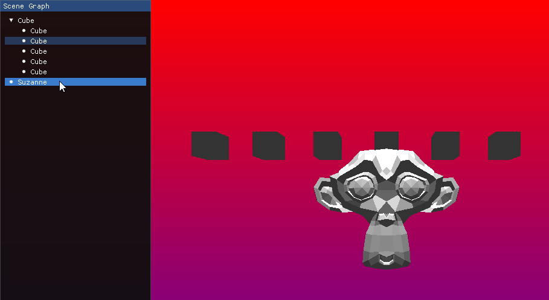
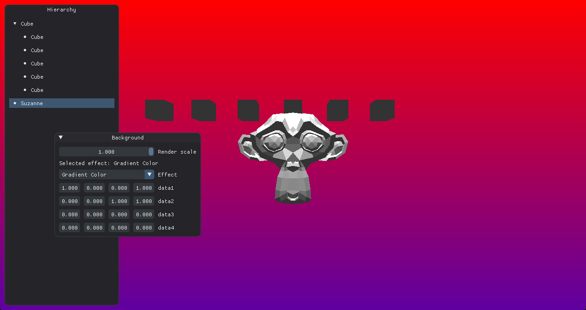

# Render Scene Tree UI

This tutorial will guide you through creating a scene tree  viewer using ImGui. We'll build a
simple tree view for our scene graph that displays nodes, supports selection, and handles
parent-child relationships.

## Main Window Setup

The `engine_ui_definition` procedure from `drawing.odin` is where we set up the ImGui window
that will house our scene tree.

```odin title="drawing.odin"
engine_ui_definition :: proc(self: ^Engine) {
    // imgui new frame
    im_glfw.new_frame()
    im_vk.new_frame()
    im.new_frame()

    v := im.get_main_viewport()
    im.set_next_window_pos({10, 10})
    im.set_next_window_size({250, v.work_size.y - 20})
    im.begin("Scene Graph", nil, {.No_Focus_On_Appearing, .No_Collapse, .No_Resize})
    @(static) selected_node: i32 = -1
    for &hierarchy, i in self.scene.hierarchy {
        if hierarchy.parent == -1 {
            render_scene_tree_ui(&self.scene, i, &selected_node)
        }
    }
    im.end()

    //make imgui calculate internal draw structures
    im.render()
}
```

1. We begin by configuring the window's position and size relative to the main viewport,
placing it at top-left corner with a small offset (`10`, `10`) for padding. It has a fixed
width of `250` pixels and a height that dynamically spans the viewport’s working area, leaving a
20-pixel margin at the bottom to avoid overlapping other UI elements or the screen edge.

    ```odin
    v := im.get_main_viewport()
    im.set_next_window_pos({10, 10})
    im.set_next_window_size({250, v.work_size.y - 20})
    ```

2. The window, titled "Hierarchy," is created with flags that prevent it from being resized,
   collapsed, or focused on appearance, giving it a stable, docked appearance.

    ```odin
    im.begin("Hierarchy", nil, {.No_Focus_On_Appearing, .No_Collapse, .No_Resize})
    ```

3. Inside this window, we define a static variable `selected_node` to track the currently
   selected node across frames, then iterate through the scene's hierarchy to find and render
   root nodes.

    ```odin
    @(static) selected_node: i32 = -1
    for &hierarchy, i in self.scene.hierarchy {
        if hierarchy.parent == -1 {
            render_scene_tree_ui(&self.scene, i, &selected_node)
        }
    }
    ```

## Scene Tree Rendering

The `render_scene_tree_ui` procedure is responsible for rendering the scene tree with ImGui. It
handles displaying individual nodes, managing their appearance, detecting user interactions,
and traversing the hierarchy.

```odin
render_scene_tree_ui :: proc(scene: ^Scene, #any_int node: i32, selected_node: ^i32) -> i32 {
    name := scene_get_node_name(scene, node)
    label := len(name) == 0 ? "NO NODE" : name
    is_leaf := scene.hierarchy[node].first_child < 0
    flags: im.Tree_Node_Flags = is_leaf ? {.Leaf, .Bullet} : {}

    if node == selected_node^ {
        flags += {.Selected}
    }

    // Make the node span the entire width
    flags += {.Span_Full_Width, .Frame_Padding}

    is_opened := im.tree_node_ex_ptr(&scene.hierarchy[node], flags, "%s", cstring(raw_data(label)))

    // Check for clicks in the entire row area
    was_clicked := im.is_item_clicked()

    im.push_id_int(node)
    {
        if was_clicked {
            log.debugf("Selected node: %d (%s)", node, label)
            selected_node^ = node
        }

        if is_opened {
            for ch := scene.hierarchy[node].first_child;
                ch != -1;
                ch = scene.hierarchy[ch].next_sibling {
                if sub_node := render_scene_tree_ui(scene, ch, selected_node); sub_node > -1 {
                    selected_node^ = sub_node
                }
            }
            im.tree_pop()
        }
    }
    im.pop_id()

    return selected_node^
}
```

Here's how it works, broken down into clear steps:

1. We start by retrieving the node's name and determining whether it's a leaf node. The name is
   fetched using a helper procedure `scene_get_node_name`, and if it's empty, we default to "NO
   NODE". We then check if the node is a leaf by examining its `first_child` field—
   if it's less than `0`, there are no children, marking it as a leaf.

    ```odin
    name := scene_get_node_name(scene, node)
    label := len(name) == 0 ? "NO NODE" : name
    is_leaf := scene.hierarchy[node].first_child < 0
    ```

    This is the code for `scene_get_node_name`, place into `scene.odin`:

    ```odin
    scene_get_node_name :: proc(self: ^Scene, #any_int node: i32) -> string {
        name_idx := self.name_for_node[u32(node)]
        if name_idx == NO_NAME {
            return ""
        }
        return self.node_names[name_idx]
    }
    ```

2. Next, we configure the ImGui tree node flags to control its behavior and appearance. For
   leaf nodes, we set the `.Leaf` flag to remove the expand arrow and add `.Bullet` for a small
   visual marker. If the current node matches the selected node, we include the `.Selected`
   flag to highlight it. Finally, we add `.Span_Full_Width` to make the node stretch across the
   window, ensuring the entire row is clickable, and `Frame_Padding` to use the current frame
   padding settings, increasing the size of the tree node for better visibility and
   interaction.

    ```odin
    flags: im.Tree_Node_Flags = is_leaf ? {.Leaf, .Bullet} : {}
    if node == selected_node^ {
        flags += {.Selected}
    }
    flags += {.Span_Full_Width, .Frame_Padding}
    ```

3. We them create the node using `im.tree_node_ex_ptr`, passing the node pointer, flags, and the
   label as a formatted string.

    ```odin
    is_opened := im.tree_node_ex_ptr(
        &scene.hierarchy[node],
        flags,
        "%s",
        cstring(raw_data(label)),
    )
    ```

4. After rendering, we check for user interaction and handle node selection. We use
   `im.is_item_clicked()` to detect if the node was clicked. To ensure ImGui widgets have unique
   IDs, we push the node's index onto the ID stack. If a click is detected, we log the
   selection and update the `selected_node` pointer with the current node's index.

    ```odin
    // Check for clicks in the entire row area
    was_clicked := im.is_item_clicked()

    im.push_id_int(node)
    {
      if was_clicked {
          log.debugf("Selected node: %d (%s)", node, label)
          selected_node^ = node
      }
    ```

5. If the node is expanded (i.e., `is_opened` is `true`), we recursively render its children.
   We start with the `first_child` of the current node and iterate through all siblings using
   the `next_sibling` field. For each child, we call `render_scene_tree_ui` recursively,
   passing the same scene and selected node pointer. If a child returns a selected node index
   greater than `-1`, we update `selected_node` with that value. After rendering all children,
   we call `im.tree_pop()` to close the tree node.

    ```odin
    if is_opened {
        for ch := scene.hierarchy[node].first_child;
            ch != -1;
            ch = scene.hierarchy[ch].next_sibling {
            if sub_node := render_scene_tree_ui(scene, ch, selected_node); sub_node > -1 {
                selected_node^ = sub_node
            }
        }
        im.tree_pop()
    }
    ```

6. Finally, we pop the ID stack to avoid conflicts with other nodes, ensuring ImGui's internal
   state remains consistent. The procedure returns the current value of `selected_node`, which
   could have been updated either by clicking the current node or by a selection in one of its
   children.

    ```odin
    im.pop_id()
    return selected_node^
    ```

This is the end result for this section:



## Bonus: Update ImGui style

Maybe you are tired to see the default ImGui style, so lets change the base colors for a
pleasant and modern dark theme with dark accents.

Add this to `init.odin`, just above `engine_init_imgui` procedure:

```odin
// odinfmt: disable
setup_imgui_style :: proc() {
    style := im.get_style()
    colors := &style.colors

    // Base colors for a pleasant and modern dark theme with dark accents
    colors[im.Col.Text]                  = {0.92, 0.93, 0.94, 1.00}  // Light grey text for readability
    colors[im.Col.Text_Disabled]         = {0.50, 0.52, 0.54, 1.00}  // Subtle grey for disabled text
    colors[im.Col.Window_Bg]             = {0.14, 0.14, 0.16, 1.00}  // Dark background with a hint of blue
    colors[im.Col.Child_Bg]              = {0.16, 0.16, 0.18, 1.00}  // Slightly lighter for child elements
    colors[im.Col.Popup_Bg]              = {0.18, 0.18, 0.20, 1.00}  // Popup background
    colors[im.Col.Border]                = {0.28, 0.29, 0.30, 0.60}  // Soft border color
    colors[im.Col.Border_Shadow]         = {0.00, 0.00, 0.00, 0.00}  // No border shadow
    colors[im.Col.Frame_Bg]              = {0.20, 0.22, 0.24, 1.00}  // Frame background
    colors[im.Col.Frame_Bg_Hovered]      = {0.22, 0.24, 0.26, 1.00}  // Frame hover effect
    colors[im.Col.Frame_Bg_Active]       = {0.24, 0.26, 0.28, 1.00}  // Active frame background
    colors[im.Col.Title_Bg]              = {0.14, 0.14, 0.16, 1.00}  // Title background
    colors[im.Col.Title_Bg_Active]       = {0.16, 0.16, 0.18, 1.00}  // Active title background
    colors[im.Col.Title_Bg_Collapsed]    = {0.14, 0.14, 0.16, 1.00}  // Collapsed title background
    colors[im.Col.Menu_Bar_Bg]           = {0.20, 0.20, 0.22, 1.00}  // Menu bar background
    colors[im.Col.Scrollbar_Bg]          = {0.16, 0.16, 0.18, 1.00}  // Scrollbar background
    colors[im.Col.Scrollbar_Grab]        = {0.24, 0.26, 0.28, 1.00}  // Dark accent for scrollbar grab
    colors[im.Col.Scrollbar_Grab_Hovered]= {0.28, 0.30, 0.32, 1.00}  // Scrollbar grab hover
    colors[im.Col.Scrollbar_Grab_Active] = {0.32, 0.34, 0.36, 1.00}  // Scrollbar grab active
    colors[im.Col.Check_Mark]            = {0.46, 0.56, 0.66, 1.00}  // Dark blue checkmark
    colors[im.Col.Slider_Grab]           = {0.36, 0.46, 0.56, 1.00}  // Dark blue slider grab
    colors[im.Col.Slider_Grab_Active]    = {0.40, 0.50, 0.60, 1.00}  // Active slider grab
    colors[im.Col.Button]                = {0.24, 0.34, 0.44, 1.00}  // Dark blue button
    colors[im.Col.Button_Hovered]        = {0.28, 0.38, 0.48, 1.00}  // Button hover effect
    colors[im.Col.Button_Active]         = {0.32, 0.42, 0.52, 1.00}  // Active button
    colors[im.Col.Header]                = {0.24, 0.34, 0.44, 1.00}  // Header color similar to button
    colors[im.Col.Header_Hovered]        = {0.28, 0.38, 0.48, 1.00}  // Header hover effect
    colors[im.Col.Header_Active]         = {0.32, 0.42, 0.52, 1.00}  // Active header
    colors[im.Col.Separator]             = {0.28, 0.29, 0.30, 1.00}  // Separator color
    colors[im.Col.Separator_Hovered]     = {0.46, 0.56, 0.66, 1.00}  // Hover effect for separator
    colors[im.Col.Separator_Active]      = {0.46, 0.56, 0.66, 1.00}  // Active separator
    colors[im.Col.Resize_Grip]           = {0.36, 0.46, 0.56, 1.00}  // Resize grip
    colors[im.Col.Resize_Grip_Hovered]   = {0.40, 0.50, 0.60, 1.00}  // Hover effect for resize grip
    colors[im.Col.Resize_Grip_Active]    = {0.44, 0.54, 0.64, 1.00}  // Active resize grip
    colors[im.Col.Tab]                   = {0.20, 0.22, 0.24, 1.00}  // Inactive tab
    colors[im.Col.Tab_Hovered]           = {0.28, 0.38, 0.48, 1.00}  // Hover effect for tab
    colors[im.Col.Tab_Selected]          = {0.24, 0.34, 0.44, 1.00}  // Active tab color (TabActive)
    colors[im.Col.Tab_Dimmed]            = {0.20, 0.22, 0.24, 1.00}  // Unfocused tab (TabUnfocused)
    colors[im.Col.Tab_Dimmed_Selected]   = {0.24, 0.34, 0.44, 1.00}  // Active but unfocused tab (TabUnfocusedActive)
    colors[im.Col.Docking_Preview]       = {0.24, 0.34, 0.44, 0.70}  // Docking preview
    colors[im.Col.Docking_Empty_Bg]      = {0.14, 0.14, 0.16, 1.00}  // Empty docking background
    colors[im.Col.Plot_Lines]            = {0.46, 0.56, 0.66, 1.00}  // Plot lines
    colors[im.Col.Plot_Lines_Hovered]    = {0.46, 0.56, 0.66, 1.00}  // Hover effect for plot lines
    colors[im.Col.Plot_Histogram]        = {0.36, 0.46, 0.56, 1.00}  // Histogram color
    colors[im.Col.Plot_Histogram_Hovered]= {0.40, 0.50, 0.60, 1.00}  // Hover effect for histogram
    colors[im.Col.Table_Header_Bg]       = {0.20, 0.22, 0.24, 1.00}  // Table header background
    colors[im.Col.Table_Border_Strong]   = {0.28, 0.29, 0.30, 1.00}  // Strong border for tables
    colors[im.Col.Table_Border_Light]    = {0.24, 0.25, 0.26, 1.00}  // Light border for tables
    colors[im.Col.Table_Row_Bg]          = {0.20, 0.22, 0.24, 1.00}  // Table row background
    colors[im.Col.Table_Row_Bg_Alt]      = {0.22, 0.24, 0.26, 1.00}  // Alternate row background
    colors[im.Col.Text_Selected_Bg]      = {0.24, 0.34, 0.44, 0.35}  // Selected text background
    colors[im.Col.Drag_Drop_Target]      = {0.46, 0.56, 0.66, 0.90}  // Drag and drop target
    colors[im.Col.Nav_Cursor]            = {0.46, 0.56, 0.66, 1.00}  // Navigation highlight (NavHighlight)
    colors[im.Col.Nav_Windowing_Highlight]= {1.00, 1.00, 1.00, 0.70}  // Windowing highlight
    colors[im.Col.Nav_Windowing_Dim_Bg]  = {0.80, 0.80, 0.80, 0.20}  // Dim background for windowing
    colors[im.Col.Modal_Window_Dim_Bg]   = {0.80, 0.80, 0.80, 0.35}  // Dim background for modal windows

    // Style adjustments
    style.window_rounding    = 8.0  // Softer rounded corners for windows
    style.frame_rounding     = 4.0  // Rounded corners for frames
    style.scrollbar_rounding = 6.0  // Rounded corners for scrollbars
    style.grab_rounding      = 4.0  // Rounded corners for grab elements
    style.child_rounding     = 4.0  // Rounded corners for child windows

    style.window_title_align = {0.50, 0.50}  // Centered window title
    style.window_padding     = {10.0, 10.0}  // Comfortable padding
    style.frame_padding      = {6.0, 4.0}    // Frame padding
    style.item_spacing       = {8.0, 8.0}    // Item spacing
    style.item_inner_spacing = {8.0, 6.0}    // Inner item spacing
    style.indent_spacing     = 22.0          // Indentation spacing

    style.scrollbar_size = 16.0  // Scrollbar size
    style.grab_min_size  = 10.0  // Minimum grab size

    style.anti_aliased_lines = true  // Enable anti-aliased lines
    style.anti_aliased_fill  = true  // Enable anti-aliased fill
}
// odinfmt: enable
```

Next, call `setup_imgui_style()` at the end of the `engine_init_imgui` procedure to
apply the custom style.

This is the end result with the new style:



## Conclusion

Our tree view might not have editing options yet, but it’s a great starting point for
integrating scene graphs into the engine, setting the framework for more advanced functionality
in upcoming chapters.
