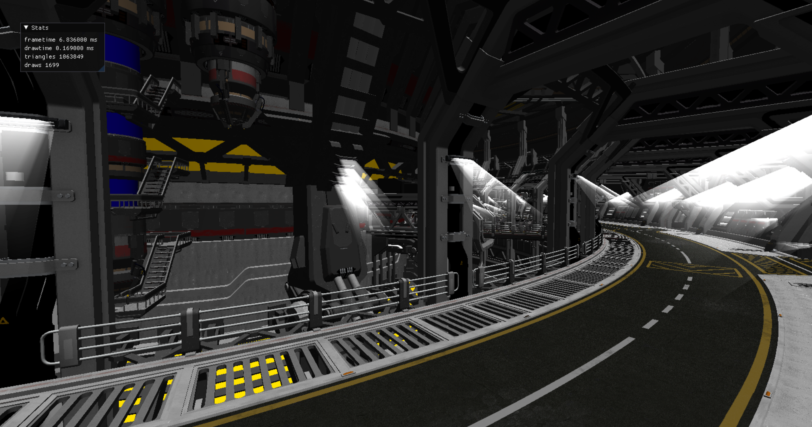

# Welcome to Odin VulkanGuide

End stage after the tutorial

:::info[Odin Guide]

This page presents an [Odin](https://odin-lang.org/) adaptation of the
[vkguide.dev](https://vkguide.dev/) tutorial. Full credit goes to the original authors.

:::

Welcome to a new work-in-progress Vulkan guide. The focus of this guide is to understand Vulkan
correctly, and act as a stepping stone for then working in your own projects. Unlike most
samples and other Vulkan guides, which like to hardcode rendering loops, in here we will have a
focus around dynamic rendering, so that it can act as a better base code for a game engine.

While the guide is focused around game rendering, its concepts can be used in CAD and
visualization just fine.

This guide is meant for the people who already know the basics about 3d graphics, and have
worked with either OpenGL or DirectX in the past. This guide will not explain 3d rendering
basics such as linear algebra math.

The code uses **Vulkan 1.3**, and directly uses those new features to simplify the tutorial and
engine architecture.

:::tip[Get Help]

If you encounter any issues or need help while following this guide, feel free to reach out
through GitHub [Issues][] and [Discussions][]. For general questions about
[Odin](https://odin-lang.org/) and GPU programming, I recommend [Odin Discord][] and [Odin
Forum][].

:::

The guide is separated into multiple sections for code organization.

- **[Introduction](/category/introduction)** - Overview about Vulkan API and the libraries used
  by this project
- **[Chapter 0](/category/0-project-setup)** - Setting up the guide initial code
- **[Chapter 1](/category/1-initializing-vulkan)** - Vulkan initialization and render loop
  setup. (Draws a flashing clear color)
- **[Chapter 2](/category/2-drawing-with-compute)** - Vulkan compute shaders and drawing (Uses
  a compute shader to draw)
- **[Chapter 3](/category/3-graphics-pipelines)** - Vulkan mesh drawing (Draws meshes using
  the graphics pipeline)
- **[Chapter 4](/category/4-textures-and-engine-architecture)** - Textures and better
  descriptor set management
- **Chapter 5** - Full GLTF scene loading and high performance rendering

[Issues]: https://github.com/Capati/odin-vk-guide/issues
[Discussions]: https://github.com/Capati/odin-vk-guide/discussions
[Odin Discord]: https://discord.gg/vafXTdubwr
[Odin Forum]: https://forum.odin-lang.org/
